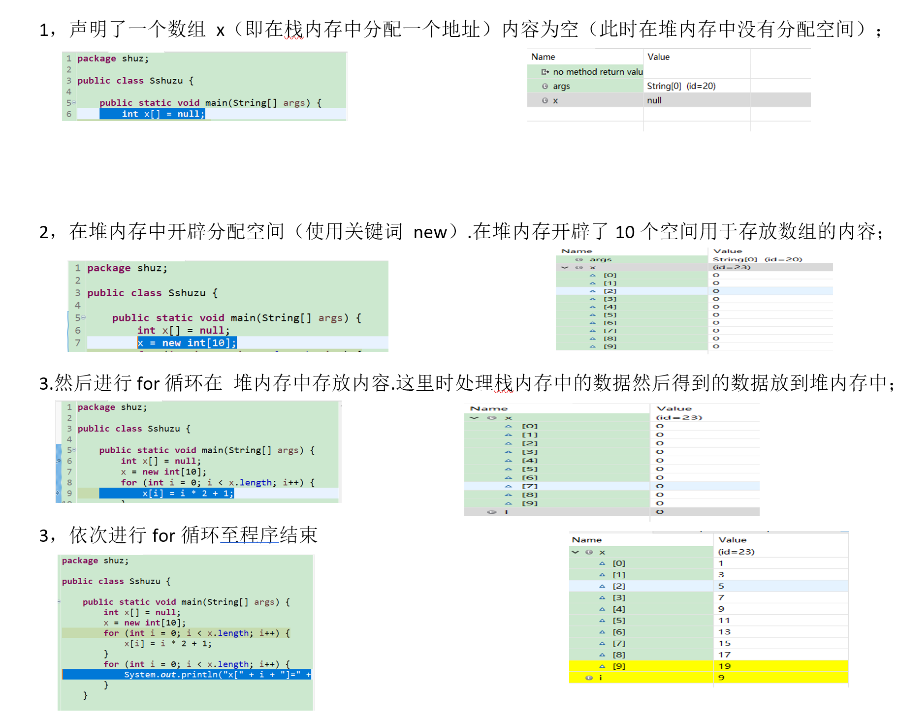

# JAVA概述

## JAVA跨平台的原理

> 经常回顾一下，避免自己忘了，同时传播知识共同成长何乐而不为呢。。。有些东西自己能够讲出来，说明自己也懂了。

1. ***java的运行机制***


如图所示，java 将.java文件经过javac.exe编译成.class文件，之后就可以在各大平台运行了，运行的时候是通过java.exe进行解析然后在JVM虚拟机上运行，由于每个平台上都有jvm所以java可以做到一次编译到处运行；
java是边解析边运行，因此属于解析型语言；

> java的特性-—— 1，跨平台，真正做到一次编译，就可以到处运行；
> 2，高性能，现在的java将一些常用的代码提前就编译好了并将与运行结果存储起来，以加快执行速度，提高性能；
> 3，java支持自动垃圾回收机制，在对象建立的时候垃圾收集器就开始对他进行监控，当对相应不到的时候在空余时间将他回收；
> 4，java可以将程序运行中的一场抛给jvm，方便程序员查看错误原因，同时也提高了程序的健壮性；
> 4，Java支持多线程，支持分布式，Java是针对intenet进行分布式设计的，java有专门针对tcpip的api能够处理TCPIP协议，同时Java还可以支持远程方法调用；

1. ***C++的运行机制***
   

> C将文件经过不同的编译器编译后生成针对不同平台的（适合该平台的文件）文件，然后该文件可以直接在该平台运行；

一些整理，便于理解！！
共同学习共同进步，日拱一卒。


## JAVA的运行机制

> 我们在边写完java类之后要经过javac编译之后才能运行，那么这个过程是怎样的呢？

首先我们在画内存的时候，首先是静态方法、类先加载到内存中，然后是main方法所在的类信息被加载到内存中--这一步叫classLoader,当然不能凭空产生class字节码文件，需要配合java的类库才能完成；

字节码文件加载完毕之后，进入字节码解释器执行，当然由于java还要考虑到程序运行速度的问题，一些字符串、常量、静态数据等会被作即时编译。

然后再加载到执行引擎执行---最后调用系统底层硬件去完成相应的擦操作；


## 一.环境配置

**1.1.JDK环境的配置;**

JAVA_HOME    ----java的运行环境 

PATH  -------定义所有的java命令

CLASSPATH-------类的路径的配置

大纲:要掌握

**1.2.cmd的调试**

检测cmd下运行  java -version

​                 javac -version

两者版本要符合运行要求.一般建议高版本.java8 jdk8及以上

**1.3.了解Java的运行机制**

**.java文件java.exe经过javac.exe编译生成**.class

Java的运行需要classpath 环境.

**.java   →    (编译成class文件)再classpath所指定的目录中找到该类→      运行程序

 

## 二.Java中的字符集

**2.1.Java标识符**

由数字.字母和下划线（_）.美元符号（$）或人民币符号（￥）组成。在Java中是区分大小写的.而且还要求首位不能是数字。最重要的是.Java关键字不能当作Java标识符。

下面的标识符是合法的：

myName.My_name.Point s.$point s._sys_ta.OK._23b._3_

下面的标识符是非法的：

\#name.25name.class.&time.if

**2.2.Java中的关键字**


## 三.声明详解

注:java中类的声明有两种

**3.1.类的声明**

类名首字母必须大写.所以Java文件名首字母也是大写;

public    class

Class

**3.2.两者的区别**

新建一个文件名Hello.java的文件

用public    class 声明的类名要与.java文件名(Hello)一致.生成”Hello.class”文件.   否则编译会出错如


class 声明的类名可以与.java文件名不一致可生成案例中可以生成 Helloa.class.不报错 


一个JAVA文件中.只能有一个 public    class 声明.但是可以允许多个class声明. 


## 四. Java虚拟机

**4.1.大致运行结构**

JVM for Dos

​                                             JVM for Unix

Source.java→  编译→Source.class→   JVM       JVM for Win

​                                             JVM for linux

​                                             JVM for other   

 

再不同平台上都植入java虚拟机.以保证Java程序能在不同平台上与运行而不出错.这充分体现了Java程序的可移植性.                  

## 五.简单的JAVA程序

**5.1.public**

public   是一個关键字.用于声明类的权限.表明这是一个公有类.其他任何类都可以访问.

**5.2.class**

class用于类的声明.其后紧跟着是类名 这里是Hello.保存的文件名必须是Hello.由于JAVA区分大小写.这要注意;

另一个对于没有公有类的源文件. 源文件名和非public   类文件名可以不同---上面提到过.

**5.3.大括号{}**

{}表明类的区域.这里面的内容都是类的一部分;

**5.4.程序的运行入口--main**

main是整个java程序的入口.所有的java程序都是从main

开始运行的.String为参数类型.表示字符串.args表示参数                                             

   public    static   void main(String[] args)


# JAVA基础入门

## 1.Java的注释格式

单行注释   //

多行注释 /*.....*/

 文档注释 /**....*/        

## 2.Java中数据类型

```
基本数据和引用数据
```

| 基本数据 | 数值 | byte  short  int       long   float   double |
| -------- | ---- | -------------------------------------------- |
| 基本数据 | 字符 | char                                         |
| 基本数据 | 布尔 | boolean                                      |
|          | 引用 | class                                        |
|          | 引用 | interface                                    |
|          | 引用 | String,数组,实例                             |

int  表示一个整数

byte长度<short长度<int 长度<long长度

在JAVA中带小数的数据如果不声明.默认为double类型.整数默认为int 类型；


如果数据定义错误.会无法编译成class文件. 例子中  定义 byte=300.超出了byte所能定义的数据范围.就会提示错误; 

**2.1.数值型数据**

注意:各个数据类型之间可以转型

**2.11.byte 与int,long**

由位数多的转型成位数小的.需要强制完成 

int  x =30;

 byte b =x ;

 

这时候需要强制完成代码为

int  x =30;

byte b =(byte)x ;

   

由位数小的转型成位数多的.自动完成

byte i =100;

int  x =i;


**2.12.double 与float**

float   i = 3.3333333333333;

 

代码修改为

float   i =(float  ) 3.3333333333333;

 

或者改为 float   i = 3.3333333333333f;

**2.2字符型数据**

字符型数据表示一个个字符.字符要用‘’(单引号)括起来

char a = ‘i’

char和int 之间也可以转换


我们可以发现  x的值变成了65.

因为java中编码方式是 Unicode.兼容ASCII码

例子:

数字+1.变回字符;

**2.3.转义字符**

在Java中有一系列转义字符:

\\   \”   \”     \’ \’   \n (换行)   \t(打印8个空格)

常见的转义字符

转移字符对应的英文是escape character  . 转义字符串（Escape Sequence）

字母前面加上捺斜线"\"来表示常见的那些不能显示的ASCII字符.称为转义字符.如\0.\t.\n等.就称为转义字符.因为后面的字符.都不是它本来的ASCII字符意思了。

所有的转义字符和所对应的意义：

| 转义字符 | 意义                               | ASCII码值（十进制） |
| -------- | ---------------------------------- | ------------------- |
|          |                                    |                     |
| \b       | 退格(BS) .将当前位置移到前一列     | 008                 |
| \f       | 换页(FF).将当前位置移到下页开头    | 012                 |
| \n       | 换行(LF) .将当前位置移到下一行开头 | 010                 |
| \r       | 回车(CR) .将当前位置移到本行开头   | 013                 |
| \t       | 水平制表(HT) （跳到下一个TAB位置） | 009                 |
| \v       | 垂直制表(VT)                       | 011                 |
| \\       | 代表一个反斜线字符''\'             | 092                 |
| \'       | 代表一个单引号（撇号）字符         | 039                 |
| \"       | 代表一个双引号字符                 | 034                 |
| \0       | 空字符(NULL)                       | 000                 |
| \ddd     | 1到3位八进制数所代表的任意字符     | 三位八进制          |
| \uhhhh   | 1到2位十六进制所代表的任意字符     | 二位十六进制        |

注意：区分.斜杠："/" 与 反斜杠："\" .此处不可互换

**2.4./斜线与\反斜线**

① / 斜线. slash或又称为forward slash （前斜线）. 原本是标点符号。 起源于古罗马.中世纪时用作逗号（而当时的双斜线//是被当作连接号的.后来演化成等号=）。

　　a) 英语里的斜线. 最常用的即使替代字符“or”表选择. 比如： Yes/No； 还有就是避免名字的冲突.比如美国的人口普查表中有"Assyrian/Chaldean/Syriac". 就是为了避免因Syriac名字不同叫法而产生的冲突或歧义.其实也是or的含义；

　　b) 算术； 英文里面称over. 比如： 123/456.也即分数
 　　c) 金钱表示。 $50/- 表示50美元上限. 后面没有了.防止有人添加修改。

　　d) 日期的表示

② \ backslash. 反斜线. 主要用于电脑中. 也正是对普通/斜线的借鉴。 操作系统（xNix）. 电脑语言（C/C++. Perl）.编码（部分Unicode）等都使用它。

问题：一个(char)字符能不能放下一个汉字？

在一般情况下一个汉字=两个字符.但是在JAVA中使用的是UNICODE编码.UNICODE属于16为编码.所以可以放下任意内容.所以JAVA字符是可以放下一个汉字的；

 

char c =’中’;//一个字符只能放下一个汉字；

int  x =c;

System.out.println(c);

System.out.println(x);//如果出现错误.则可能是运行语言环境的问题.将运行环境修改为 中国 即可；

**2.5.字符串类型数据**

字符串类型String

我们发现String 开头首字母大写.代表String是一个类.但这个类又比较特殊.可以按照基本数据类型那样直接使用；

```java
public  static   void main(String[] args) {
String str = "世界啊.你好啊.我很好"	;
System.out.println(str);

```

注意：我们之前学过了.默认情况下各个数据类型之间可以转换

byte → short→int →long→float  →double(由位数低的转成位数高的自行完成.反之要加括号强制完成)但是String又比较特殊.所有的类型数据遇到String都会向String转换。

```java
int x = 10;	float  y = 300.3f;// 在Java中带小数部分的默认为double类型.
		float  i = y / x;
		System.out.println(i);//30.029999
```

显然这不是一个正确结果.因为所有的数字都变成了字符串.所以此处就成了字符串的连接.所以如果想要得到正确结果.就需要加括号.括号内的优先级最大。 

```java
int x = 100;		int y = 200;
		String str = "x+" + "y" + "=";
		System.out.println(str + (x + y));

```

2.6.boolean型

boolean只有两种值  true和false

布尔类型的数据 京城用于表示 非此即彼的数据比如男女等.也可用于程序控制结合 if等语句

```java
package boll;
public  class Kongzhi {
	public  static  void main(String[] args) {
	booleanflag =false;
if (flag==false) {	System.out.println("欢迎光临");
}
	}
```

**2.7.基本数据的默认值**


如果是数值类型的.则默认值为0..字符型默认值为空.布尔类型默认为false；

虽然数据有默认值.但是当我们写代码时定义在主方法main之中的变量数据默认值是无效的.所以要给数据一个初始值.否则会运行时提示出错。--尚未初始化变量。

```java
public   class Hello {
    public   static   void main(String[] args) {   //main主方法
    int  x;
        System.out.println(x);    //尚未初始化变量x  
        }
    }
```

针对出错的代码的两种修改方法；

要么在main方法之外 添加static   int  x ;

要么在main方法内将x赋初始值；

注意：声明变量时 加上空格.以避免出现未知错误.造成不必要的麻烦。

```java
public  class Changliang {
int past =200;//全局变量
	public  static  void main(String[] args) {
		int outer = 1;//成员变量 
		{			int inner = 2;//局部变量 inner 的作用范围只到块结束.之后不能在访问它/
			System.out.println("inner=" + inner);
			System.out.println("outer=" + outer);} //局部变量作用结束
		// System.out.println("inner="+inner);//超出块的范围则无法访问
		int inner = 3;//可以重新定义一个新的inner
		System.out.println("inner=" + inner);
		System.out.println("outer=" + outer);
		System.out.println("In class level.x=" + x);}
	static   int x = 10;//成员变量}

```

## 3.JAVA中运算符

**3.1.四则运算**

```java
public  class Sizeyunsuan {
	public  static  void main(String[] args) {
int x = 100;
int y = 120;
 System.out.println("x+"+"y"+"="+(x+y));
 System.out.println("x-y="+(x-y));
 System.out.println("x*"+"y"+"="+(x*y));
 System.out.println("x/"+"y"+"="+(x/y));
 System.out.println("x%"+"y"+"="+(x%y));
	}
}
注意:加括号.否则就默认向String类型转换;

```

```java
public  class Yunsuanfu {
	public  static  void main(String[] args) {
		System.out.println(10/0);
		}
}//程序提示运行错误.因为0不能做分母;
}

```


**3.2.简便运算**

```java
public  class Jianbianyunsuan {
	public  static  void main(String[] args) {
		int x = 101;
		System.out.println(x++);
		System.out.println(x);
	}
}

```


**3.21.x++与++x区别:**

x++表示先进行运算之后进行自增;

++x表示先进性自增之后进行运算;

```java
public  class Jianbianyunsuan {
	public  static  void main(String[] args) {
		int x = 101;
		System.out.println("x++的值为"+(x++));
		System.out.println(x);	}}
//注释这里的运算逻辑:x先进行(main方法)运算.结果为 x=101.之后在进行自增再进行(main方法)运算.结果为 x=102;

```

我们修改代码为:++x

```java
public  class Jianbianyunsuan {
	public  static  void main(String[] args) {
		int x = 101;
		System.out.println("++x的值为"+(++x));
		System.out.println(x);	}}//注释这里的运算逻辑:x先进行自增然后
进行(main方法)运算.结果为 x=102;这时x的值已经变成了102;
```

**3.3.关系运算**

```java
public  class Jianbianyunsuan {
	public  static  void main(String[] args) {
		int x = 101;
		int y  = 102;
		int a =101;
		System.out.println(a==x);
		System.out.println(x!=y);
	}
}
```

**3.4.逻辑运算符**

**3.41.与:&  &&**


我们先来看一个代码案例

```java
public  class Yunsuanfu {
	public  static  void main(String[] args) {
	if (1==2&&10/0==0) {
	System.out.println("条件满足!");
}
	}

```

**3.42.或:|     ||**

|:表示正常的或.所有的条件都必须判断.

   ||:表示的是短路或.如果第一个条件为真.则后续条件不再判断;

```java
public  class Yunsuanfu {
	public  static  void main(String[] args) {
		if (1==1|10/0==0) {
	System.out.println("条件满足!");
}
	}
}
//注释:    |   第一个条件为真时.会继续判断第二个;

```

```java
public  class Yunsuanfu {	
	public  static  void main(String[] args) {
		// TODO Auto-generated method stub
if (1==1||10/0==0) {
	System.out.println("条件满足!");
}	}
//注释    ||第一个条件为真时.不再去判断下一个


```

**3.5.位运算**

在普通的开发中.位运算很少用到;

Java位运算是针对于整型（byte、char、short、int 、long）数据类型的二进制进行的移位操作。

计算机表示数字正负不是用+ -加减号来表示.而是用最高位数字来表示.0表示正.1表示负 。

| 数据类型 | byte | boolean | short | int  | long | float | double | char |
| -------- | ---- | ------- | ----- | ---- | ---- | ----- | ------ | ---- |
| 位数     | 8    | 8       | 16    | 32   | 64   | 32    | 64     | 16   |

 

**3.51.位运算的操作符:**

左位移（<<）.右位移（>>）.无符号右位移（>>）.按位与（&）.按位或（|）.按位非（～）.按位异或（^） .共七种位运算符.除了按位非是一元运算符.其他的都是二元运算符。
   对于位移运算符来说.有一点需要注意.就是如果操作符左边是int 类型.则操作数右边的数将只会在小于2的5次方以下.就是32以下才有效。因为Java中int 类型是4个字节.也就是32位.左移超过32.其实等同于左移的减去32。比如数字2左移2位.和左移34位的结果是一致的。对长整型long来说.其实也是类似的.不过不是32.是64而已。
   为了便于测试.我们下面的例子全都是使用8位来进行测试。

左位移（<<）
 例如将数字2左移2位（以下首位是符号位）：
 2的二进制表示为：[0] 0000 0010 十进制：2
 左移2位后的结果：[0] 0000 1000 十进制：8
 -2的二进制表示为：
 原码： [1] 0000 0010    补码：[1] 1111 1110
 左移2位后的结果：
 补码：[1] 1111 1000    原码：[1] 0000 1000
 最终结果是：-8
 这里简单说一点：正数的话.原码.反码.补码是一样的.而负数话.从补码求原码和从原码求补码是一样的.也就是说补码的补码还是码。

右移（>>）
 同样.使用数字2来测试：
 2的二进制表示为：[0] 0000 0010 十进制：2
 右移2位后的结果：[0] 0000 0000 十进制：+0
 -2的二进制表示为：
 原码： [1] 0000 0010    补码：[1] 1111 1110
 右移2位后的结果：
 补码：[1] 1111 1111    原码：[1] 0000 0001
 最终结果是：-1
 这里也说一点.右移过程.首位补符号位.而左移.则是低位全部补0。

无符号右移（>>>）
 同样.使用数字2来测试：
 2的二进制表示为：    [0] 0000 0010 十进制：2
 无符号右移2位后的结果：   0000 0000 十进制：0
 -2的二进制表示为：
 原码： [1] 0000 0010    补码：[1] 1111 1110
 无符号右移2位后的结果（这里因为int 是32位.所以使用省略号了）：
 补码： 0011 … 1111    原码： 0011 … 1111
 最终结果是：2的30次方-1.使用Windows计算器得出：1073741823
 这里其实还要说一点.无符号右移.忽略符号位.首位补0。

按位与（&）
 这次我们使用数字3和5.-3和-5.-3和5来测试：
 3的二进制表示为：    [0] 0000 0011
 5的二进制表示为：    [0] 0000 0101
 进行逻辑与之后：    [0]0000 0001 十进制：1
 -3的二进制表示为：
 原码： [1] 0000 0011    补码：[1] 1111 1101
 -5的二进制表示为：
 原码：[1] 0000 0101    补码： [1] 1111 1011
 补码按位与的结果是：
 补码：[1] 1111 1001    原码：[1] 0000 0111 十进制：-7
 -3的二进制表示为：
 原码： [1] 0000 0011    补码：[1] 1111 1101
 5的二进制表示为：    [0] 0000 0101
 补码按位与计算的结果是：
 补码：[0] 0000 0101    原码：[0] 0000 0101 十进制：5
 这里还要说一点.符号位参与位运算。

按位或（|）
 这次我们还是使用数字3和5来测试：
 3的二进制表示为：    [0] 0000 0011
 5的二进制表示为：    [0] 0000 0101
 进行按位或之后：    [0]0000 0111 十进制：7

按位非
 将操作数的每一位都取反.包括符号位。
 这次我们还是使用数字3来测试：
 3的二进制表示为：    [0] 0000 0011
 进行按位非之后：
 补码 [1]1111 1100    原码：[1]0000 0100
 十进制：-4

按位异或（^）
 这个简单来说.就是相同的为0.不同的为1.包括符号位。
 这次我们使用数字-3和5来测试：
 -3的二进制表示为：
 原码： [1] 0000 0011    补码：[1] 1111 1101
 5的二进制补码表示为：    [0] 0000 0101
 补码按位异或计算的结果是：
 补码：[1] 1111 1000    原码：[1] 0000 1000 十进制：-8

我们来看代码案例:   

**3.511.按位或 (  |  )**

```java
	public  static  void main(String[] args) {
		int x = 3;
		int y = 5;
		System.out.println(x | y);
	}
}

```

  3  → 00000000 00000000 00000000 00000011

5 → 00000000 00000000 00000000 00000101

|  →00000000 00000000 00000000 00000111

注释:相对为都是0则按位或 是0.否则是1 (为了便于理解.就是看对应位的有一个1就为1否则是0


**3.512.按位 与   (  &  )**

```java
public  static  void main(String[] args) {
		int x = 3;
		int y = 5;
		System.out.println(x&y);
	}

```

3  → 00000000 00000000 00000000 00000011

5  → 00000000 00000000 00000000 00000101

&  → 00000000 00000000 00000000 00000001

如果相对为是1.则为1.否则为0   (为了便于理解.就是将对应位有两个1才为1.否则是0

**3.513.按位异或  (   ^   )**

按位异或指相同为相同则为0.不同则为1

3 的二进制 : 00000000 0000000000000000 00000011

6 的二进制 : 00000000 0000000000000000 00000110

3^6         00000000 0000000000000000 00000101      → 5

**3.514.左移位     (  <<  )**

左移操作是将运算数的二进制代码整体左移指定位数.左移之后的空位置用0来填充;

```java
	public  static  void main(String[] args) {
		
		int x = 3;
		int y = 2;
		System.out.println(x<<y);}}


```

3  → 00000000 00000000 00000000 00000011           

<<2 

00000000 00000000 00000000 00001100   

 12

 

3.515.右移位     (  >>  )

右移操作是将运算数的二进制代码整体右移指定位数.右移之后的位置用符号来填充.如果是正数用0来填充.是负数则用1来填充;

```java
	public  static  void main(String[] args) {
		int x = 3;
		int y =2;
		System.out.println(x>>y);
	}
}


```

 

3  → 00000000 00000000 00000000 00000011

\>>2 →00000000 00000000 00000000 00000000  → 0

所有的数据右移两位.结果成为了0


**3.516.无符号右移     (  >>>  )**

```java
	public  static  void main(String[] args) {
		int x = 3;
		int y =2;
		System.out.println(x>>>y);
	}
}


```

3  → 00000000 00000000 00000000 00000011

\>>>2 →00000000 00000000 00000000 00000000 

所有的数据右移两位.结果成为了0

如果现在操作的是负数.则必须注意.负数的操作=整数的反码+1

负数的补码:为原码取反后+1

注意:

+0的源码 . 00000000.反码为00000000

-0的源码 .10000000. 反码为11111111

 

```
问题1:现在要求2^3.如何让操作性能更高?
```

最快的操作不是相乘的操作.而是进行移位的操作

```java
public  class Yiwei {

   public  static  void main(String[] args) {

      int x = 2;

      System.out.println(x<< 2);

   }

}
```

**3.517. 取反  (    ～   )**

反码: 按位进行取反.即0变1.1变0后得到的数值.

正数的原码.反码补码为一样的.负数的取反是使用补码的形式表示出来.在进行取反操作   注意:整数第一位为0表示.复数的第一位为1表示.

举个例子:

3  原码: 000000000 00000000 00000000 00000011

-3  原码: 100000000 00000000 00000000 00000011

-3   反码: 11111111 11111111 11111111 11111100

-3   补码: 11111111 11111111 11111111 11111101 对负数讲.补码的补码就是原码

~-3  -3取反: 10000000 00000000 00000000 00000010   → -2

```java
public  class Weicaozuo {
	public  static  void main(String[] args) {		
		int x = -3;
		System.out.println(~x);
	}
}

```

**3.6位操作**

位操作指使用二进制代码完成的操作;

```java
public  class Weicaozuo {
	public  static  void main(String[] args) {		
		int x = 3;
		int y = 6;
		System.out.println(x | y);//7
		System.out.println(x&y);//2
		System.out.println(x ^ y);//5
	}
}


```

3 的二进制 : 00000000 00000000 00000011

6 的二进制 : 00000000 00000000 00000110

3|6          00000000 00000000 00000010     →  2

3&6          00000000 00000000 00000111     →  7

3^6         00000000 00000000 000000101      →  5

**3.61.举几个例子便于理解:正数的左右移**

**3.62.左移:**


|      |      | 0    | 0    | 0    | 0    | 0    | 0    | 0    | 0    | 0    | 0    | 0    | 0    | 0    | 0    | 0    | 0    | 0    | 0    | 0    | 0    | 0    | 0    | 0    | 0    | 0    | 0    | 0    | 0    | 0    | 0    | 1    | 1    | 3的原码 |
| ---- | ---- | ---- | ---- | ---- | ---- | ---- | ---- | ---- | ---- | ---- | ---- | ---- | ---- | ---- | ---- | ---- | ---- | ---- | ---- | ---- | ---- | ---- | ---- | ---- | ---- | ---- | ---- | ---- | ---- | ---- | ---- | ---- | ---- | ------- |
| 0    | 0    | 0    | 0    | 0    | 0    | 0    | 0    | 0    | 0    | 0    | 0    | 0    | 0    | 0    | 0    | 0    | 0    | 0    | 0    | 0    | 0    | 0    | 0    | 0    | 0    | 0    | 0    | 0    | 0    | 1    | 1    | 0    | 0    | 3<<2    |

移出2位                                                                    补2位

**3.63.右移:**

| 0    | 0    | 0    | 0    | 0    | 0    | 0    | 0    | 0    | 0    | 0    | 0    | 0    | 0    | 0    | 0    | 0    | 0    | 0    | 0    | 0    | 0    | 0    | 0    | 0    | 0    | 0    | 0    | 0    | 0    | 1    | 1    |      |      | 3原码 |
| ---- | ---- | ---- | ---- | ---- | ---- | ---- | ---- | ---- | ---- | ---- | ---- | ---- | ---- | ---- | ---- | ---- | ---- | ---- | ---- | ---- | ---- | ---- | ---- | ---- | ---- | ---- | ---- | ---- | ---- | ---- | ---- | ---- | ---- | ----- |
| 0    | 0    | 0    | 0    | 0    | 0    | 0    | 0    | 0    | 0    | 0    | 0    | 0    | 0    | 0    | 0    | 0    | 0    | 0    | 0    | 0    | 0    | 0    | 0    | 0    | 0    | 0    | 0    | 0    | 0    | 0    | 0    | 1    | 1    | 3>>2  |

补2位                                                                                                                                    移出2位

正数的原码与补码相同　

+3的补码→00000011

负数的补码　　　　将其原码除符号位外的所有位取反（0变1.１变0.符号位不变）后+１

 

负数的左移与右移.是将负数的补码进行相应操作后取反（符号位不变）

**3.64.负数的左移  空位置补0**

求　-3<<2

|      |      | 1    | 0    | 0    | 0    | 0    | 0    | 0    | 0    | 0    | 0    | 0    | 0    | 0    | 0    | 0    | 0    | 0    | 0    | 0    | 0    | 0    | 0    | 0    | 0    | 0    | 0    | 0    | 0    | 0    | 0    | 1    | 1    | -3的原码           |      |
| ---- | ---- | ---- | ---- | ---- | ---- | ---- | ---- | ---- | ---- | ---- | ---- | ---- | ---- | ---- | ---- | ---- | ---- | ---- | ---- | ---- | ---- | ---- | ---- | ---- | ---- | ---- | ---- | ---- | ---- | ---- | ---- | ---- | ---- | ------------------ | ---- |
|      |      | 1    | 1    | 1    | 1    | 1    | 1    | 1    | 1    | 1    | 1    | 1    | 1    | 1    | 1    | 1    | 1    | 1    | 1    | 1    | 1    | 1    | 1    | 1    | 1    | 1    | 1    | 1    | 1    | 1    | 1    | 0    | 1    | -3的补码（原码+1） |      |
| 0    | 0    | 1    | 1    | 1    | 1    | 1    | 1    | 1    | 1    | 1    | 1    | 1    | 1    | 1    | 1    | 1    | 1    | 1    | 1    | 1    | 1    | 1    | 1    | 1    | 1    | 1    | 1    | 1    | 1    | 0    | 1    | 0    | 0    | 补码左移两位       |      |
|      |      | 1    | 0    | 0    | 0    | 0    | 0    | 0    | 0    | 0    | 0    | 0    | 0    | 0    | 0    | 0    | 0    | 0    | 0    | 0    | 0    | 0    | 0    | 0    | 0    | 0    | 0    | 0    | 0    | 1    | 1    | 0    | 0    | 取反               |      |
|      |      |      |      |      |      |      |      |      |      |      |      |      |      |      |      |      |      |      |      |      |      |      |      |      |      |      |      |      |      |      |      |      |      |                    |      |

结果为-12

当一个负数左移很多位时（左移补0.无论正负）可能变成正数

3.62负数的右移

求-3>>2

| 1    | 0    | 0    | 0    | 0    | 0    | 0    | 0    | 0    | 0    | 0    | 0    | 0    | 0    | 0    | 0    | 0    | 0    | 0    | 0    | 0    | 0    | 0    | 0    | 0    | 0    | 0    | 0    | 0    | 0    | 1    | 1    |      |      | -3的原码         |
| ---- | ---- | ---- | ---- | ---- | ---- | ---- | ---- | ---- | ---- | ---- | ---- | ---- | ---- | ---- | ---- | ---- | ---- | ---- | ---- | ---- | ---- | ---- | ---- | ---- | ---- | ---- | ---- | ---- | ---- | ---- | ---- | ---- | ---- | ---------------- |
| 1    | 1    | 1    | 1    | 1    | 1    | 1    | 1    | 1    | 1    | 1    | 1    | 1    | 1    | 1    | 1    | 1    | 1    | 1    | 1    | 1    | 1    | 1    | 1    | 1    | 1    | 1    | 1    | 1    | 1    | 0    | 1    |      |      | -3的补码         |
| 1    | 1    | 1    | 1    | 1    | 1    | 1    | 1    | 1    | 1    | 1    | 1    | 1    | 1    | 1    | 1    | 1    | 1    | 1    | 1    | 1    | 1    | 1    | 1    | 1    | 1    | 1    | 1    | 1    | 1    | 1    | 1    | 0    | 1    | -3的补码右移两位 |
| 1    | 0    | 0    | 0    | 0    | 0    | 0    | 0    | 0    | 0    | 0    | 0    | 0    | 0    | 0    | 0    | 0    | 0    | 0    | 0    | 0    | 0    | 0    | 0    | 0    | 0    | 0    | 0    | 0    | 0    | 0    | 1    | 1    | 0    | 取反后+1         |

 

结果为-1

**3.65.无符号右移**

无符号右移   空位补0 

正数同右位移

负数则为求完补码后之际位移相应位数后得到的结果。不用再取反；

求-3>>>2

| 1    | 0    | 0    | 0    | 0    | 0    | 0    | 0    | 0    | 0    | 0    | 0    | 0    | 0    | 0    | 0    | 0    | 0    | 0    | 0    | 0    | 0    | 0    | 0    | 0    | 0    | 0    | 0    | 0    | 0    | 1    | 1    |      |      | -3的原码         |
| ---- | ---- | ---- | ---- | ---- | ---- | ---- | ---- | ---- | ---- | ---- | ---- | ---- | ---- | ---- | ---- | ---- | ---- | ---- | ---- | ---- | ---- | ---- | ---- | ---- | ---- | ---- | ---- | ---- | ---- | ---- | ---- | ---- | ---- | ---------------- |
| 1    | 1    | 1    | 1    | 1    | 1    | 1    | 1    | 1    | 1    | 1    | 1    | 1    | 1    | 1    | 1    | 1    | 1    | 1    | 1    | 1    | 1    | 1    | 1    | 1    | 1    | 1    | 1    | 1    | 1    | 0    | 1    |      |      | -3的补码         |
| 0    | 0    | 1    | 1    | 1    | 1    | 1    | 1    | 1    | 1    | 1    | 1    | 1    | 1    | 1    | 1    | 1    | 1    | 1    | 1    | 1    | 1    | 1    | 1    | 1    | 1    | 1    | 1    | 1    | 1    | 1    | 1    | 0    | 1    | -3的补码右移两位 |
| 0    | 0    | 1    | 1    | 1    | 1    | 1    | 1    | 1    | 1    | 1    | 1    | 1    | 1    | 1    | 1    | 1    | 1    | 1    | 1    | 1    | 1    | 1    | 1    | 1    | 1    | 1    | 1    | 1    | 1    | 1    | 1    |      |      |                  |

 

结果为1073741823

随着程序开发.在程序中直接进行位操作已经较少了.一般在加密的代码中会进行位操作.例如

MD5加密格式需要移位操作.

正则在JAVA开发中有很多重要的地位.包括JAVASCRIPT也都是支持正则的.在JDK1.4之后程序中增加了对正则的支持。


# JAVA基础知识

在程序设计中.不管怎么变化都会离不开  判断和循环操作。

## 1.判断语句

判断是进行程序的分支.之前的程序顺序的操作结构从头到尾进行一次的操作；

**If 语句**


二选一进行判断.如果要判断多个.就要使用 if else 语句

**If  else语句**

```java
public  class Ifyuju {
	public  static  void main(String[] args) {
		//一个小朋友.在2014年9月之前出生的.可以上小学.否则上幼儿园
		int year = 2010;
		int month = 9;
		if(year> 2014) {
			System.out.println("上幼儿园");} 
		elseif (year == 2014) {
			if(month> 9) {
				System.out.println("上幼儿园");} 
			else {
				System.out.println("上小学");}			
		}
		else {
			System.out.println("上小学");}		
	}
}


```

 范例：给定一个分数.判断等级

x<60.需要努力

60<=x<80.一般

80<=x<=100优秀

```java
package ifyuju;
public  class Hello {
	public  static  void main(String[] args) {
		int x = 80;
		if (x< 60) {
			System.out.println("需要努力");
		} elseif (x< 80) {
			System.out.println("一般");
		} else {
			System.out.println("优秀");
		}
	}
}

```

**Switch语句**

Switch语句的结构

switch ( 整形表达式){

case 常量表达式1:{ 语句1

} break;

case 常量表达式2:{语句2

}break;

case 常量表达式3:{语句3

}break;

default:{   //如果没有符合条件的.给出返回值

}break;

}

Switch 中只能接受数字或字符的操作.并不能接收任何的表达式操作.在JDK1.5之后可以接受枚举类型的操作                                             

范例：


## 2.循环语句

循环的过程中必须合理的控制循环的开始条件、结束条件.以及中间的循环体操作；

循环语句的类型；

 while  do.....while   for

范例  用三种  循环语句   表达1到100的和

**for 循环**

```java
public  class Xunhuanyuju {
	public  static  void main(String[] args) {
		int i = 1;
		int result = 0;
		for (; i<= 100; i++) {
			result += i;
		}
		System.out.println(result);
	}
}


```

**While 循环**

```java
public  class Xunhuanyuju {
	public  static  void main(String[] args){	
int t = 1.he =0;		
		while(t<=100) {
			if (t%2==0) {
				he += t;
			}
			++t;		}
		System.out.println(he);	
	}
}
//调试时我们发现.while实现进行判断在进行循环体的操作；
```

**do ......while 循环**

do ..........while语句的格式

do {  执行操作

}

While(判断条件);

范例：

```java
public  class Xunhuanyuju {
	public  static  void main(String[] args){
int a =1.sum=0;
		do {
			if(a%2==1) {
				sum+=a;				
			}
			a++;
		}while(a<100);
		System.out.println(sum);
	}
}
//do ....while 先进行一次循环.再进行判断；
```


小结：for 、while 和 do...while循环语句都是在外面定义了一个循环变量.之后在里面修改变量；

我们也可以发现.for循环是比较简洁的

## 3.循环控制

任何语言循环控制的代码基本一致

分支结构 ：if 、if ....else、 if......else if...else 

循环结构: for、 while、 do....while

循环控制：break; continue;

在进行循环操作的时候.使用break和continue 进行控制；

范例：当i=88时跳出循环  break

```java
public  class Xunhuanyuju {
	public  static  void main(String[] args) {
		int i = 1.result=0;
		for (; i<= 100; i++) {
			result += i;
			if(i==88) {
				break;   //当i=88时跳出循环
			}		}
		System.out.println(result);
	}
}

```

范例   当i==3时跳过循环.执行后续的--continue 

```java
public  class Xunhuanyuju {
	public  static  void main(String[] args) {
				int i = 1;		
		for (; i<= 10; i++) {
			
			if(i==3) {
				continue;   //当i==3时跳过循环
			}
			System.out.println("i="+i);
		}
}}
		
```

**3.1break 和continue 的用法小结**

1，break 用于switch语句中.终止switch语句

2，break 用于循环语句时.跳出循环

3，break用于其他位置时.毫无意义

4，continue用在循环中.跳出本次循环.继续进行下一次循环

5，continue用于其他位置时.毫无意义


```java
public  class Switchyuju {
	public  static  void main(String[] args) {
		int x = 1;
		switch (x) {
		case 1: {
			System.out.println("差");
		}
		case 2: {
			System.out.println("良");
		}	
		case 3: {
			System.out.println("优");
		}
		default: {
			System.out.println("输入错误");
		}		}	}}

```

```java
public  class Switchyuju {
	public  static  void main(String[] args) {
		int x = 4;
		switch (x) {
		case 1: {
			System.out.println("差");		}
			break;
		case 2: {
			System.out.println("良");		}
			break;
		case 3: {
			System.out.println("优");		}
			break;
		default: {
			System.out.println("输入错误");}
		}	}}

```

我们可以看到.当没用break关键字时.不会再判断下一个case值.直接向后运行.直到遇到break.或者整体的switch 结束。 所以我们在编写switch语句时.必须加上 break； 

```java
public  class Xunhuanyuju {
	public  static  void main(String[] args) {
			int i = 1.result = 0;		
		for (; i<= 100; i++) {
			result += i;
			if(i==99) {
				continue; //	当i==99不会输出内容；即跳过此次循环执行之后的	
			}System.out.println(result);
		}
		}}

```

**3.2实例讲解**

范例1   打印9*9乘法表 这里可以看到 print  与println 的区别

```java
public  static   void main(String[] args) {
for(int x=1;x<10;x++) {
	for(int y=1;y<=x;y++) {
		System.out.print (x+"*"+y+"="+x*y); 
	     }
		System.out.println();//换行
	}
	}
}

```

嵌套循环的运行逻辑.外层循环给定一个值.按照此值进行里层循环直至结束.外层再换另一个值再次进行循环；

范例2  判断在3000之内那些书能被3.5.7同时整除；

```java
	public  static  void main(String[] args) {
		for (int i = 1; i<= 3000; i++) {
			if (i % 3 == 0 &&i % 5 == 0 &&i % 7 == 0) {
				System.out.println(i + "能同时被3.5.7整除");
			}
		}
		System.out.println("Exit");
	}
}


```

 

范例3   打印正三角形

```
	public  static  void main(String[] args) {
		System.out.println(""
				+ "                  *\r\n"
				+ "	                * *\r\n"
				+ "	               * * * \r\n"
				+ "	              * * * *\r\n"
				+ "	             * * * * *\r\n"
				+ "	            * * * * * *\r\n"
				+ "	           * * * * * * *\r\n"
				+ "	          * * * * * * * *");
	}
}


```

上面来搞笑的！ 

下面用for打印8*8的正三角形 

```java
public  static  void main(String[] args) {
		System.out.println("打印8*8的正三角形");
		/*分析逻辑
		 * 要素 空格和*号.所以要建立两个循环来分别控制 *和空格的输出
		 * 循环多少次---需要外部的一个大循环来确定循环次数		
		 * */	
		for (int x =0;x<=8;x++) {//首先确定循环次数
			for(int y=0;y<8-x;y++) {//控制空格的输出
				System.out.print ("");//这里不用换行
			}
			for(int y=0;y<x;y++) {//控制*的输出
				System.out.print ("* ");//这里也不用换行
			}System.out.println();//换行
		}
	}
}

```

范例4：给定三个数字.求出最大值.并将最大值输出；

**三目运算符：**

```java
public  class Linchun {

   public  static  void main(String[] args) {

      int x = 10. y = 12. z = 50;

      int max = x<y ? y : x;

//注释：如果x<y.则y是最大值.否则是x

      max = max<z ? z : max;

      System.out.println(max);

   }

}

```

将三个数定义成数组.然后调用getMax方法

逻辑.要针对对象调用方法.先建立针对对象的方法；

```java
public  class Yu {//构造方法
public  int  getmax (int  []array) {//建立有返回值的方法
	int max =array[0];
	for (int i=0;i<array.length;i++) {
		if ( max<array[i]) {
			max=array[i];
		}

```

```java
public  class YUNxing {
	public  static  void main(String[] args) {
		Yu T  = new Yu();//
int date[]= {100.102.105.784.888.999};
int result =T.getmax(date);
System.out.println(result);
	}
}

```

 

## 4.数组

数组属于引用书类型.所以先要了解引用；

**4.1基本概念**

例如.定义100个整型变量：

在java中可以用如下语法格式定义一个数组

数据类型   数组名 [] =new 数据类型[长度];

int  a [] =new int  [100];

其中也可以将以上语法变为一下格式

数据类型 [] 数组名称 =new 数据类型[长度];

int  [] a=new int  [100];

或者

int  a[]={0.2.33.44.44.55.44.77......100};

```java
public  static  void main(String[] args) {
int [] temp =newint [10];//声明一个整型数组.大小为10

```

此时数组已经声明完毕.下面就可以使用数组.使用形式如下

通过数组名[ 下标]的形式进行访问.在进行访问时.数组下标从0开始；数组的下标不能超过数组的界限；数组的长度     **数组名.length**

范例1  数组静态初始化

```java
	public  static  void main(String[] args) {
//int [] temp =new int [10];//定义了一个数组.数组中默认值为0.长度为10
		int temp[] = { 0. 1. 2. 3. 4. 5. 6. 7. 8. 9 };
		System.out.println("数组的长度" + temp.length);
		for (int i = 0; i<temp.length; i++) {
			System.out.println("temp" + "[" + i + "]" + "=" + temp[i]);
		}	}}


```

```java
	public  static  void main(String[] args) {
int [] temp =newint [10];//定义了一个数组.数组中默认值为0.长度为10
		System.out.println("数组的长度" + temp.length);
		for (int i = 0; i<temp.length; i++) {
			System.out.println("temp" + "[" + i + "]" + "=" + temp[i]);
		}
	}
}


```

因为使用了关键字 “new”.所以在数组使用时已经为其开辟好了新空间

数组的使用分为两个部分：

1.声明数组：声明数组时候一般都是在栈内存中声明的；

2.为数组开辟空间.使用关键字new 进行空间的开辟.在堆内存中声明；

将以上的操作化成图形.如下所示                   

 有时候为了更好的清楚以上的图形.就可以将数组的使用分为两个步骤：

1.声明一个数组：数据类型 数组名 [ ]=null;   //因为数组是引用数据类型.引用的默认值都是 null

2.开辟数组：数组名称=new数据类型[长度];//使用关键字new完成;

```java
	public  static  void main(String[] args) {
int [] temp =null;//声明了一个数组.但是没有开辟堆内存空间
		temp =newint  [10];//在堆中开辟了10个大小的空间
        System.out.println("数组的长度" + temp.length);
		for (int i = 0; i<temp.length; i++) {
			System.out.println("temp" + "[" + i + "]" + "=" + temp[i]);
		}
	}
}	

```

数组的声明时所有的内容都是默认值0.

范例：声明一个10个元素的数组.之后为数组里的每一个元素设置的内容都是奇数；观察内存的分配

```java
	public  static  void main(String[] args) {
		int x[] = null;
		x = newint [10];
		for (int i = 0; i<x.length; i++) {
			x[i] = i * 2 + 1;
		}
		for (int i = 0; i<x.length; i++) {
			System.out.println("x[" + i + "]=" + x[i]);
		}
	}
}


```

**程序分析**

声明了一个数组（即在栈内存中分配一个地址）内容为空（此时在堆内存中没有分配空间）



4,输出结果；

一个堆内存空间可以同时设置多个栈的引用；

```java
	public  static  void main(String[] args) {
		int [] temp = null;// 声明了一个数组.但是没有开辟堆内存空间
		temp = newint [10];// 开辟了10个大小的空间
		int  temp1[] = temp;
		System.out.println("数组temp的长度" + temp.length);
		System.out.println("数组temp1的长度" + temp1.length);
		temp1[8]=300;
for (int i = 0; i<temp.length; i++) {
			System.out.println("temp1" + "[" + i + "]" + "=" + temp1[i]);
			System.out.println("temp" + "[" + i + "]" + "=" + temp[i]);
		}
	}
}


```

 

我们将数组temp1中的temp[8]赋予值300.我们发现输出结果中temp[8]的值也跟着改变了.因为temp和temp1指向同一个空间.那么这样的操作就表示引用数据类型的操作.也可以称为引用传递；

**数组详解：**

数组属于引用数据类型.使用时需要开辟内存空间；

数组的定义格式：

1.声明时直接开辟内存空间

数据类型 数组名[]=new 数据类型[长度]

数据类型 [] 数组名=new 数据类型[长度]

2，分步声明：

声明数组：数据类型 数组名[]=null;

实例化数组： 数组名称 =new 数据类型[长度];

关键字new只要一出现.则肯定表示数据类型时引用数据类型.要进行堆栈空间开辟；

范例：

```java
public  static  void main(String[] args) {
		int x[] = null;
		x = newint [3];		
for (int i = 0; i<x.length; i++) {
			System.out.println(x[i]);
		}
	}
}

```

开辟的内容都使用默认值表示.如果想要为数组的元素赋值.则需要通过下标的方式进行访问；

我们看下图.开辟栈内存空间的意义.就相当于表示一个人的名字.


在数组的操作中在栈内存中保存的永远是数组名称.之开辟占内存空间的数组永远无法使用.必须有指向的堆内存才可以使用.要想开辟堆内存.则必须使用new关键字.之后只是将堆内存的使用权交给了栈内存空间.而且一个堆内存空间可以同时被多个栈内存空间使用。 


以上的代码中数组的操作除第一个外.其他都属于动态初始化

数组的动态与静态初始化；

动态初始化--因为在开辟数组时不知道数组中的具体内容是多少.而只是使用了默认值表示

静态初始化--在声明数组时直接写出数组中数据 

数据类型  数组名 [ ] = {数组内容（中间用英文逗号隔开）  }

int   array [ ] ={1.2.3.4.5.6.7.8.9};

**4.2二维数组**

如果把一维数组当成几何中的线性图形.那么二维数组就相当于一个表格

**4.21二维数组的声明：**

二维数组的声明方式和一维数组类似.内存的分配也是用new关键字.其声明与分配内存的格式如下图所示：

**4.22动态初始化：**

数据类型 数组名 [][]

数组名=new数据类型[行的个数]and[ 列的个数]：

动态初始化

数据类型 数组名[][]=new 数据类型 [行的个数]and[列的个数]

int  i [][]=new int  [5][6];//行数必须写上.列数不作要求

或者

int  i [][];

i  =new int  [5]and[6]

**4.23.静态初始化**

数据类型 数组名称[][] ={值1.值2.值3...........};

int  i [][]={{1.2.3}.{2.3.4.5}.{4.5.6.7.8.9}};

```java
	public  static  void main(String[] args) {
		int i[][] = { { 1. 2 }. { 2. 3. 4 }. { 4. 5. 6. 7. 8 } };
		System.out.println("数组开辟后的内容：");
		for (int x = 0; x<i.length; x++) {
			for (int y = 0; y<i[x].length; y++) {
				System.out.print (i[x][y] + "、");
			}
			System.out.println("");
		}
	}
}

```

```java
import java.util.*;
public  class Sz {
	//int [][]a= new int [0][];//行数必须写.列可以不写
	public  static  void main(String[] args) {
		int [][]scores=new int [2][3] ;//行数表示班级.列数表示学生数
		Scanner input = new Scanner(System.in);
	   for (int i=0;i<scores.length;i++) {//班级
		   System.out.println("-------"+"第"+(i+1)+"班"+"---------");
		   for(int j =0;j<scores[i].length;j++) {//学生成绩
			   System.out.println("请输入第"+(i+1)+"班"+"第"+(j+1)+"名同学的成绩");//
			   scores[i][j]=input.nextInt();
		   }
	   }
		System.out.println("-------------统计成绩-----------------");
		for (int i=0;i<scores.length;i++) {
			System.out.println("-------"+"第"+(i+1)+"班学生的总成绩---------");	
			int sum =0;
			double avg=0;
			for (int j =0;j<scores[i].length;j++) {
				sum+=scores[i][j];	
			}
			System.out.println(sum+"分");
			System.out.println("-------"+"第"+(i+1)+"班学生的平均分---------");
			avg=sum/3;
			System.out.println(avg+"分");
		}
		input.close();
	}
}


```

**4.3 Arrays**

Arrays一个与数组操作有关的类.可以使用此类进行数组的排序操作；

```java
	public  static  void main(String[] args) {
		int i[] = { 1. 2. 3. 4. 5. 6 };
		int g[] = { 6. 5. 4. 3. 2. 1 };
		Arrays.sort(g);//数组的排序
		System.out.println(Arrays.equals(i. g));
		Arrays.fill(g. 5);//将g全部填充为5
		System.out.println(Arrays.toString(g));//输出内容
	}
}

```

```

```

```
在Java中Arrays类提供了很多方法去供使用；

```

Arrays.sort(数组名);可以对数组进行升序排列.但是不能直接通过sysout输出

Arrays.toString(数组名);可以通过sysout输出

通过Arrays.sort()可以快速对数组进行排序.然后可以通过Arrays.toString()将数组内容以文本的形式输出出来；

Arrays.fill(数组名.要填充的内容);用于对数快速初始化；

Arrays.equals(数组1.数组2);

Arrays.binarySearch(数组名. 要查询的元素);在查询前一定要对数组进行升序排序

```
Arrays.copyof()与system.arraycopy()
数组名1=Arrays.copyOf(数组名2.要复制的长度)
system.arraycopy(源数组.源数组起始位置.目标数组.目标数组的起始位置.要复制的长度)

```

```java
public  static  void main(String args[]) {
//为数组num开辟长度为6的空间
		int num[] =new int [6];
		//初始化数组.将数组num中6个元素全部填充为6
		Arrays.fill(num. 5);
		int num2[];
		int num3[]= {9.8.7.6.5.4.3.2.1};
	//将数组num的前两个元素复制给num2称为一个新数组；
	num2=Arrays.copyOf(num. 2);
	//将num2中元素以字符串形式打印出来
	System.out.println(Arrays.toString(num2));
	//比较num和num2中的元素是否一样
	System.out.println(Arrays.equals(num. num2));
	//比较num和num2是否是同一个对象（地址是否相等）
	System.out.println(num.equals(num2));
	//将num32中元素以字符串形式打印出来
	System.out.println(Arrays.toString(num3));
	//将num3进行升序排列
	Arrays.sort(num3);
	//二分法查询数组中的某一个元素所在位置.在此之前.数组要经过升序排序
	System.out.println(Arrays.binarySearch(num3. 5));
	System.out.println("****************************");
	String str1=new String("java");
	String str2=new String("java");
	String str3="java";
	System.out.println(str1==str2);
	System.out.println(str1.equals(str2));
	System.out.println(str2==str3);
	System.out.println(str2.equals(str3));
	}
}

```

**4.4对象数组的使用**

我们可以把类理解为用户自定义的数据类型.它和基本数据类型（如int 、float  等）具有相同的地位。

对象也可以用数组来存放.可通过下面两个步骤来实现。

比如要建立3个Person类

Person  P[];

P[0]=new Person();P[1]=new Person();P[1]=new Person();//动态初始化

或者直接写成Person P[]={new Person().new Person().new Person()};//静态初始化；


```java
/*
 * 定义一个book类.包括属性title（书名）、price（价格）及pub（出版社）.
 * pub的默认值是“天天精彩出版社”.并在该类中定义方法getInfo().来获取这三个属性。
 * 再定义一个公共类BookPress.其内包括主方法。在主方法中.
 * 定义3个book类的实例b1.b2和b3.分别调用各个对象的getInfo()方法.
 * 如果“天天精彩出版社”改名为“每日精彩出版社”.请在程序中实现实例b1.b2和b3的pub改名操作。
 * 完成功能后.请读者思考一下.如果book类的实例众多.有没有办法优化这样的批量改名操作？
 */
class Book {
	String Title;
	doublePrice;
	String Pub = "天天精彩出版社";
	public   Book(String Title. doublePrice. String Pub) {
		this.Title = Title;
		this.Price = Price;
		this.Pub = Pub;
	}
	String getInfo() {
		return  "书名:" + "《" + this.Title + "》" + "\n" + "|" + "建议零售价:" + this.Price + "￥" + "|" + "出版社是:" + this.Pub;	}
}

```

```java
public  class BookPress {
	public  static  void main(String args[]) {
		///////////方式一//////////
//		Book b1 = new Book("java". 47.8. "天天精彩出版社");//初始化b1
//		Book b2 = new Book("C++". 56.8. "每日精彩出版社");
//		Book b3 = new Book("C##". 66.8. "每日精彩出版社");
//		b2.Pub = b1.Pub;
//		System.out.println(b1.getInfo());
//		System.out.println(b2.getInfo());
//		System.out.println(b3.getInfo());
		//////////////////////////方式二/////////////////
Book b[]= {new Book("java". 47.8. "天天精彩出版社").new Book("C++". 56.8. "天天精彩出版社").new Book("C##". 66.8. "天天精彩出版社")};
for(int i=0;i<b.length;i++) {
	if (i==0) {
		b[i].Pub="每日精彩出版社";	
	}elseif(i%2!=0){
		b[i].Pub="我爱我家出版社";   		
	}
	System.out.println(b[i].getInfo());
    }
	}
}

```

## 5.类

**5.1类的图形所示**

在开发中所有的类都是应该以图形的形式展现给用户.那么类的图形如下所示：

| 类名称 |
| ------ |
| 属性   |
| 方法   |

例如之前的Person 类就可以用如下表示；

属性的表示格式：访问权限  变量名称数据类型

“-”：表示private  权限

“+”：表示public   权限

方法的表示格式：访问权限  方法名称（参数名称） 返回值类型

 

| Person                                                       |
| ------------------------------------------------------------ |
| -name String   -age int                                      |
| +getName(name String)void   +getName() String   +setAge(a int )void   +getAge()int |

可以直接通过工具Power Designer完成设计 


完成之后可以直接生成操作代码

也可以自写好类的代码.在Power Designer转换成图形；

File菜单下--

 

在以后类的开发中一定要有类图的表示关系。

用private  关键字声明一个方法.此方法只能在类的内部进行访问.外部无法调用


**5.2类与对象定义**

可以定义一个类并产生对象.实际上之前所有的程序都是存在类的定义的.因为类要使用class进行定义

类的组成：属性、方法

类的定义格式：

​                                                        class 类名称 {                             声明成员变量（属性）和构造方法；

数据类型 属性

 

   public    返回值的数据类类型  方法名称 （参数1.参数2.....）{

程序语句;                                                        定义方法内容      

[return   表达式:] 

}

}

属性与之前的变量是一样的.数据类型上就是java的两种数据类型：基本数据类型、引用数据类型

此时在方法的定义不在出现static  关键字了

范例：

public    class Person{

String name; //表示人的姓名

int  age;//表示人的年龄

public    void tell(){//定义说话的方法

System.out.println(“姓名：”+name+”.年龄：”+age);

}

}

此时已经定义了一个类.类中有两个属性：name、age一个说话的方法：tell()

类已经定义出来了.但是只有类是不能呢个直接使用的.还要产生对象.

**5.21类的创建与使用**

类名 对象名称 =null ;//声明对象

对象名称 =new 类名();//实例化对象

或者   类名 对象名称 = new类名();

```java
public  class Person {
public  static  void main (String args[]) {
		Person per =new Person();//产生实例化对象
	}
}
```

5.22访问类中的属性和方法：

访问属性：对象名称.属性名

访问方法：对象名称.方法名()   

```java
class Person {// 定义一个类
	String name ="zzy";	int age= 28 ;	Double high=1.75;	Boolean sex =true;//
	public  void tell() {// 定义方法
		System.out.println("姓名:" + name + "性别:" + sex + "年龄:" + age + "岁" + "身高:" + high + "m");
	}	public  static  void main(String args[]) {
		Person per = new Person();//产生实例化
		per.name = "张三";		per.age = 30;       per.high =1.80;
		per.tell();// 调用类中的方法
	}
}

```

**5.23对象的产生**

对象的产生分为两步：

声明对象： 类名称 对象名称 =null;

实例化对象：对象名称=new 类名称();

如果对象只是声明的话.则无法直接使用.必须实例化之后才可以正确的使用；

**习题：设计一个表示学生的类.****里面包含学生的三项成绩：计算机、数学、英语成绩、**

**要求可以求总分.****平均分.****最高、最低分.****并且可以输出一个学生的完整信息！**

程序的开发步骤：

1，根据需求定义所要的类；

2，根据题中要求规划出类的属性： name 、age、sex、computer、English、math、score等

3，所有的属性必须封装：private 

4，所有的属性必须通过 getter及setter访问

5，如需增加构造方法：为属性赋值

6，所有的信息不要再类中直接输出.二十交给调用出输出；即在类中不能出现 System.out.println()语句


```java
public  class Student {
	private  String name;
	private int age;
	private float  computer;
	private float  math;
	private float  english;
	public   Student(String n. int a. float  e. float  m. float  c) {
		this.setName(n);
		this.setAge(a);
		this.setComputer(c);
		this.setMath(m);
		this.setEnglish(e);
	}

```

1.按要求定义学生类中的各项属性； 

```java
public   float   sum() {
		return  english + computer + math;
	}
	public   float   avg() {
		return  this.sum() / 3;
	}
	public   float   max() {
		float  max = computer>math ? computer : math;
		max = max>english ? max : english;
		return  max;
	}
	public   float   min() {
		float  min = computer<math ? computer : math;
		min = min<english ? min : english;
		return  min;
	}
	public   String getInfo() {
		return  "学生信息：\n" + "\t|-姓名：" + this.getName() + "\n" + "\t|-年龄：" + this.getAge() + "\n" + "\t|-数学成绩："
				+ this.getMath() + "\n" + "\t|-计算机成绩：" + this.getComputer() + "\n" + "\t|-英语成绩：" + this.getEnglish();
	}

```

```java
public  void setName(String n) {
		name = n;}
	public  void setAge(int a) {
		age = a;}
	public  void setComputer(float  c) {
		computer = c;}
	public  void setMath(float  m) {
		math = m;}
	public  void setEnglish(float  e) {
		english = e;}
	public   String getName() {
		return  name;}
public   int  getAge() {
return  age;}
	public   float   getEnglish() {
		return  english;
	}
	public   float   getMath() {
		return  math;
	}
	public   float   getComputer() {
		return  computer;
	}


```

```java
public  static  void main(String args[]) {
		Student stu = new Student("张三". 22. 89.0f. 80.0f. 86.0f);
		System.out.println("总分：" + stu.sum());
		System.out.println("最高成绩" + stu.max());
		System.out.println("最低成绩" + stu.min());
		System.out.println("平均成绩" + stu.avg());
		System.out.println(stu.getInfo());	}}

```

总结：

1：类与对象的关系

类是对象的模板.对象是类的实例

2：垃圾的产生

3对象的产生格式

   声明对象：类名称 对象名称 =null;如果直接使用此对象.会出现空指向异常

实例化对象；对象名称 =new 类名称（）；

2，封装性：private   以及setter 、getter

3，构造方法；

与类名称相同的方法

无返回值声明

如果一个类中没有明确的声明一个构造.则会自动生成一个无参的什么都不做的构造

构造方法允许重载

**5.231创建匿名对象；**

这里没有创建对象名.即如果创建对象.自然用Liangle()整体来作为新构造的匿名对象.如果创建对象.则应该为

```java
package student;

public  class Liangle {
	public  void say() {
		System.out.println("爆发吧");
	}
	public  static  void main(String[] args) {
new Liangle().say();//这里没有创建对象名.即Liangle LL=newLiangle();LL.say()
	}
}


```

> 匿名对象有如下两个特点。

> ⑴ 匿名对象是没有被其他对象所引用.即没有栈内存指向。

> ⑵ 由于匿名对象没有栈内存指向.所以其只能使用一次.之后就变成无法找寻的垃圾对象.故此会被垃圾回收器收回。

**5.24.对象的比较**

**思考：**

1.一个对象在类的外部能不能直接访问类中的私有成员？

不可以！！！！

范例：


提示错误.因为无法访问私有类。

对象的比较有两种方式:

1.利用 ==运算符  用于比较两个对象内存地址是否相同；

2.利用equals()    用于比较两个对象的内容是否相同； 


```java
package student;
public  class Liangle {
	public  static  void main(String[] args) {
		String str1 = new String("java");
		String str2 = new String("java");
		String str3 = str2;
		System.out.println(str1 == str2);// 只比较地址.由于创建了两个实例化对象.所以两者地址不同
		System.out.println(str1.equals(str2));// 只比较内容
		System.out.println(str2 == str3);
		System.out.println(str2.equals(str3));
	}
}

```

2.如果一个对象在类的内部可以访问私有成员吗？ 

```java
class Person {
	private  String name;private int age;//私有化name 和age
	public   Person(String name. int age) {
		this.name = name;		this.age = age;	}
	public  void fun(Person temp) {//引用传递.建立一个方法.用于接收
		temp.name = "李四";		temp.age = 30;	}
	public   String getName() {
		return  this.name;	}
	public   int  getAge() {
		return  this.age;	}}
public  class LIANXI {
	public  static  void main(String[] args) {
		// TODO Auto-generated method stub
		Person per1 = new Person("张三". 33);
		per1.fun(per1);//
		System.out.println(per1.getName() + per1.getAge());	}}

```

这种情况下唯一用处.只在对象的比较上 

```java
class Person {
	private  String name;
	private int age;
	public   Person(String name. int age) {		this.name = name;
		this.age = age;	}
	public  void fun(Person temp) {
		temp.name = "李四";
		temp.age = 30;	}
	public   String getName() {
		return  this.name;	}
	public   int  getAge() {
		return  this.age;	}}


```

```java
public  class LIANXI {
	public  static  void main(String[] args) {
		Person per1 = new Person("张三".33);
	Person per2=new Person ("张三".33);
	if(per1.getName().equals(per2.getName())&&per1.getAge()==per2.getAge()) {
		System.out.println("两个是相同的对象");}		
	}
}

```

这样的比较是由第三方发起的.如果自己要想发起比较.此时应该是类中的一个功能 

**5.241 this的用法;**

```java
class Person {
	String name;
	int age;
	public   Person(String name. int age) {//构造方法
		this.name = name;
		this.age = age;}
/////////////////////构造方法/////////////////////.///
	public   String talk() {
		return  "我是:" + this.name + ".今年:" + this.age + "岁";}}
public  class Person1 {
	public  static  void main(String args[]) {	
	//////////////////////声明静态Person类的数组--////////////
		Person p[] = { new Person("张三那". 24). new Person("赵四". 34). new Person("王二麻子". 46) };
		for (int i = 0; i<p.length; i++) {
			System.out.println(p[i].talk());
		}	}}


/*当创建一个对象后.JVM就会给这个对象分配一个自身的引用----this.
		由于this只和对象本身相关联.所以this只能在类中非静态方法中使用.静态方法、静态属性属于类.
		他们与具体的对象无关.所以静态属性、方法是没有this的
		*/
/*构造方法Person()中有参数name.age他们隶属于构造方法Person().
		 * 属于局部变量
		 * */
```


```java
class Person {
	private  String name;
	private int age;
	public   Person(String name. int age) {
		this.name = name;
		this.age = age;	}
	public  boolean compare (Person per) {
		if (this ==per) {//地址相等
			return  true;		}
		if(this.name.equals(per.name)&&this.age==per.age) {
			return  true;
		}else {
		return  false;}	}
	public  void fun(Person temp) {
		temp.name = "李四";
		temp.age = 30;	}
	public   String getName() {
		return  this.name;	}
	public   int  getAge() {
		return  this.age;	}}
public  class LIANXI {
	public  static  void main(String[] args) {
		Person per1 = new Person("张三".33);
	Person per2=new Person ("张三".33);
	if(per1.compare(per2)) {
		System.out.println("两个是相同的对象");	}		}}

```

## 6.方法

**6.1静态方法static  （类方法）和 非静态方法（实例方法）的区别：**

方法我们主要分为三种：
 1.构造方法
 2.非静态方法（普通方法/实例方法）
 3.静态方法（类方法）

**6.11、静态方法和非静态方法的区别**

（调用对象、引用变量不同） 

 静态方法:是使用static  关键字修饰的方法.又叫类方法.属于类的.不属于对象. 在实例化对象之前就可以通过类名.方法名调用静态方法。 （静态属性.静态方法都是属于类的.可以直接通过类名调用）。

1. 在静态方法中.可以调用静态方法。
2. 在静态方法中.不能调用非静态方法。
3. 在静态方法中.可以引用类变量（即.static  修饰的变量）。 
4. 在静态方法中.不能引用成员变量（即.没有static  修饰的变量）。
5. 在静态方法中.不能使用super和this关键字

非静态方法:是不含有static  关键字修饰的普通方法.又称为实例方法.成员方法。属于对象的.不属于类的。（成员属性.成员方法是属于对象的.必须通过new关键字创建对象后.再通过对象调用）。

- **A**.在普通方法中.可以调用普通方法。
- **B**.在普通方法中.可以调用静态方法
- **C**.在普通方法中.可以引用类变量和成员变量
- **D**.在普通方法中.可以使用super和this关键字

**6.12、静态方法和非静态方法的区别（调用方法不同）**

 静态方法可以直接调用.类名调用和对象调用。（类名.方法名 / 对象名.方法名）
 但是非静态方法只能通过对象调用。（对象名.方法名）

**6.13、静态方法和非静态方法的区别（生命周期不同）**

静态方法的生命周期跟相应的类一样长.静态方法和静态变量会随着类的定义而被分配和装载入内存中。一直到线程结束.静态属性和方法才会被销毁。（也就是静态方法属于类）  非静态方法的生命周期和类的实例化对象一样长.只有当类实例化了一个对象.非静态方法才会被创建.而当这个对象被销毁时.非静态方法也马上被销毁。（也就是非静态方法属于对象）

**总结**：类方法可以直接通过类名调用.实例方法必需先实例化类.再初始化对象.然后通过类的实例对象才能调用

**举例**：

```java
package lianxi;
public  class Anli{	static   String a="string-a";
static   String b;  String c="stirng-c";  String d;
//static  语句块用于初始化static  成员变量.是最先运行的语句块
static  //定义静态方法
  {
print   static  ("before static  ");
b="string-d";//这里静态方法只能访问用类中静态数据a或者b.不能调用成员变量c和d
print   static  ("after static  ");  }
//输出静态成员变量
public  static  void print   static  (String title)
  {    System.out.println("---------"+title+"---------");
    System.out.println("a=\""+a+"\"");
    System.out.println("b=\""+b+"\"");  }
public   Anli()  {
    print ("before constructor");d="string-d";    print ("after constructor");
  }
//打印所有属性.包括静态成员
public  void print (String title)
  {    System.out.println("---------"+title+"---------");
    System.out.println("a=\""+a+"\"");
    System.out.println("b=\""+b+"\"");
    System.out.println("c=\""+c+"\"");
    System.out.println("d=\""+d+"\"");  }
public  static  void main(String[]args)  {
    System.out.println();
    System.out.println("---------创建usingAttribute对象---------");
    System.out.println();
new Anli();  }
}

```


**6.14隐藏子类中的方法**

```java
class Animal{
	public void Eat() {
		System.out.println("我饿了");	}
	public static void Run() {
		System.out.println("我跑了");	}}
class Cat extends Animal{
public void Eat() {
	System.out.println("小猫爱吃鱼");}
	public static void Run() {
	System.out.println("我旋转跳跃不停歇了");	}
}

public class Huigui {
	public static void main(String[] args) throws Exception {
	Animal an= new Cat();
	an.Eat();
	an.Run();
	/*这里隐藏了子类的同名方法，
	虽然子类也是由static修饰的Run方法，
	此调用等同于Animal.Run();
实际上系统也会建议将an.Run()修改为Animal.Run()
	*/	
	}
}
```

```
小结：

```

关于异常的关键字

1.try-catch-finally其中finally 可有可无.是作为统一的出口；

2.throw 关键字是在程序中人为抛出一个异常.throws关键字是在方法的声明处使用.表示此方法不处理不处理任何异常；

3.包就是一个文件夹.一个类加入包之中完整的名称是：包.类名称

4.static   import 是在JDK1.5之后新增加的功能.属于静态导入。

5.异常中可以使用assert关键字判断程序到某个地方确定是某个内容.但是一般情况下不使用此关键字

6.一些系统常用包:java.lang

7.在实际开发中使用接口表示一种标准.表示一种能力（标识接口）.表示将方法名称（方法视图）暴露给远程客户端；

范例：实现一个宠物商店.宠物商店中存在多种宠物。

分析：

定义宠物标准 

```java
package org.petshop;
public   int erface Pet {//如果需要则扩展接口内容即可
public   String getName();
public   int  getAge();
public   float   getPrice();
}


```

宠物标准定义完毕之后.下一步是宠物商店的设计；

商店中包含多种宠物,每种宠物是一个类,所以商店的设计要用到类的数组；

```java
package org.petshop;
public  class Petshop {
//这里Pet相当于一种数据类型.用接口定义了一种数据类型（标准）
	private  Pet pets[];
	private int foot;
	public   int  PetShop(int len) {
		if (len> 0) {
			this.pets = new Pet[len];
		} else {
			this.pets = new Pet[1];// 至少保留一个宠物
		}
		return  len;
	}
	public  boolean add(Pet pet) {
		if (this.foot<this.pets.length) {
			this.pets[this.foot] = pet;// 保存宠物
			this.foot++;// 修改脚标
			return  true;// 增加宠物
		} else {
			return  false;// 增加失败
		} // 因为查询的时候可能返回多个内容.所以还应该以数组的形式表示
	}
	public   Pet[] search(String keyWord) {
		Pet[] result = null;// 声明数组
		int count = 0;// 记录出有多少种宠物符合信息
		for (int i = 0; i<this.pets.length; i++) {// 循环查询
			if (this.pets[i] != null) {// 表示有宠物信息
		if (this.pets[i].getName().indexOf(keyWord) != -1) {// 查询到到结果
					count++;// 修改查询个数
				}
			}
		}
		result = new Pet[count];// 根据查找的个数开辟数组空间
		count = 0;// 加入内容
		for (int i = 0; i<this.pets.length; i++) {// 循环查询
			if (this.pets[i] != null) {// 表示有宠物信息
			if (this.pets[i].getName().indexOf(keyWord) != -1) {// 查询到到结果
					result[count] = this.pets[i];// 返回查询的内容
					count++;// 修改查询个数
				}
			}
		}
		return  result;
	}
}

```

```java
public  class Cat implements Pet {
	private  String name;
	private int age;
	private float  price;
	public   Cat(String name. int age. float  price) {
		super();
		this.name = name;
		this.age = age;
		this.price = price;
	}
	public   String getName() {
		return  name;	}
	public  void setName(String name) {
		this.name = name;	}
	public   int  getAge() {
		return  age;	}
	public  void setAge(int age) {
		this.age = age;
	}
	public   float   getPrice() {
		return  price;	}
	public  void setPrice(float  price) {
		this.price = price;	}
	public   String toString() {
		return  "宠物猫的名字：" + this.name + ".年龄" + this.age + "价格" + this.price + "￥";
	}
}


```

同理得到宠物狗.虎的；

下面要验证各个之间的关系

```java
package org.petshop;
public  class TestPetShop {
	public  static  void main(String args[]) {
		PetShop shop = new PetShop(5);// 定义能存放5个宠物的商店
		shop.add(new Cat("黑猫". 3. 89.8f));// 增加宠物
		shop.add(new Cat("白猫". 2. 87.8f));// 增加宠物
		shop.add(new Cat("花猫". 3. 99.8f));// 增加宠物
		shop.add(new Dog("白狗". 1. 89.8f));// 增加宠物
		shop.add(new Dog("黑狗". 1. 79.8f));// 增加宠物
		shop.add(new Dog("花狗". 3. 98.8f));// 增加 失败
		Pet p[] = shop.search("狗");
		for (int x = 0; x<p.length; x++) {
			System.out.println(p[x]);
		}
	}
}


```

实际上从开发中此种模式也是经常用的.所以一定要理解其代码意义.使用接口进行解耦合操作所有之间的关联使用接口完成 ;

## 7.构造方法：

在每个类中都存在一个构造方法.构造方法的主要目的是为了类中属性初始化.

观察对象的实例化操作：

Person per =new Person();

实际上此括号”()”就表示调用的是一个方法.那么这个方法实际上就是构造方法；构造方法定义时有一些要求.要求如下：

1，构造方法的名称必须与类名称一致；

2，构造方法定义时没有返回值的类型声明；

3，不能在构造方法中使用return  返回一个内容；

4，如果在一个类中没有明确的声明一个构造方法的话.则会自动生成一个无参的什么都不做的构造方法；

5，构造方法一般定义是为public  。

 

**7.1构造方法**

**7.1构造方法的定义**

实例化一个类的对象后.如果要给属性赋值.需要通过访问对象的属性或setXXX（）方法。在实例化对象后同时给对象的属性赋值可以使用构造方法.构造方法也叫做构造函数.用来对对象进行初始化

构造方法的特点：

1.当使用关键字new的时候才调用构造方法.

2.构造方法本身是可以重载操作的.重载的原则与普通方法一致；

3.如果一个类中已经明确声明了一个构造方法.则不会在重新生成无参的构造方法

```java
class Person{
	private  String name;
	private int age;
//	public   Person(String n.int  a) {//构造方法无返回值
//		name =n;//如果没有声明构造方法.则会自动生成无参的误操作的构造方法.
//		age =a; //构造方法只有在new关键字是才调用   
//		System.out.println("************");//运行结果如图一
//	}
    public  void tell() {
		System.out.println("姓名"+this.getName()+"年龄"+this.getAge());
	}
	public   String getName() {
		return  name;	}
	public  void setName(String name) {
		this.name = name;	}
	public   int  getAge() {
		return  age;	}public  void setAge(int age) {
		this.age = age;	}
}
public  class Ceshi {
	public  static  void main(String[] args) {
		Person per =null;
		per = new Person();	
//per = new Person("张三".78);	
	per.tell();		
	}
}
```

**7.2构造方法重载**

在一个类中可以定义多个构造方法.只要每个构造方法参数类型或参数个数不一样

```java
package person;
class Person{
	private  String name;
	private int age;
	public   Person(String n) {//构造方法--方法名和类型是相同的.并且没有返回值类型和返回值	}
public   Person(String n) {//构造方法重载	
	}
	public  Person(String n.int a) {
		this.setName(n);		this.setAge(a);
		System.out.println("************");	}
	public  void tell() {
		System.out.println("姓名"+this.getName()+"年龄"+this.getAge());}
	public   String getName() {
		return  name;	}
	public  void setName(String name) {
		this.name = name;	}
	public   int  getAge() {
		return  age;	}
	public  void setAge(int age) {
		this.age = age;	}}

```

```java
public  class Ceshi {
	public  static  void main(String[] args) {
		Person Per =null;
		Per1 = newPerson("张三".78);	Per2=new Person("李四")
		Per1.tell();	Per2.tell();
	}
}
```

在代码中.Person类中定义了两个参数构造方法和一个参数构造方法.它们是构造方法的重载。在实例化对象时.p1和p2因为传入的参数的不同.调用的不同的构造方法。我们发现两个构造方法给对象的属性赋值不同.在给一个参数的构造方法中只是给name赋值的.此时的age属性的值是默认为0的。 

一定要注意.构造方法一定是在使用关键字new的时候才进行调用.而且一个类中至少要存在至少一个构造方法；

**7.3构造方法私有化**

使用private   关键字可以声明属性.声明的属性不能被外部直接访问.同样可以使用private  声明方法.声明的方法只能在类内部看见使用；

构造方法也可以使用private  关键字声明.一旦声明之后.则外部无法直接进行对象实例化操作；                                              

可以编译运行的代码：

```java
package person;
class Single{
	public  void print () {
		System.out.println("Hello world!");
	}
}
//静态方法可以在对象没有实例化的时候进行调用
public  class Siyouhua {
	public  static  void main(String[] args) {
		Single S = null;// 声明对象
		S = new Single();// 实例化对象
		S.print ();//调用方法
	}
}


```

当把构造方法私有化时.编译器会提示出错；

```java
package person;
class Single{
	private  Single() {//构造方法私有化
		
	}
	public  void print () {
		System.out.println("Hello world!");
	}
}
//静态方法可以在对象没有实例化的时候进行调用
public  class Siyouhua {
	public  static  void main(String[] args) {
		Single S = null;// 声明对象
		S = new Single();// 实例化对象
		S.print ();//调用方法
	}
}//构造方法私有化.外部无法调用 


```


**7.31单例设计**

```java
package person;
class Single{
	private  static   Single instance = new Single();//静态方法可以在对象没有实例化的时候进行调用
	private  Single() {//构造方法私有化
	}
	public  static   Single getIntance() { //静态方法只能被静态访问.这里返回一个静态对象
		return  instance;
	}
	public  void print () {
		System.out.println("Hello world!");
	}
}
public  class Siyouhua {
	public  static  void main(String[] args) {
		Single S = null;// 声明对象
		Single S1=null;
		S = Single.getIntance();// 实例化对象
		S.print ();//调用方法
		S1=Single.getIntance();
		S1.print ();
	}
}
//S1.S2都被指向同一个对象instance.无论方法中有多少个对象.其构造方法都被Instance垄断了

```

如果一个类只能有一个实例化对象.这样的设计被称为单例设计.应用案例：windows 的回收站设计

当整个系统中只需要有一个实例化对象时.就会用到这样的设计；

**7.32关于代码块**

代码分为：普通代码块.构造代码块.静态代码块.以及同步代码块

**构造代码块**

构造代码块先于构造方法执行.两这个都是在调用构造方法时才执行.因此构造代码块可以用来给某些公有属性初始化；

```java
public  class Gouzao {
	public  static  void main(String args[]) {
		Books B1 = new Books();	System.out.println("---------------------");
		Books B2 = new Books("C#");	
	}
}普通代码块（main主方法下的普通代码块）

class Books {
	String name;
	//构造代码块////初始化某些属性
	{ 
		System.out.println("构造代码执行");
		name ="java";
	}

```

**静态代码块**

静态代码块使用static   修饰.主要作用是初始化静态变量；在main方法中静态代码块咸鱼main方法执行.在main之外.先执行main在执行静态方法.然后在执行其他方法；


```java
public  class Gouzao {
	static   {
		System.out.println("静态代码块1执行");	}
	public  static  void main(String args[]) {
		System.out.println("main方法执行");
		Books B1 = new Books();
	System.out.println("---------------------");
		Books B2 = new Books("C#");		}}
class Books {
	String name;
	// 构造方法代码块1//
	Books() {
		System.out.println("构造方法1执行");
		show();	}
//构造方法代码块2//
	Books(String name) {
		System.out.println("构造方法2执行");
		this.name = name;	
		show();	}
	void show() {
		System.out.println("书的名字" + name);
	}	
	//构造代码块//
		{ 		
	System.out.println("构造代码执行");//初始化
			name ="java";
		}
}
```

**7.4观察者设计(了解)**


如果想要实现这样的观察者设计.需要是一个Observer接口和Observeable 类

```java
import java.util.Observable;
import java.util.Observer;
@SuppressWarnings("deprecation")
public  class Per implementsObserver {
	@Override
	public  void update(Observablearg0. Object arg1) {
		// TODO Auto-generated method stub
		//arg1表示改变之后的价格;
		//arg0表示被观察的对象;
		System.out.println("被观察的操作有所修改"+arg0+arg1);
	}
}


```

```java
import java.util.Observable;
@SuppressWarnings("deprecation")
public  class House extendsObservable {
private float  price;
public   House (float  price) {
	this.price=price;}
public   String toString() {
	return  "房子";  }
public   float   getPrice() {
	return  price;}
public  voidsetPrice(float  price) {
	super.setChanged();//通知内容跟已经可以修改
	this.price = price;
	//一旦修改.则表示价格改变.应该立即通知观察者
		super.notifyObservers(price);//通知所有观察这已经改变}}

```

```java
public  class TestObserver {
	@SuppressWarnings("deprecation")
	public  static  void main(String[] args) {
		House h=new House(12000.2f);
Per P1=new Per();
Per P2=new Per();
Per P3=new Per();
h.addObserver(P1);//增加一个观察者
h.addObserver(P2);//增加一个观察者
h.addObserver(P3);//增加一个观察者
h.setPrice(15000.8f);
	}
}
```

每一个人表示一个观察者.每个人观察Observerable的子类；当房子的价格改变的时候,首先要设置 改变的发生点之后通过notifyObserver()方法唤醒全部的观察者；


## 8.关于类的四种性质

**8.1类的封装性**

先看一串代码：

```java
package chwenyu_xuexi;
class Plant {
	 String name;	int age;
	public  voidSell() {
		System.out.println("这颗植物的名字" + name + "这颗植物的年龄" + age);	}}
public  class Xuexi {
	public  static  void main(String[] args) {
		Plant Pl1 = new Plant();
		Pl1.name = "Rose";		Pl1.age = -5;
		Pl1.Sell();
	}
}
```

如果年龄为负数.不影响程序的执行但是现实情况中不存在年龄为负数的案例.所以这样的数据不应该设置上去.

因为现在的类中操作都是对外部可见的。可以直接访问.此时可以通过封装性来解决此问题.在java中封装性有很多体现.但是最简单的体现就是加入”private  “关键字。

封装属性：private   数据类型 属性名称=默认值；

封装方法：private   返回值类型/void 方法名(  参数列表 ){   方法体  } 

```java
package chwenyu_xuexi;
class Plant {
	 String name;	int age;
	public  void Sell() {
		System.out.println("这颗植物的名字" + name + "这颗植物的年龄" + age);
	}}
public  class Xuexi {
	public  static  void main(String[] args) {
		// TODO Auto-generated method stub
		Plant Pl1 = new Plant();
		Pl1.name = "Rose";
		Pl1.age = -5;
		Pl1.Sell();	}
}
```

将上面代码进行封装 

```java
package chwenyu_xuexi;
class Plant {
	private String name;	private int age;
	public  void Sell() {
		System.out.println("这颗植物的名字" + name + "这颗植物的年龄" + age);}}
public  class Xuexi {
	public  static  void main(String[] args) {
		Plant Pl1 = new Plant();
		Pl1.name = "Rose";//为名字赋值
		Pl1.age = -5;		Pl1.Sell();
	}
}

```

编译后我们会发现错误 


现在提示 name和age是用private  关键字声明的.无法在外部直接访问；证明现在的属性是安全的.可以自己保护了;

但是现在的代码是安全了.只是安全过头了.都无法进行操作了.那么该怎么办呐.

所以.只要是属性就必须封装.被封装的属性通过setter及getter方法设置和取得。

例如.name属性.setter    ： setName；  getter ：getName； 

```java
package chwenyu_xuexi;
class Plant {
	private  String name;
	private int age;
	public  void Sell() {
		System.out.println("这颗植物的名字" + name + "这颗植物的年龄" + age);	}
	public  void setName(String n) {
		name=n;	}
	public  void setAge(int a) {
		age=a;	}
	public   String getName() {
		return  name;	}
	public   int  getAge() {
		return  age;	}}
public  class Xuexi {
	public  static  void main(String[] args) {
				Plant Pl1 = new Plant();		Pl1.setName("Rose"); //为名字赋值
		Pl1.setAge(-5) ;		Pl1.Sell();
	}
}
```

加入setter和getter后.已经可以访问类中的name和age属性.是通过间接地方式完成.但是此时并没有对输入的内容进行检查；所以可以在setter中加入检验方法 


```java
package chwenyu_xuexi;
class Plant {
	private  String name;
	private int age;
	public  void Sell() {
		System.out.println("这颗植物的名字" + name + "这颗植物的年龄" + age);
        //System.out.print   ln("这颗植物的名字" + this.getName() + "这颗植物的年龄" + this.getAge()); 	}
	public  void setName(String n) {	
		name=n;	}
	public  void setAge(int a) {	
		if (a>=0&&a<=100) {//在setter中加入检验方法
			age=a;		}	}
	public   String getName() {
		return  name;	}
	public   int  getAge() {
		return  age;	}}
public  class Xuexi {
	public  static  void main(String[] args) {
				Plant Pl1 = new Plant();		Pl1.setName("Rose"); //为名字赋值
		Pl1.setAge(5) ;		Pl1.Sell();
	}
}
```

在访问本类中其他方法的时候.为了保证此方法是本类中定义的.可以在方法前加入 this.方法().

**8.2类的继承**

我们新建一个类Vehicle和一个Car类.


```java
classVehicle{
	private  String name;
	private int price;
	public   String getName() {
		return  this.name;
	}
	public  void setName(String name) {
		this.name = name;
	}
	public   int  getPrice() {
		return  this.price;
	}
	public  void setPrice(int price) {
		this.price = price;
	}
}
```

```java
classCar{
	private  String name;
	private  String color;
	private int price;
	public   String getName() {
		return  this.name;
	}
	public  void setName(String name) {
		this.name = name;
	}
	public   String getColor() {
		return  this.color;
	}
	public  void setColor(String color) {
		this.color = color;
	}
	public   int  getPrice() {
		return  this.price;
	}
	public  void setPrice(int price) {
		this.price = price;
	}}

```

 这样的两个类中.我们发现代码重复太多,

按照之前的学习.定义两个类只能这样；从实际上可以发现Car属于Vehicle的一种.Car比Vehicle多了一些属性和方法.也就是说Car要比Vehicle定义更多。那么这个时候就可以使用继承概念；


> 继承：就是扩展已有类.在继承中分为子 和父类.父类有时候又称为超类（super class）.子类又称为派生类

继承的语法；

class 子类 extends 父类{  }

了解语法之后.如何实现一个基本继承；我们还是看上面的代码 ;

 通过继承语法.我们可以选择在子类中增加属性或者方法以扩展父类 ;

 

```java
class Vehicle {
	private  String name;
	private int price;
	public   String getName() {
		return  this.name;
	}
public  void setName(String name) {
		this.name = name;
	}

```

```java
	public   int  getPrice() {
		return  this.price;
	}
	public  void setPrice(int price) {
		this.price = price;
	}
}

```

```java
class Car extends Vehicle {
	private  String color;// 在子类中扩展属性
	public   String getColor() {
		return  this.color;
	}
	public  void setColor(String color) {
		this.color = color;
	}
	public  void Sell() {// 在子类中扩展方法
		System.out.println(this.getName() + this.getColor() + "这款车的售价是" + this.getPrice() + "人民币");
	}
}
```

```java
public  class Jicheng {
	public  static  void main(String[] args) {
		Car C = new Car();
/*在Car类中并没有出现name.price属性.但是可以继承父类中的属性**/
C.	setName("大众");		
D.	C.setColor("红色");
		C.setPrice(150000);
		C.Sell();
	}
}
```

**8.3继承的限制**

在java中.继承的时候显然可以扩充类的功能.但是其本身也是存在以下限制的;

在java中不允许多重继承.一个子类只能继承一个父类.不能继承多个父类；

**8.31一个子类只能继承一个父类.**

比如这样的代码是错误的

class A{}

class B {}

class C extends A.B{}. //因为同时继承了两个父类

**8.32在java中允许多层继承**

class A{}

class B extends A {}

class C extends B{}

在继承中子类不能访问父类的私有操作而只能继承全部的公有操作；

对于私有的内容不可以直接访问.但是可以通过其他方法访问如getter（）

```java
class Vehicle {
	private  String name;	private int price;
public   Vehicle(String name.int price) {
	System.out.println("父类构造方法执行");}
	public   String getName() {
		return  this.name;	}
	public  void setName(String name) {
		this.name = name;	}
	public   int  getPrice() {
		return  this.price;	}
	public  void setPrice(int price) {
		this.price = price;	}}
class Car extends Vehicle {
	public   Car(String name. String color.int price) {
		super(name. price);
		System.out.println("子类构造方法执行");	}
	private  String color;// 在子类中扩展属性和方法
	public   String getColor() {
		return  this.color;	}
	public  void setColor(String color) {
		this.color = color;	}
	public  void Sell() {
		System.out.println(this.getName() +  this.getColor()+"这款车的售价是" + this.getPrice() + "人民币");
	}
}

```

```java
public  class Jicheng {
	public  static  void main(String[] args) {
		CarC = new Car("大众"."红色".1500000);
		C.setName("大众");// 在Car类中并没有出现name.price属性.但是可以调用父类中的属性
		C.setColor("红色");
		C.setPrice(150000);
		C.Sell();
	}
}

```

```java
public  class Jicheng {
	public  static  void main(String[] args) {
		// TODO Auto-generated method stub
		CarC = new Car("大众"."红色".1500000);
//		C.setName("大众");// 继承父类
//		C.setColor("红色");//子类自己有的
//		C.setPrice(150000);//继承父类
		C.Sell();	}}
在父类中没有定义构造方法.则自动生成一个无参的构造方法.
父类构造方法先于子类执行
如果在父类中定义一个有参构造方法.那么在子类中也必须定义一个    有参构造方法.但是我们就会发现这样做是多余的.因为子类构造方法中的参数无法传进父类.
```

构造方法目的是类中属性初始化；

在实例化子类对象的时候肯定要先实例化父类中的内容.为父类初始化;

 那么实际上.如果子类中没有多余的属性.那么对于子类的构造方法.隐藏了super()的语句.如果子类中增加属性和方法.就会出现super( 父类中的参数+子类扩展的参数);

```java
class Car extends Vehicle {
	public   Car( String name.int price.String color) {
		this(name. price);//明确调用父类中有两个参数的构造方法
		this.color=color;
		//System.out.println("子类构造方法执行");
	}
	
	public   Car(String name. int price) {
		this(name.price."红色");//
	}

```

那么在子类构造方法中能不能用this()来调用本类中的构造方法呢？

实际上不可以.因为this在调用本类构造方法时要求至少留有一个构造方法是没有使用this()调用的.作为统一出口实际上不管子类怎么搞.那么这个统一的出口.最终都会调用父类的构造方法；

**8.4方法的覆写**

```java
class MICA{	
	public  void fun() {
		System.out.println("A");
	}}
class MICB extends MICA{
	public  void fun() {
		System.out.println("B");
	}
}
```

在这里我们回顾一下  java中访问权限的知识：

Java中访问权限分为 public    protect default private   final

访问权限严格性有小到大排序  public    protect default private   final

> public   ：公有的.不仅可以在本类中访问也可以跨类甚至跨包访问（跨包需要 import 导入包含该属性或者方法的该包）

> protect：介于public   和private  之间能被类及其子类访问.即使类在不同的包中也可以；

> default： 不需要为某个类或者访问加入修饰符即为默认访问权限.这类声明的权限只能在本包中访问。

> private  :似有访问.只能在当前声明的类的内部访问；

> 类和接口的访问类型不能为private  和protect

```java
class MICA{	
	public  void fun() {
		System.out.println("A");
	}
}
class MICB extends MICA{
	public  void fun() {
		System.out.println("B");
	}
}
public  class Fuxie {
public  static  void main(String args[]) {
	  MICB M=new MICB ();
	M.fun();//运行时调用的是MICB中的方法
  }
}

```

```java
class MICA{	
	public  void fun() {
		System.out.println("A");
	}
}
class MICB extends MICA{
	private voidfun() {
		System.out.println("B");
	}
}
//子类在覆写父类的方法时访问权限严格性上不能大于父类.所以上述代码在编译时会报错；


```

在使用子类实例化对象调用的永远是被覆写过的方法；

思考.子类方法的访问权限与父类之间有什么联系？

子类在覆写父类的方法时访问权限严格性不能大于父类；如果子类中的方法访问权限严格性小于父类比如父类 private   子类为public   . 那么这就不叫方法的覆写了；

```java
class MICA{	
	private voidfun() {
		System.out.println("A");
	}}
class MICB extends MICA{
	public  void fun() {
		System.out.println("B");
	}
}
public  class Fuxie {
public  static  void main(String args[]) {
	  MICB M=new MICB ();
	M.fun();
  }
}
```

```java
class MICA{	
	private voidfun() {
		System.out.println("A");
	}}
class MICB extends MICA{
	public  void fun() {
		System.out.println("B");
	}
}
public  class Fuxie {
public  static  void main(String args[]) {
	  MICB M=new MICB ();
	M.fun();
  }
}
```

当我们修改子类中方法访问权限为default时.编译时会提示  修改为 public  


所以方法覆写时一定要注意访问权限；

方法覆写的原则：只要是子类实例化对象.调用的方法也被子类覆写过.则永远调用的是覆写过的操作；


```java
class MICA{	
	public  void fun() {
		System.out.println("A");
	}
	public  voidprint  () {
		this.fun();
	}
}
class MICB extends MICA{
	public  void fun() {
		System.out.println("B");
	}
}
public  class Fuxie {
public  static  void main(String args[]) {
	  MICB M=new MICB ();
	M.print ();//
  }}

```

```java
class MICA{	
	private void fun() {
		System.out.println("运行时调用的是MICA中的方法");
	}
	public  void  print  () {
		this.fun();
	}
}
class MICB extends MICA{
	public  void fun() {
		System.out.println("运行时调用的是MICB中的方法");
	}
}
public  class Fuxie {
public  static  void main(String args[]) {
	  MICB M=new MICB ();
	M.print ();//
  }
}
```

将父类的方法访问权限改为private  .子类改为default.运行结果----"运行时调用的是MICA中的方法"

证明fun方法没有被覆写了！说明子类中方法属于新建的方法.即不属于方法的覆写；

> 注意.在使用private  定义父类中的方法.则在子类中永远是新建一个方法而不是覆写； 即私有构造/方法是不能被子类继承的;


思考：如果子类中的对象在调用覆写过的方法时也想把父类中的方法输出.该怎么写代码呢？ 

```java
package chwenyu_xuexi;
class MICA{	
	public  void fun() {
		System.out.println("运行时调用的是MICA中的方法");
	}
}
class MICB extends MICA{
	public  void fun() {
		super.fun();//调用父类中的方法；
		System.out.println("运行时调用的是MICB中的方法");
	}
}
public  class Fuxie {
public  static  void main(String args[]) {
	  MICB M=new MICB ();
	M.fun();//
  }
}


```

**8.5属性的覆盖**

子类中声明了父类同名的属性称为覆盖；

```java
class MIC1{	
	public   String name="Hello";
}
class MIC2 extends MIC1{
	String name ="WORLD";//属性覆盖了
	public  void print () {
		System.out.println("name="+name);	}		}
public  class Fugai {
public  static  void main(String args[]) {
	MIC2 mm=new MIC2();
	mm.print ();
}
}
```

```java
class MIC1{	
	public   String name="Hello";
}
class MIC2 extends MIC1{
	String name ="WORLD";//属性覆盖了
	public  void print () {
	System.out.println("name="+super.name);
	}	
public  class Fugai {
public  static  void main(String args[]) {
	MIC2 mm=new MIC2();
	mm.print ();
}
}
```

如果将子类中的name改为name1.输出结果为 name =Hello.因为在找属性的时候优找本类中的.找不到则在从父类中找.在实际情况中.属性要封装.所以属性的覆盖这种概念基本用不到； 

```java
class MIC1{	
	public   String name="Hello";}
class MIC2 extends MIC1{
	int name =100;//属性覆盖了
	public  void print () {
	System.out.println("name="+name);}	
	}
public  class Fugai {
public  static  void main(String args[]) {
	MIC2 mm=new MIC2();
	mm.print ();}
}
//属性的覆盖可以类型不一样.只要同名就可以了；

```


**8.6方法覆写的应用**

再次观察MICA和MICB.

```java
package chwenyu_xuexi;
class MIC1{	String name;
	public   String getName() {
		return  name;	}
	public  void setName(String name) {		this.name = name;	}
	public   String print () {	
	return  "学生的姓名"+this.name;	}

class MIC2 extends MIC1{
	String name ; int age;
	public   int  getAge() {
		return  age;	}

```


```java
public  void setAge(int age) {
		this.age = age;
	}
public   String  print () {//方法的覆写
		return  super.print () +"学生的年龄是"+this.age;
	}		}
public  class Fugai {
public  static  void main(String args[]) {
	MIC2 mm=new MIC2();
	mm.setName("张三");
	mm.setAge(25);
	System.out.println(mm.print ());
}}

```

此时的代码没有多余的部分.达到了代码的重用；super.print ().调用父类中的重复输出部分的以简化代码；

<center>

[<div   style="float:left;width:180px;heigh:20px"/></div>](/#为什么会有这个网站)

[<div   style="float:right;width:180px;heigh:20px"/></div>](/java/JavaBase9-23.md#_9抽象类)

</center>

