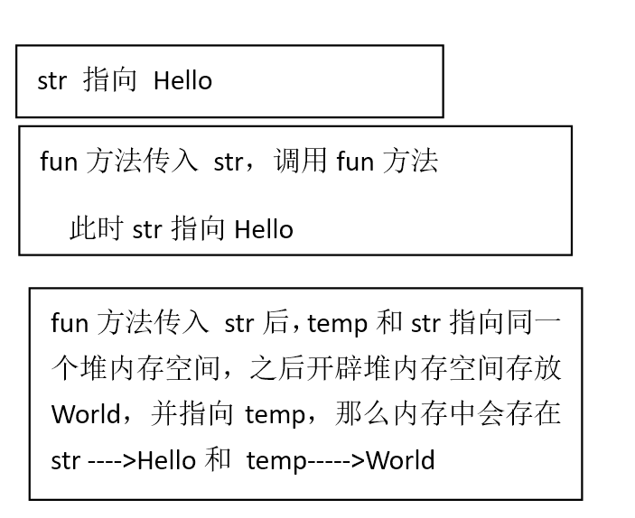

## 9.抽象类

**9.1抽象类的概念**

抽象类的定义；包含一个抽象方法的类.抽象方法是只声明而未实现的方法；所有的抽象方法必须使用abstract 声明；所有的抽象类也必须用abstract 声明；

```java
abstract  class CHWEN {//抽象类必须要有abstract  修饰.
	public  abstract  void fun();/*抽象方法也是由*abstract  修饰.而且不能加大括号.因为一旦加了大括*号就表示有方法体可以执行*/
}
```

```java
abstract  class CHWEN {//抽象类必须要有abstract  修饰.
	public  abstract  void fun();
//抽象方法也是由abstract  修饰.而且不能加大括号.
}
public  classDuotai {
	public  static  void main(String[] args) {
		CHWEN a =null;//声明对象
a=newCHWEN();
	}
}
//会提示CHWEN是抽象类.对象a不是A的实例化对象；

//即抽象类不能被实例化

```

对于抽象类来讲.不能直接进行实例化操作.但是可以声明.如果想要抽象类.则必须依靠子类.抽象类是必须被子类继承的.而且被继承的子类需要实现抽象类的全部抽象方法（方法的覆写） 

```java
abstract  class CHWEN {//抽象类必须要有abstract  修饰.
	public  abstract  void fun();//抽象方法也是由abstract  修饰.而且不能加大括号.
}
classABSextends CHWEN{	
}
public  class Chouxiang {
	public  static  void main(String[] args) {
		CHWEN a =null;
a=newCHWEN();
	}
}
```

```java
/**我们新建子类ABS.编译后提示我们
1：要么把ABS也变成抽象类
2：要么在ABS中添加覆写方法fun();覆写时要注意访问权限；
把ABS变为抽象类.我们依然得不到实例化对象a.所以只能在ABS中添加覆写方法；*/

abstract  class CHWEN {	
public  abstract  void fun();
}
class  ABS extends CHWEN{
	@Override//覆写
	public  void fun() {
	}
}
```

```java
abstract  class CHWEN {//抽象类必须要有abstract  修饰.
	public  abstract  void fun();//抽象方法也是由abstract  修饰.而且不能加大括号.
}
class  ABS extends CHWEN{
	@Override
	public  void fun() {
		// TODO Auto-generated method stub	
	System.out.println("你好！！");
	}
}

```

```java
public  class Chouxiang {
	public  static  void main(String[] args) {
		CHWEN a =null;
         ABS B= new ABS();
B.fun();
 ABS C=(ABS) a;
a.fun();
	}
}
```

注意：1.抽象类无法被实例化.所以也就不存在转型的问题.抽象类的子类（非抽象类）必须实现父类中的方法（fun()）的覆写；

2，抽象类中不一定包含抽象方法.但是包含抽象方法的一定是抽象类！

3，抽象类中的方法只是声明.不包含方法主体；所以抽象类要想实现方法必须通过子类方法的覆写来完成；

4，如果你想设计一个类.该类包含特别的成员方法.该方法的实现由他的子类确定.那么你可以在父类中声明该方法为抽象方法；

5，构造方法、类方法（用static 修饰的方法）不能声明为抽象方法。

6，被final生命的类不能被继承；

抽象类中可以存在构造方法,但是此构造方法不能被直接调用,是交给子类调用的；


```java
abstract  class CHWEN {//抽象类必须要有abstract  修饰.
	public  abstract  void fun();//抽象方法也是由abstract  修饰.而且不能加大括号.
public   CHWEN() {
	System.out.println("========================");}}
class  ABS extends CHWEN{
	public   ABS() {		//super();
		 System.out.println("************************");	 }
	public  void fun() {			System.out.println("你好！！");	}
	public  void fun2() {		System.out.println("你好yayayayayayay！！");	}}
public  class Chouxiang {
	public  static  void main(String[] args) {
         ABS B= new ABS();//创建子类的实例化对象.
B.fun();	}
}

```


```java
abstract  class CHWEN {// 抽象类必须要有abstract  修饰.
	String name;
	intage;
	public   CHWEN(String name. intage) {
		this.name = name;
		this.age = age;
	}
	public   String getName() {
		returnname;
	}
	public  void setName(String name) {
		this.name = name;
	}
    public  int getAge() {
		returnage;
	}
	public  void setAge(intage) {
		this.age = age;
	}
	public  abstract  void fun();
}
class ABS extends CHWEN {
	public   ABS(String name. intage) {
		super(name. age);
	}
	public  void fun() {			System.out.println(getName() + getAge());	}

	public  void fun2() {
		System.out.println("你好yayayayayayay！！");
	}
}

public  class Chouxiang {
	public  static  void main(String[] args) {
		ABS B = new ABS("张三". 100);// 创建子类的实力化对象."
//        B.setName("张三");
//        B.setAge(100);
		B.fun();
	}
}

public  void fun2() {
System.out.println("你好yayayayayayay！！");
	}
}
public  class Chouxiang {
	public  static  void main(String[] args) {
		ABS B = new ABS("张三". 100);// 创建子类的实力化对象."
//  B.setName("张三");无参时加这个
//  B.setAge(100);无参时加这个		B.fun();
	}}
```

在子类中创建实例化对象会永远是先调用父类中的构造方法；

实际上抽象类就是比普通类多了抽象方法；

我们在上述代码中添加几种属性---抽象类中的属性如果想要初始化.则肯定还是依赖构造方法；

**9.2抽象类的应用**

从对象多态性的概念上来讲.子类为父类实例化比较容易.因为可以发生自动向上的转型关系.那么调用的方法永远是被子类覆写过的方法；

那么.此时就可以利用此概念通过对象多态性为抽象类实例化；

```java
abstract  class Demo0{
	public  abstract  void fun();}//抽象方法1
	class Demo1 extends Demo0{//Demo1是抽象类的子类
	public  void fun() {		System.out.println("Demo1是抽象类的子类");	}
	public  void fun2() {		System.out.println("duyoudefangfa ");	}	}
public  class Chou {	public  static  void main(String[] args) {
	Demo0 a=new Demo1();//向上转型
a.fun();
        Demo1 b=new Demo1();
b.fun2();	}}
```


此时已经完成了抽象类的实例化操作；

我们来思考一下抽象类的实例化有什么应用呢？

我们新建三个类 人.老师.学生.

```java
abstract  class Person {
	String name;
	intage;
	public   Person(String name. intage) {// 人的构造方法
		this.name = name;
		this.age = age;
		System.out.println("调用人的构造方法");
	}
	public  abstract  void tell();// 抽象方法
	public   String getName() {
		Return name;
	}
	public  void setName(String name) {
		this.name = name;	}
	public  int getAge() {
		Return age;
	}
	public  void setAge(intage) {
		this.age = age;
	}
}
```

```java
class Student extends Person {
	floatscore;
	public   Student(String name. intage. floatscore) {// 学生构造方法
		super(name. age);// name 和age 继承父类的.score是学生自己的
		this.score = score;
		System.out.println("调用学生的构造方法");
	}
	public  float getScore() {
		returnscore;
	}
	public  void setScore(floatscore) {
		this.score = score;
	}
	@Override
	public  void tell() {
		System.out.println("我是学生" + getName() + "今年" + getAge() + "岁"+"期末成绩" + getScore() + "分");
	}
	public  void Score() {
	System.out.println( "可以调用score方法");
	}

}
```

如果子类中没有扩展属性方法时或者有但是不想调用时可以这么写.如果子类中有扩展.又想调用子类的扩展内容.则选择上述标红部分代码;
思考.抽象类的实例化的应用： 
比如：我们都读过一本书.但是我们对书的内容理解不一样.
     我们都会说话.但是说话的内容不一样.
我们设计一个类.该类包含特别的成员方法.该方法的实现由他的子类确定.那么你可以在父类中声明该方法为抽象方法；


```java
class Teacher extends Person {
	public   Teacher(String name. intage. floatsalary) {
		super(name. age);// 继承父类
		this.salary=salary;
		System.out.println("调用老师的构造方法");
	}	floatsalary;
	public  float getSalary() {
		returnsalary;
	}
	public  void setSalary(floatsalary) {
		this.salary = salary;
	}
	@Override
	public  void tell() {
		// TODO Auto-generated method stub
		System.out.println("我是老师" + getName() + "今年" + getAge() + "岁"+"这个月工资" + getSalary() + "元");
	}
	public  void Salary() {	
		System.out.println( "可以调用salary方法");
	}
}
public  class Yu {
	public  static   void tell(Person per) {
	 per.tell();
	    if( per   instanceof Student) {
	    Student per2=(Student) per; 
	    per2.Score();
//	    //向下转型
	    }
	    if (per   instanceof Teacher) {
		Teacher per2=(Teacher)per;
		per2.Salary();
	    }
	 }
	public  static  void main(String[] args) {
		// TODO Auto-generated method stub
//       Person per =new Student("张三丰". 20. 125.5f);//向上转型
//	 per.tell();
//	 Person per2 =new Teacher("张无忌". 45. 6000.8f);//向上转型
//	 per2.tell();
	tell(new Student("张三丰". 20. 125.5f));
	tell(new Teacher("张无忌". 45. 6000.8f));
	}
}

```

我们在上学的时候.都填写过以下表格

| 违纪卡 |      |      |      |
| ------ | ---- | ---- | ---- |
| 姓名   |      | 班级 |      |
| 日期   |      | 事由 |      |

空白的卡片没有任何意义；

我们需要按照表格的内容进行填写.

| 违纪卡 |      |      |      |
| ------ | ---- | ---- | ---- |
| 姓名   | 张三 | 班级 | 二班 |
| 日期   | 今天 | 事由 | 睡觉 |

以上程序的设计称为模板设计.所以抽象类本身最大的用处就在于模板设计


**9.21接口的应用**

了解接口：

Implements

是一个类实现一个接口用的关键字

实现一个接口

必须**实现接口中的所有抽象方法**

```java
interface ABC{
	public  void fun() ;
public  void fun2() ;
public  void funN() ;
}
classabcimplements ABC{
}

```

```java
interface ABC{
	public  void fun() ;		}
class abc implements ABC{
	@Override
	public  void fun() {		
			System.out.println("你好");	}
	}public  void fun2() {		
			System.out.println("你好");	}
	}public  void funN() {		
			System.out.println("你好");	}
	}
```

接口中的方法必须在实现接口的类中被覆写(如果该类不是抽象类).

接口可以被多重实现..抽象类只能被单一继承；

接口只有定义.而抽象类即可以有定义也可以实现；

接口的定义默认字段只有 public  static  final.抽象类默认是本包可访问；

接口的中的抽象方法不能有方法体.只能通过一个类去实现方法体

比如 接口ABC中的fun()方法通过abc类去实现 

```java
interface ABC{
	public  void fun() ;		}
class abc implements ABC{
	@Override
	public  void fun() {		
			System.out.println("你好");	}
	}
```

```java
interface ABC{
    public   void fun ();
}

class abc implements ABC{
    public   void fun() {
        System.out.println("你好呀");
    }
}
public   class Demo {
public   static   void main (String args[]) {
    ABC as=new abc();//为接口实例化
    as.fun();
}
}
```

接口也可以向抽象类那样通过对象多态性进行对象实例化操作；

抽象类可以用于定义模板操作.但是接口呢？

> 接口是作为一个标准存在的.例如电脑上的 USB接口.U盘接口.鼠标、键盘接口等也都实现了此标准； 

现实情况是.我们简化一下.电脑的USB接口被插入.电脑判断是什么东西插入

当插入U盘.U盘开始工作.读取U盘容量.拔出U盘.U盘结束工作；

当插入打印机时.打印机开始工作.读取打印机牌子.拔出打印机.打印机结束工作；


```java
interface USB{//定义USB接口
	public  void Start();//接口中的方法1
	public  void Stop();}
class Computer {
	public  static  void plugin(USB usb) {
	usb.Start();	usb.Stop();}}
class Flash implements USB{
//Flash 去实现这个接口
	public  void Start() {
		System.out.println("U盘开始工作");	}
		public  void Stop() {
				System.out.println("U盘已拔出");	}}

class Printin implements USB{
	public  void Start() {
		System.out.println("打印机开始工作");	}
		public  void Stop() {
		/		System.out.println("打印机结束工作");
	}}
public  class Demoooooo {
public  static  void main (String args[]) {
	Computer.plugin(new Flash() );	Computer.plugin(new Printin());}
}
```


```java
interface USB {//定义标准.接口中的方法由各类去实现
	public  void Start();
	public  void Stop();}
class Computer {
	public  static  void plugin(USB usb) {
		usb.Start();
		if (usb  instanceof Flash) {
			((Flash) usb).Read();		}
		if (usb  instanceof Printin) {
			((Printin) usb).Readline();		}
		usb.Stop();	}}
class Flash implements USB {
	public  void Start() {
		System.out.println("U盘开始工作");	}
		public  void Stop() {
				System.out.println("U盘已拔出");	}
	public  void Read() {
		System.out.println("U盘的容量是256g");
	}}
class Printin implements USB {
	public  void Start() {
		System.out.println("打印机开始工作");	}
		public  void Stop() {
	System.out.println("打印机结束工作");	}
	public  void Readline() {
		System.out.println("打印机的牌子是HP");	}
}

```


```java
public  class Demoooooo {
	public  static  void main(String args[]) {
		Computer.plugin(new Flash());
		Computer.plugin(new Printin());
	}
}
```

思考：方法中的参数可以是常量.也可以是某个实例化对象   比如 （类名 对象名）此时这种方式一般是用在接口或者抽象类中用于判断实例化对象属于 哪个类以便调用不同的方法;

**9.3 图形问题**

图形也可以表示出继承.抽象类.接口的关系

                                                         

继承关系.如果Person为抽象类.那么此时抽象类是用abstract  来标记的.但是从实际来说.抽象类也会用斜体的方式表示。

接口关系:就是用一个圆圈表示

​    

 

 

**9.31接口详解（重点）**

接口是一个特殊的类.在java中java由抽象方法和全局常量组成；

在java中使用 interface定义接口：

```java
interface Club{
	public  static  final String Info="China";
	public  abstract  void print();
	public  abstract  void print2();
}

```

在club接口中定义了一个全局常量.两个抽象方法.那么接口与抽象类一样.需要有子类.子类此时不再称为继承类.而是实现接口 


```java
interface Club{
	public  static  final String Info="China";
	public  abstract  void print();
	public  abstract  void print2();
}
class BBQ implements Club{//子类BBQ实现了接口Club
	public  void print() {
		// TODO Auto-generated method stub
		System.out.println("123456");
	}
	public  void print2() {
		// TODO Auto-generated method stub
		System.out.println(Info);
	}
}
public  class Jiekou {
	public  static  void main(String[] args) {
		
		BBQ b=new BBQ();
		b.print();
		b.print2();	
	}
}
```

接口定义时已经明确要求是由抽象方法和全局常量组成.那么在接口定义的时候就可以简化操作;

左右两边代码等效.即默认接口中定义的常量为全局常量方法为抽象方法；


```java
interface Club{
	public  static  final String Info="China";
	public  abstract  void print();
	public  abstract  void print2();
}
interface Club{
	 String Info="China";
	void print();
	public  void print2();
}
```

一个类虽然只能继承一个父类.但是可以同时实现多个接口.使用接口完成多继承的问题；

下面代码中子类BBQ实现了接口Club.Club2.

格式如下**class**子类名**implements**接口1名称.接口2名称.接口N名称{ 

```java
interface Club{
	 String Info="China";
	void print();
	void print2();
}
interface Club2{
	 String Info2="中国";
	void print3(); 
}
class BBQ implements Club.Club2{//子类BBQ实现了接口Club.Club2
	@Override
	public  void print() {
		System.out.println("123456");
	}
	@Override
	public  void print2() {
		System.out.println(Info);
	}
	@Override
	public  void print3() {
		System.out.println(Info2);
	}
}

```

如果一个类既要实现接口.又要继承抽象类的话.则必须按照以下的形式完成；

 class 子类 extends 抽象类 implements  接口A.接口B.接口N{ }//先继承抽象类.在实现接口          


```java
interface A{
	public  void printA();
	}
interface B{
	public  void printB();
}
abstract  class C{
	public  abstract  void printC();
}
class D extends C implements A.B{
//D继承抽象类.实现A.B接口
	public  void printB() {
	}
	public  void printA() {	
	}
	public  void printC() {		
	}
}

interface A{
	public  void printA();	}
interface B{
	public  void printB();}
interface X extends A.B{
//X继承了A.B两个接口	
public  void printX() {
	}}
abstract  class C{
	public  abstract  void printC();}
class D extends C implements A.B{
//D继承抽象类.实现A.B接口
	public  void printB() {
	}
	public  void printA() {	
	}
	public  void printC() {		
	}
public  void printX() {		
	}
}

```

一个抽象类可以实现多个接口.但是一个接口不能继承一个抽象类.

接口可以同时继承多个接口.这种在高级开发中常用到;

 

```java
interface A{
	public  void printA();	}
interface B{
	public  void printB();}
abstract  class C{
	public  abstract  void printC();
}
interface X extends A.B{//X继承了A.B两个接口
	public  void printX();
	}
class D extends C implements A.B.X{//D继承抽象类.实现A.B接口
		public  void printB() {
		System.out.println("妖精哪里逃");
	}
		public  void printA() {	
		System.out.println("我爱你.塞北的雪");
	}
		public  void printC() {		
	}
	public  void printX() {	//printx的覆写.
		System.out.println("实现接口");
	}}
public  class Learn {
	public  static  void main(String[] args) {
		A a =new D();		a.printA();
		B b =new D();		b.printB();
		X x=new D();		/*这里接口X要么借D类实现.要么添加一个其他类来实现.
		 * 为了代码简洁.一个类可以实现多个接口.所以最好在D类中实现 
	    */
		x.printX();
	}
}

```

**9.32接口实例**

新建一个接口 Window.新建一个类Mywindow去实现该接口：

```java
interface Window {
	public void Open();//打开窗口
	public void Close();//关闭窗口
	public void Min_icon();//最小化
	public void Max_icon();//最大化}
class My_window implements Window{	
}
```

在My_window类中肯定要覆写全部的方法.但是现在我希望可以根据自己的需要来选择性的覆写.那么该怎么去实现呢？

**9.321适配器设计**

用一个类先将此接口实现.但是所有的方法都属于空实现.之后在继承此类；

应该使用抽象类

```java
interface Window {
	public void Open();//打开窗口
	public void Close();//关闭窗口
	public void Min_icon();//最小化
	public void Max_icon();//最大化
}
abstract class Windows implements Window{
	public void Open() {//打开窗口
	}
	public void Close() {//关闭窗口
	}
	public void Min_icon() {//最小化
	}
	public void Max_icon() {//最大化
	}}

class My_window extends Windows{
public void Open() {//打开窗口
		System.out.println("打开窗口");	}
public void Min_icon() {//最小化
	System.out.println("窗口最小化");
}}
public class Lianxi {
	public static void main (String args[]) {
		Window win10=new My_window();
		win10.Open();
		win10.Close();//空方法
		win10.Min_icon();
	}
}
/*//用抽象类去实现接口.但是实现的方法为空（大括号不能省略）

 * 抽象类的定义：包含抽象方法的类一定是抽象类.但是抽象类不一定包含抽象方法

 * 抽象类

 */
```


这种情况我们可以自己需要选择去覆写的方法在实际情况中.这种方式成为适配器设计模式！

**9.322工厂设计模式**

观察以下代码.

```java
import java.util.*;
interface Fruits{
	public void eat();
}
class Apple implements Fruits{
	@Override
	public void eat() {
			System.out.println("烟台栖霞苹果真好吃");
	}}
class Pear implements Fruits{
	@Override
	public void eat() {
		System.out.println("烟台莱阳梨真好吃");
	}
}
public class Fruit {
	public static void main(String[] args) {	
		Fruits f = new Apple();
		f.eat();
	}
}
```


以上代码如果开发.会有问题出现；主方法实际上就是一个客户端.客户端的代码越简单越

这里如果我们换成梨.那么底层代码就要换.即更改子类.

所以在程序设计师要加入一个中间过渡的类 我们称之为 工厂类；

```java
interface Fruits{
	public void eat();}
class Apple implements Fruits{
	public void eat() {
		System.out.println("烟台栖霞苹果真好吃");	}}
class Pear implements Fruits{
	@Override
	public void eat() {
		System.out.println("烟台莱阳梨真好吃");	}}
class Factory{//这样我们在更改子类的时候就不需要去修改客户端.
	public static Fruits getFruits(String classname) {
		Fruits f =null;
		if("Apple".equals(classname)){
			f = new Apple();
			f.eat();
		}
		if ("Pear".equals(classname)) {
			f = new Pear();
			f.eat();
		}
		return f;
	}
}

}
public class Fruit {
	public static void main(String[] args) {	
	Fruits f = Factory.getFruits(args[0]);//需要传入一个参数才能正常编译否则传回空指向异常
			}
```

**以上设计案例叫** **工厂设计模式**

这样我们在更改子类的时候就不需要去修改客户端.但是还有一个问题.当我们输入其他水果时候.会返回空指向异常.所以我们还需要加代码来处理此问题。在java中.所有接口实例化对象都是通过工厂类取得的.那么客户端调用的时候根据传入的数据不同.完成的功能也不同。

```java
if("Apple".equals(classname)){
			f = new Apple();
			f.eat();
		}
```


通过字符串 的匿名对象调用方法

```java
public class Nullable {
public static void main(String args[]) {
	String str = "Hello";
	System.out.println(str.equals("Hello"));
//	String str2 =null;
//	System.out.println(str2.equals(null));//空指向异常
	String str3 =null;
//要将某一个字符串跟空值比较编译时不会出错
	System.out.println("Hello".equals(str3));}	
}
//空指向异常的思考

//如果是遇到字符串比较.永远把字符串常量写在前面。

//这是一种避免出现空指向异常的方法。

```

**9.323代理设计模式**

现在有一种情况.

例如：张扬属于老好人.也不差钱.马跃向张扬借了10000块.规定一年后还.一年之后.当张某再次向 马某讨债的时候.张某在无奈之下找到 范某.范某经营一家讨债公司.基本上手法：刀子。手枪

范某为了成功的把钱讨回来.准备好了笑道.绳索.钢筋.钢锯

马某害怕了.之后还钱

债讨回来了.范某要销毁罪证。

张某 -----范某------讨债     

**代理设计模式**                                 

讨债工作由范某完成但是真正的债主是张某范只是代理张某去完成讨债工作；所以在java中我们将这种设计模式称为**代理设计模式；**


     

```java
interface Give {
	public void giveMoney();}
class RealGive implements Give {
	public void giveMoney() {
		System.out.println("还钱");	}}
class ProxyGive implements Give { // 讨债公司
	private Give give = null;
	public ProxyGive(Give give) {
		this.give = give;	}
	public void Before() {
		System.out.println("准备工具");	}
		public void giveMoney() {
				this.Before();
		this.give.giveMoney();// 代表真正讨债者完成讨债
		this.After();
	}
	public void After() {
		System.out.println("销毁罪证");
	}}
public class Nullable {
	public static void main(String args[]) {
		Give give = new ProxyGive(new RealGive());
		give.giveMoney();
	}
}

```

**9.324.集成设计模式**

将多个类集合到一个大类，形成一个整体；举个例子，一台电脑--台式机，台式机有什么组成？-

```java
class Cpu {}
class Disk {}
class Dianyuan {}
class Xianshiqi {}
class Jianpan {}
class Zhuban {
	private Cpu cpu;
	private Disk disk;}
class Zhujixiang {
	private Zhuban zhuban;
	private Dianyuan dianyuan;
}
class Computer {
	private Zhujixiang zhujixiang;
	private Xianshiqi xianshiqi;
	private Jianpan jianpan;
}
public class Myfun {
	public static void main(String args[]) {
	}   }


```

**9.4抽象类与接口的区别（重点）**


从以上的表格中可以发现如果抽象类和接口同时都可以使用的话.应该优先使用接口.因为接口可以避免单继承的局限。 


```java
abstract class Person {
	public abstract void fun();
	interface D{//内部接口
	}
}

abstract class Demo0 {
	public abstract void fun();// 抽象方法1
	interface A {
		public void print();	}}
class B1 extends Demo0 {// 虽然有内部接口但是当我们继承父类时还没有用到接口
	public void fun() {
	System.out.println("******************");	}
	class Y implements A {
	public void print() {
	System.out.println("--------------");		}	}
}

public class Chou {
	public static void main(String args[]) {
		Demo0 d = new B1();
		d.fun();
		Demo0.A e = new B1().new Y();
		e.print();
	}
}


```

```java
abstract class Demo0{
	public abstract void fun();//抽象方法1
interface A{	
}
	}
class B1 extends Demo0{//虽然有内部接口但是当我们继承父类时还没有用到接口
	public void fun() {
	System.out.println("******************");
	}
}
public class Chou{
	public static void main (String args []) {
		Demo0 d=new B1();
		d.fun();
	}
}

```

既然接口在抽象类内部.那么只能在类的内部去实现.

但是这种代码非常不容易理解.用的很少；


**9.5方法的重载与覆写的区别**


| NO   | 比较点   | 重载                                | 覆写                          |
| ---- | -------- | ----------------------------------- | ----------------------------- |
| 1    | 英文单词 | Overload                            | Override                      |
| 2    | 概念     | 方法名称相同.参数类型或者数量不一样 | 方法名相同.参数类型和数量相同 |
| 3    | 注意点   |                                     | 访问权限不能变小              |
| 4    | 范围     | 在一个类中                          | 在继承类中                    |

**9.51类的多态性**

在JAVA中类的多态很常见正是有了多态性的概念.才让程序变得更加灵活；

多态性是java中面向对象的最后一个特征；

方法的重载和方法的覆写实际属于多态性的一种.真正的多态性还包含一种称为对象多态性的概念

对象多态性主要是指子类和父类的相互转换关系

向上转型： 父类 父类对象 =子类实例 -------自动完成

向下转型：子类 子类对象 =（子类）父类实例 ----强制完成 

```java
class A{
	public  void fun1() {
		System.out.println("第一个A类中的fun方法");}
	public  void  fun2() {		this.fun1();	}}
class B extends A{
	public  void fun1() {//fun1的覆写
		//super.fun1();调用父类中的fun1方法
		System.out.println("第一个B类中的fun方法");}
	public  void fun3() {
		System.out.println("子类自己的fun方法");	}}
public  class Duotai {
	public  static  void main(String[] args) {
//B b =new B(); b.fun2();A a=b;//发生向上转型.子类实例变为父类
    A a =new B();//发生向上转型.子类实例变为父类.与上一行代码一样
	a.fun2();
	//a.fun3();//A类中没有fun3.那么就没法调用B类中的fun3
	}}


```

```java
class A{
	public  void fun1() {
System.out.println("第一个A类中的fun方法");	}
	public  void  fun2() {		this.fun1();	}}
class B extends A{
	public  void fun1() {//fun1的覆写
	System.out.println("第一个B类中的fun方法");	}
	public  void fun3() {
		System.out.println("子类自己的fun方法");}}
public  class Duotai {
	public  static  void main(String[] args) {
	B b =new B();		b.fun3();
     A a =new B();//向上转型 那么a不能调用B类中fun3().a要想调用fun3().只能向下转型
     B c = (B)a;//向下转型.这个时候c中有fun3()
c.fun3();//这时候c可以调用fun3()
	c.fun2();	}

}


```

我们发现只要调用fun1()一定是找被覆写过的方法;

再来看以下的程序：


```java
public  static  void main(String[] args) {
//	B b =new B();	
//	b.fun3();
//     A a =new B();//向上转型 那么a不能调用B类中fun3().a要想调用fun3().只能向下转型
//     B c = (B)a;//向下转型.这个时候c中有fun3()
//     c.fun3();
//	c.fun2();
		Aa =newA();//在A中建立实例 a
		B b=(B)a;//将实例a强制向下转型
		b.fun1();
          b.fun2();
b.fun3();
	}


```

将上面代码main之前的保持一致.修改main方法下面的代码：编译可以编译.但是无法执行.因为出现了类型转换异常.因为我们在父类中建了实例化对象a. 将其强制转换为 B中的实例.会出现类型转换异常.我们可以这样理解.刨除A类以外的代码.A不知道自己的子类是谁.所以也就不能让他随便调用即使B中覆写了A中的方法； 


通过以上代码我们可以总结如下：

由子类实例花父类可以.由父类实例化子类就会出现类型转换异常；

一些异常代码提示：

class cast exception 类型转换异常 java：30  原因为两个没有关系的类相互转换造成的

Null point er Exception 空指向异常      原因为用空null去调用属性和方法.             

例如现在要求设计一个方法,此方法可以接收A类的所有子类的实例（即A类所有子类的实例都可以调用该方法通过**方法重载**完成）这里回顾一下方法重。。。。。

> 方法的重载.如果有很多子类.那么这种方式有明显短板,这时就体现出java中多态性的优点了.所有的子类都向父类靠拢且是自动转换；那么我们就可以在A类中建立方法.在子类中覆写


在不使用对象多态性的条件下.代码如下：

```java
class A {
	public  void fun1() {
		System.out.println("第一个A类中的fun方法");}
	public  void fun2() {
		this.fun1();	}}
class B extends A {
	public  void fun1() {// fun1的覆写
System.out.println("第一个B类中的fun方法");
	}
	public  void fun3() {
		System.out.println("子类自己的fun方法");
	}
}
class C extends A {
	public  void fun1() {// fun1的覆写
	System.out.println("第一个C类中的fun方法");
	}
	public  void fun4() {
		System.out.println("C子类自己的fun方法");
	}
}
public  class Duotai {
	public  static  void fun(B b) {
		b.fun1();
		b.fun2();
		b.fun3();	}
	public  static  void fun(C c) {
		c.fun1();
		c.fun2();
		c.fun4();	}
	public  static  void main(String[] args) {
		fun(new B());
	}
}

```

```java
class A {
	public  void fun1() {
		System.out.println("第一个A类中的fun方法");
	}
	public  void fun2() {
		this.fun1();
	}
}
class B extends A {
	public  void fun1() {// fun1的覆写
		// super.fun1();调用父类中的fun1方法
		System.out.println("第一个B类中的fun方法");
	}
	public  void fun3() {
		System.out.println("子类自己的fun方法");
	}
}
class C extends A {
	public  void fun1() {// fun1的覆写
		// super.fun1();调用父类中的fun1方法
		System.out.println("第一个C类中的fun方法");
	}
	public  void fun4() {
		System.out.println("C子类自己的fun方法");
	}
}
public  class Duotai {
	public  static  void fun(A a) {//建立静态方法
		//a.fun1();
		a.fun2();
	}
	public  static  void main(String[] args) {
		fun(new B());//传进B类中实例化对象
fun(new C()); //传进C类中实例化对象
	}
}


```

这种方式与上一种方式相比.对象方法不用修改.省去了多次方法重载的操作.

另一个.为什么要建立静态方法？

因为我们在main方法中使用了static  .static  只能由static  修饰的来访问；

但是以上的操作也会出现一个小的问题：

这样我们只能调用被覆写过的方法.子类自己的方法没法被调用.要想调用.看以下代码.当出现多个子类时.而子类又想调用自己独有的方法.那么仍然会出现类型转换异常；

```java
public  class Duotai {
	public  static  void fun(A a) {//建立静态方法
		a.fun2();
		B b=(B)a;
		b.fun3();
		C c=(C)a;
		c.fun4();
	}
	public  static  void main(String[] args) {
		fun(new B());//传进B类中实例化对象
        fun(new C()); //传进C类中实例化对象
	}
}

```

以上仍然会出现类型转换异常.那么现在希望如果传入B类.则调用B自己独有的方法fun3().如果传入C类.则调用C自己独有的方法fun4()；那么想要完成这样的功能则需要判断传进的对象到底是哪一个类的实例；

在java中提供了  instanceo 关键字完成这样的功能；

代码格式如下：

对象  instanceof 类   返回值为boolean类型数据.（true或者false） 

```java
public  class Duotai {
	public  static  void fun(A a) {//建立静态方法
		//a.fun();//有静态修饰符的属性、方法中不能用super和this调用
		a.fun2();		if (a  instanceof B) {		B b=(B)a;		b.fun3();}
		if(a  instanceof C) {		C c=(C)a;		c.fun4();}	}
	public  static  void main(String[] args) {
		fun(new B());//传进B类中实例化对象fun(new C()); //传进C类中实例化对象	}}

```

在这种情况下.我们发现如果子类都有自己的独有方法.那么if语句要写好多遍.那么这种情况只适用于子类不扩充方法的情况；

我们得出结论.在继承关系的设计中父类的设计很重要.只要父类设计合理子类代码开发就会非常简便；

## 10.万象鼻祖Object类

**10.1.Object类**

在Java中.一切都是继承关系.如果一个类没有明确指定继承哪个类.则默认情况下就是继承自Object类.class Person{
 }

实际这个类改写成如下形式

class Person extends Object{}


```java
class Plant extends Object {
}
public class Xuexi {
	public static void main(String[] args) {
		// TODO Auto-generated method stub
		Object obj =new Plant();
		Object obj2="hello";
		}
}
```

那么.对于Object类接收.不光可以接收类的引用.也可以接收其他引用比如数组 

```java
interface National{};//定义接口
class Plant extends Object implements National{	}
public class Xuexi {
	public static void main(String[] args) {		int i[]= {1.2.3};
		National na =new Plant();
		Object obj2=na;//用obj接收实例na
		National temp =(National)obj2;
		Object obj =i;//使用Objec接收数组
		int x[]=(int[])obj;//向下转型
		for (int j=0;j<i.length;j++) {
			System.out.print(x[j]+".");
		}
		}
}

```

```java
interface National{};//定义接口
class Plant  implements National{}
public class Xuexi {
	public static void main(String[] args) {
		
		int i[]= {1.2.3};
		National na =new Plant();
		Object obj2=na;//用obj接收实例na
		National temp =(National)obj2;
		Object obj =i;//使用Objec接收数组
		int x[]=(int[])obj;//向下转型
		for (int j=0;j<i.length;j++) {
			System.out.print(x[j]+".");
		}
		}
}
```

上面两处代码一样

Object 类的功能不止于此.对于一个完整的类来讲.应该覆写Object类中的以下三个方法.

toString() 对象打印时调用

equals() 对象比较时调用.实际上String类就已经覆写好了此方法

hashcode() 输出哈希值

**10.2.toString()**

```java
class Plant  {
}
public class Xuexi {
	public static void main(String[] args) {
		System.out.println(new Plant());
		}
}


```

```java
class Plant  {
}
public class Xuexi {
	public static void main(String[] args) {
		System.out.println(new Plant().toString());
		}
}

```

观察以上代码.输出结果一样.都是返回new Plant() 地址（因为没有参数）.所以我们在打印输出时调用的方法就是toString();

当我们覆写toString()方法后我们                                                 

```
class Plant  {
	public String toString() {//覆写了Object类中的toString()方法
		return "Hello.java";
	}
}
public class Xuexi {
	public static void main(String[] args) {
		System.out.println(new Plant().toString());	}}


```

**10.3.equals()**


```java
class Plant  {
	String name;	int age;
	public boolean equals(Object obj) {
		if (this==obj) {			return true;		}
		Plant pla=(Plant )obj;
		if (this.name.equals(pla.name)&&this.age==pla.age) {
			return true;		}
		else {			return false;		}	}
	public Plant(String n.int a) {
		this.name=n;
		this.age=a;	}
	public String toString() {
		return "姓名："+this.name+"年龄"+this.age;	}}
public class Xuexi {
	public static void main(String[] args) {
		System.out.println(new Plant("Rose".12).toString().equals(new Plant("Rose".12)));
	}}

```

以上代码为覆写过的equals().我们发现.如果代码中标绿的部分换成其他内容.比如”hello”.那么程序在编译的时候不会提示错误.因为 newPlant()与Hello 都是Object类接收的.但是在cmd中执行的时候会出现  类型转换异常。 

## 11.内部类

```
内部类：在一个类的内部还有另外一个类.

```

内部类也可以在方法之中。此时内部类如果要想访问外部类的数据.那么外部类的属性必须为final修饰的；在java1.8之后如果内部类在方法体中.那么内部类调用外部类的属性.默认外部类的数据为final修饰。

内部类的格式：

class A {       cass B{}    }

```
 
内部类唯一的好处就是可以访问外部类的私有成员;

```

```java
class Outer {
	private String name = "Hello World!!! ";
	class Inner {
		public void print() {
			System.out.println(name);
		}
	}
	public void fun() {
		new Inner().print();		}
}

public class Lequ {
	public static void main(String[] args) {
		Outer in = new Outer();
		in.fun();
	}
}


```

```java
class Outer1 {
	private String name = "Hello World!!! ";
	public String getName() {
		return name;
	}
	public void fun() {
		new Inner1(this).print();
			}
}
	class Inner1 {
		private Outer1 out1;
		public Inner1(Outer1 out1) {
			this.out1=out1;
		}
		public void print() {
	System.out.println(this.out1.getName());
		}
	}

public class Lequ1 {
	public static void main(String[] args) {
		// TODO Auto-generated method stub

		new Outer1().fun();
		
	}

}
```


如果将内部类移到外面.那么会增加哪些步骤呢?如上述标黄的部分.
如果在外部想产生内部类的实例.则必须保证外部类的属性被初始化.而且外部类也必须先产生一个实例
外部类.内部类  内部类对象=外部类实例 new 内部类();

```java
class Outer {
	private String name = "Hello World!!! ";
	public void fun() {
		new Inner().print();
			}
	class Inner {		
		public void print() {
			System.out.println(name);
		}
	}
}

public class Lequ {
	public static void main(String[] args) {
		
		Outer out =new Outer();
Outer.Inner in= out.new Inner();//实例化内部类
in.print();

	}
}
```

内部类经编译后生成的文件如下图所示:


如果一个内部类在外部类的方法之中.那么编译生成的文件有什么变化?


可不可以这样实例化内部类呢?

Outer.Inner in= **new** Outer. Inner();呢？

这么写是错误的.如果把内部类变为静态内部类.为了能正常运行.私有成员也加上static修饰.那么程序可以正常执行.此时静态内部类就相当于一个外部类.这时就可以通过外部类.内部类来使用


```java
package org_chwenyulim_order;

 class Outer {
	private  String name = "Hello World!!! ";
	
	public void fun() {
		class Inner {			
			public void print() {
				System.out.println(name);
			}
		}
		new Inner().print();
			}
	}

public class Lequ {
	public static void main(String[] args) {
		new Outer().fun();
	}
}

```

> 在方法中定义内部类.可以直接访问外部类的各个成员.但是如果要访问方法中的参数.则在参数上要使用final关键字声明;不过在Jdk1.8之后如果没有加 final修饰.则默认为final修饰;


```java
 class Outer {
	private  String name = "Hello World!!! ";
	public void fun(int temp) {
		class Inner {			
			public void print() {
            //Int temp2=2;
              //temp +=temp2;
				System.out.println(temp);
				System.out.println(name);
			}
		}
		new Inner().print();			}
  }
public class Lequ {
	public static void main(String[] args) {
		//Outer.Inner oi=new Outer().new Inner();
		new Outer().fun(30);
	}
}

```

静态类分为局部内部类.成员内部类以及静态内部类(静态内部类不能存在于外部类方法之中.因为内部类在加载时会在产生内部类实例的时候加载.如果没用到内部类.则不会加载.而静态修饰的在运行时就会被加载到内存中.这与内部类的特点不一致.所以….) 

```java
 class Outer {
	private  String name = "Hello World!!! ";
	public static  void fun() {
		//static class Inner0{错误的
					}
		class Inner1 {	//局部内部类		
			public void print() {
				//System.out.println(temp);
				System.out.println(name);
			}
		}
		new Inner1().print();
			}
	class Inner{//成员内部类
		
	}
	static class Inner1{//静态内部类	
	}
 }
public class Lequ {
	public static void main(String[] args) {
		Outer.Inner oi=new Outer().new Inner();
		new Outer().fun();
	}
}


```

**11.1匿名内部类**

匿名内部类是在抽象类和接口的基础上发展起来的.看代码.如果B类只使用一次.那么此时有必要将其单独定义一个类么？

**匿名内部类**

```java
interface A {
	public void fun();
}
class B implements A {
	@Override
	public void fun() {
			System.out.println("helloworld");
	}
}

class C {
	public void fun1(A a) {
		a.fun();
	}
	public void fun2() {
		this.fun1(new B());
	}
}
public class Lequ {
	public static void main(String[] args) {
		new C().fun2();
	}
}


```

```java
package org_chwenyulim_order;

interface A {
	public void fun();
}
class C {

	public void fun1(A a) {
		a.fun();
	}

	public void fun2() {
		this.fun1(new A() {
			public void fun() {
				System.out.println("Hello World!!!");
			}
		});
	}
}
public class Lequ {
	public static void main(String[] args) {
		new C().fun2();
	}
}

```

```
在一般的开发中匿名内部类很少使用.现在只有两种情况下可以经常看见匿名内部类.一个是

```

```
Java的图形界面上

```

```
Spring 开发框架上

```

```

```

**11.2匿名对象**

匿名对象：只使用一次的对象称为匿名对象.使用一次之后就会被回收。

```java
public class Lequ {
	public static void main(String[] args) {
		C c=new C();
		c.fun2();
	}
}

```

```java
public class Lequ {
	public static void main(String[] args) {
		new C().fun2();
	}
}

```

右面代码框中的new C();即为匿名对象.匿名对像没有地址.当使用完之后就会被系统回收.左边的代码中的对象有地址；
匿名对象的格式： new 类名();


## 12.方法详谈

方法 在其他的语言中也成为函数.他们的功能是一样的。

**12.1方法的基本概念**

方法是一段可以调用的代码段.在java中如果某些代码希望可以被重复调用时就可以使用方法进行定义.但是在定义时因为现在要求所有的方法是可以有住房那个发直接调用的.所以.此时的方法声明格式如下：

public  返回值类型 方法名称(参数列表){     }

return 返回值;//此时返回值的类型不为  void

对于返回值来讲.在java中返回值类型可以是基本数据类习惯也可以是引用数据类型.如果一个方法不希望有任何的返回值.则返回值类型定义为 void.


无返回值的方法： 

```java
public class Lequ {
	public static void main(String[] args) {
	Fun();
	Fun();
	Fun();
	}
		public static  void Fun() {
System.out.println("helloworld");
		}
}

```

有返回值的方法：

```java
public class Lequ {
	public static void main(String[] args) {
	System.out.println(Fun());
	}
		public static  int Fun() {
			int result =0;
			for (int i=0;i<=100;i++) {
				result +=i;			}
			return result;
		}
}

```

在无返回值的方法之中也可以用return返回方法的调用处--即结束该方法的执行;

```java
public class Lequ {
	public static void main(String[] args) {
	System.out.println("HelloworldFun()");
		Fun();
	}
		public static  void Fun() {
			int result =0;
			for(int i =0;i<51;i++) {
			result+=i;
			if (result ==55) {
				return  ;//返回方法调用处.即下面的部分被执行
			}
			}
		System.out.println("不被执行的"+result);
		}
}

```

**12.2方法的重载（深入认知）**

在方法的操作中有一个特别重要的概念就是方法的重载.即方法名称相同但是参数的个数不同或类别不同；

```java
public class Lequ {
	public static void main(String[] args) {
	Fun(50);		Fun(100.0f);
	}
		public static  void Fun(int X) {
			int result =0;
			for(int i =0;i<X;i++) {
			result+=i;
			}
		System.out.println(+result);
				}
		public static  void Fun(float X) {
			int result =0;
			for(int i =0;i<X+1;i++) {
			result+=i;
			}
		System.out.println(result);
		}
}

```

```java
public class Lequ {
	public static void main(String[] args) {
	Fun(50);		Fun1(100.0f);
	}
		public static  void Fun(int X) {
			int result =0;
			for(int i =0;i<X;i++) {
			result+=i;
			}
		System.out.println(+result);
				}
		public static  void Fun1(float X) {
			int result =0;
			for(int i =0;i<X+1;i++) {
			result+=i;
			}
		System.out.println(result);
		}
}

```


方法的重载好处.避免方法的的重复.如果参数不同.那么我就要写不同的方法名.不如第一种方便.不管如何操作.都是完成的相同操作的.那么这个时候完全就可以用方法的重载完成。
**方法的重载---** 

```java
public class Lequ {	public static void main(String[] args) {
		System.out.println(1);
		System.out.println('林');
		System.out.println(3.1415926d);
		System.out.println(1.1f);
		System.out.println(2==3);
		}
}
//System.out.println();可以打印不同的数据类型.这也说明System.out.println()也被重载了；
```

```java
public class Lequ {
	public static void main(String[] args) {
	Fun(50);		Fun(100);
	}
		public static  int Fun(int X) {
			int result =0;
			for(int i =0;i<X;i++) {
			result+=i;
			}
		return result	;			}
		public static  float Fun(int X) {
			int result =0;
			for(int i =0;i<X+1;i++) {
			result+=i;
			}
		return result;
		}
}/**gai方法不算是方法的重载.因为方法名一样.参数一样.虽然返回值类型不一样.但是这并不是方法的重载；
方法的重载只要求方法名一样.参数类型或者个数不同；
当参数一样的时候.就失去了方法重载的意义；*/


```

**12.3方法的递归调用**

方法的递归调用即一个方法不断去调用自己的过程；举个例子.比如for循环中1到100的和

```java
public static  int Fun() {
			int result =0;
			for(int i =0;i<100;i++) {
			result+=i;
			}

```

如果用方法的递归的方式去完成.如果想使用递归调用.一定要注意递归调用的结束条件；

```java
public class Lequ {
	public static void main(String[] args) {
	System.out.println(Fun(0));
	System.out.println(Fun2(100));
	}
		public static  int Fun(int X) {
			if (X<=10) {				
				return (X+Fun(X+1)); 
			}else {
				return 0;
			}
}
		public static  int Fun2(int X) {
			if (X>0) {
			return (X+Fun2(X-1)); 
			}else {
				return 0;
			}
}
}

```

注意.在一般的开发中不建议过多的使用递归调用.因为有肯可能会造成内存的溢出；

> 因为这会使得计算机将每一次计算得到的结果都保留在内存中,如果这样的操作过多会造成内存溢出;

**12.4方法与数组**

之前所有的操作代码中.所有的方法都是接收了 普通的数据类型.当然一个方法本身也可以接收引用数据类型.所以在方法中对数组所做的一切都会被保留下来；


```java
public class Lequ {

   public static void main(String[] args) {

   int x[]= {1.2.2.3.4.5};

   print(x);//接收数组

}

   public static void print(int temp[]) {//此方法接收数组

      for (int i=0;i<temp.length;i++) {

       System.out.println("temp["+i+"]"+temp[i]);

      }  }}
```

以上的操作可以画成 


X和temp都指向同一个空间。

既然方法可以接收数组.那么方法也可以返回一个数组

```java
public class Lequ {
	public static void main(String[] args) {
	int x[]= UN();//通过方法取得内容
	print(x);//接收数组}
	public static void print(int temp[]) {//此方法接收数组
		for (int i=0;i<temp.length;i++) {
			System.out.println("temp["+i+"]"+temp[i]);
		}	}
	public static int [] UN() {
		int y[]= {1.2.3.4.5.6};
		return y;
	}}

```

如果方法返回数组的话直接在返回值类型处明确的写出要返回的数组类型即可； 

```java
public class Lequ {
	public static void main(String[] args) {
	int x[]= UN();//通过方法取得内容
   x[0]=6;//修改第一个元素
	print(x);//接收数组
}
	public static void print(int temp[]) {//此方法接收数组
		for (int i=0;i<temp.length;i++) {
			System.out.println("temp["+i+"]"+temp[i]);
		}	}
	public static int [] UN() {
		int y[]= {1.2.3.4.5.6};
		return y;
	}}

```

上面代码在内存中的状态为： 


实际上这就是数组的引用传递。 

**12.5与数组相关的方法（重点**）

在学习数组经常会出现数组的排序操作.java中也提供了数组排序的方法

```java
import java.util.Arrays;
public class Lequ {
	public static void main(String[] args) {
		int a[]= {11.22.33.44.55.66.77.88.99};
		int b[]= {111.222.333.444.555.666.777.888.999};
		int c[]=Arrays.copyOfRange(a. 3. 6);
		System.arraycopy(a. 1. b. 2. 3);//将b的3到5为元素替换为a的2到4号元素
	int x[]= UN();//通过
	Arrays.sort(x);
	int[] Z=Arrays.copyOf(x. 3);
	System.out.println("--c为a中从序号3到序号6（不含6）的拷贝--");
	print(c);
	System.out.println("--Z为x排序后的从序号0到3（不含3）的拷贝--");
	print (Z);
	System.out.println("--b为将b的3到5为元素替换为a的2到4号元素--");
	print(b);//接收数组
}
	public static void print(int temp[]) {//此方法接收数组
		for (int i=0;i<temp.length;i++) {
			System.out.println("temp["+i+"]"+temp[i]);
		}
	}
	public static int [] UN() {
		int y[]= {17.1.12.0.-1.47.9};
		return y;
	}
}

```

 

System.arraycopy(源数组. 源数组起始点.目标数组. 目标数组起始点.拷贝个数);的参数意义

java语言在开发中的三个分支

1，java SE ;java基础核心部分

2，javaEE；java的企业开发平台

3，javaME；java的嵌入式开发

Java属于编译和解释型语言集合

编译 javac命令

解释 java命令

java实现可移植性指的是JVM.各个操作系统的不同JVM以达到程序独立于平台

Java的特点：可移植性.简单.多线程.面向对象.垃圾回收

## 13.this 关键字

this 关键字是 Java 常用的关键字.可用于任何实例方法内指向当前对象.也可指向对其调用当前方法的对象.或者在需要当前类型对象引用时使用。


```java
class Plant {
	private  String name;
	private int age;

	public  void Sell() {
		System.out.println("这颗植物的名字" + name + "这颗植物的年龄" + age);
	}
	public  void setName(String name) {	
		this.name=name;
	}
	public  void setAge(int age) {	
		if (age>=0&&age<=100) {
			this.age=age;
		}
	}

```

**13.1.this.属性名**

大部分时候.普通方法访问其他方法、成员变量时无须使用 this 前缀.但如果方法里有个局部变量和成员变量同名.但程序又需要在该方法里访问这个被覆盖的成员变量.则必须使用 this 前缀。以上面的代码为例.假设有一个Plant类.

在构造的setter方法中的参数和给出的成员变量之间重名的时候.就需要用this来区分两者；

以标红部分**this**.name=name;为例.等号右边为参数 name.等号左边表示成员变量name.这行代码表示将参数name传递给成员变量；

提示：当一个类的属性（成员变量）名与访问该属性的方法参数名相同时.则需要使用 this 关键字来访问类中的属性.以区分类的属性和方法中的参数。

**13.2this.方法名**

this 关键字最大的作用就是让类中一个方法.访问该类里的另一个方法或实例变量。 

```java
class Dog{
	public  void Run() {
		System.out.println("调用run方法");	}
	public  void Jump() {
		Dog d=new Dog();
		d.Run();
		System.out.println("正在执行 run 方法");
	}	
}
public  classDogTest {
	public  static  void main(String[] args) {
		// TODO Auto-generated method stub
Dog dog =new Dog();
dog.Run();
dog.Jump();
	}
}
```

 

上面的程序中.一共产生了两个 Dog 对象.在 Dog 类的 run( ) 方法中.程序创建了一个 Dog 对象.并使用名为 d 的引用变量 (d.Run())来指向该 Dog 对象。在 DogTest 的 main() 方法中.程序再次创建了一个 Dog 对象.并使用名为 dog 的引用变量来指向该 Dog 对象。

我们发现在dog引用Jump()方法时产生了两个Dog的实例化对象；

在  jump( ) 方法中调用 方法时是否一定需要一个 Dog 对象？---答案是肯定的.因为因为没有使用 static   修饰的成员变量和方法都必须使用对象来调用。

是否一定要在Jump()方法中产生一个实例化对象d呢？

不一定.因为当程序调用 run( ) 方法时.一定会提供一个 Dog 对象.这样就可以直接使用这个已经存在的 Dog 对象.而无须重新创建新的 Dog 对象了。因此需要在 run() 方法中获得调用该方法的对象.通过 this 关键字就可以满足这个要求。

this 可以代表任何对象.当 this 出现在某个方法体中时.它所代表的对象是不确定的.但它的类型是确定的.它所代表的只能是当前类的实例。只有当这个方法被调用时.它所代表的对象才被确定下来.谁在调用这个方法.this 就代表谁。所以上方的代码可以修改为：


```java
class Dog{
	public  void Run() {
		System.out.println("调用run方法");
	}
	public  void Jump() {
		this.Run();
		System.out.println("正在执行 run 方法");
	}	
}
public  classDogTest {
	public  static  void main(String[] args) {
		// TODO Auto-generated method stub
Dog dog =new Dog();
      dog.Run();
      dog.Jump();
	}
}

```

从第一种 Dog 类定义来看.在 Dog 对象的 Jump() 方法内重新创建了一个新的 Dog 对象d.并调用它的 Jump( ) 方法.这意味着一个 Dog 对象dog的 Jump() 方法需要依赖于另一个 Dog 对象d的 Run( ) 方法.这不符合逻辑。
第二种 Dog 类定义是当一个 Dog 对象调用 Jump( ) 方法时.Jump( ) 方法需要依赖它自己的  Run( )方法.与第一种定义类的方法相比.更符合实际情形。
在现实世界里.对象的一个方法依赖于另一个方法的情形很常见.例如.吃饭方法依赖于拿筷子方法.写程序方法依赖于敲键盘方法。这种依赖都是同一个对象两个方法之间的依赖。因此.Java 允许对象的一个成员直接调用另一个成员.可以省略 this 前缀。也就是说.将上面的 run( ) 方法改为如下形式也完全正确。 

```java
class Dog{
	public  voidRun() {
		System.out.println("调用run方法");
	}
	public  void Jump() {
		//Dog d=new Dog();
	Run();
		System.out.println("正在执行 run 方法");
	}	
}
public  class UPDOWN {
	public  static  void main(String[] args) {
		// TODO Auto-generated method stub
      Dog dog =new Dog();
dog.Run();
dog.Jump();
	}
}
```

大部分时候.一个方法访问该类中定义的其他方法、成员变量时加不加 this 前缀的效果是完全一样的。

注意：对于 static   修饰的方法而言.可以使用类来直接调用该方法.如果在 static   修饰的方法中使用 this 关键字.则这个关键字就无法指向合适的对象。所以.static   修饰的方法中不能使用 this 引用。并且 Java 语法规定.静态成员不能直接访问非静态成员。

省略 this 前缀只是一种假象.虽然程序员省略了调用 jump() 方法之前的 this.但实际上这个 this 依然是存在的。

**13.3this().构造方法**

this( ) 用来访问本类的构造方法

注意：

在构造方法中使用时.必须是第一条语句。同super调用父类的构造方法

> this( ) 不能在普通方法中使用.只能写在构造方法中。 

```java
public  class Student {
    String name;
// 无参构造方法（没有参数的构造方法）
public   Student() {
this("张三");//这里this调用构造方法this( ) 不能在普通方法中使用.只能写在构造方法中。
    }
// 有参构造方法
public   Student(String name) {
this.name = name;
    }
// 输出name和age
public  void print () {
        System.out.println("姓名：" + name);
    }
public  static  void main(String[] args) {
        Student stu = new Student();
stu.print ();
    }
}

```

```java
class Person{
	private int age;
	private String name;
	public Person() {
		System.out.println("调用无参构造方法");	}
	public Person(String name) {
		this();//调用无参的构造方法
		this.name=name;
		System.out.println("调用一个参构造方法");	}
	public Person (String name.int age) {
		this(name);//调用有一个参数的构造方法
		this.age=age;
		System.out.println("调用两个参构造方法");	}
	public int getAge() {
		return age;	}
	public void setAge(int age) {
		this.age = age;	}
	public String getName() {
		return name;	}
	public void setName(String name) {
		this.name = name;	}}
public class Lequ {
	public static void main(String[] args) {
	Person per =new Person("zzy".28);
	System.out.println(per.getName());	
	}	}

```

如果有多个构造方法.那么我们避免了再次写this.name=name.this.age=aged等类似的代码.直接调用被已有的其他构造方法中的属性去完成操作。

所有的构造方法都是在对象操作前最早调用的.所以用this调用的构造方法必须放在构造方法第一位（首行）上.如下图.把this(name);放在this.age=age;后则编译时提示：this的调用必须是构造方法中的第一个；


既然this()调用的构造方法在构造方法第一位.那么我可不可以这样呢？在无参的构造方法中也调用一个构造方法？我这样写.在无参的构造方法Person()中首行加入this(“2”.3).编译后会提示递归调用；


这表明在使用this()调用构造方法时必须保证至少有一个构造方法没有使用this()调用；而此构造方法就将为调用的出口.一般这个出口会使用无参构造去完成。

以上是this使用最多的几种用法.但是this也有一个最重要的概念------表示当前对象.当前正在调用类中的方法的对象称为当前对象；


**13.4this表示当前对象**

来看以下代码：

 

```java
class Person{
	public void print() {
		System.out.println(this);
	}
}
public class Lequ {
	public static void main(String[] args) {
	
	Person per =new Person();
	System.out.println(per);
		per.print();	}	}

```

```java
class Person {
	public void print() {
		System.out.println(this);
	}
}

public class Lequ {
	public static void main(String[] args) {
		Person per = new Person();
		System.out.println(per);
		per.print();
		Person per2 = new Person();
		System.out.println(per2);
		per2.print();	}}

```


编译运行后this和per.per2的内存地址一样.所以this表示当前正在调用方法的对象.谁调用就是谁.如果有多个则this指向多个对象。那么之前this.属性名中的this就表示当前对象的属性

```java
class A {
	private B b=null;
	public void fun() {
		this.b= new B(this);
		this.b.fun();
	}
	public void print() {
		System.out.println("Hello World");
	}
}
class B{
	private A a =null;
	public B (A a) {
		this.a=a;	}
	public void fun() {
		this.a.print();	}}
public class Lequ {
	public static void main(String[] args) {
		new A().fun();
	}}

```

this 的详细分析

```
class A {
	private B b=null;
	public void fun() {
		this.b= new B(this);
		//括号里的this指向当前调用的匿名对象new A()
		//括号外的this指向当前调用属性的对象new B(this)
		this.b.fun();//通过实例化的对象b去调用B中的fun()方法
		System.out.println(this);
		//this的内存地址org_chwenyulim_order.B@c2e1f26
	}
	public void print() {
		System.out.println("Hello World");	}
}
class B{
	private A a =null;
	public B (A a) {//B类的构造方法--传入一个实例化对象
		this.a=a;	}
	public void fun() {
		this.a.print();//此时this指向实例化对象a
		System.out.println(this);
		//org_chwenyulim_order.A@dcf3e99
	}
}
public class Lequ {
	public static void main(String[] args) {
		new A().fun();
		//new B(new A()).fun();
		//System.out.println(new B(new A()));
			}}


```

**13.5this与super的**

| NO   | 比较点 | this                                                         | super                                                        |
| ---- | ------ | ------------------------------------------------------------ | ------------------------------------------------------------ |
| 1    | 属性   | this.属性表示的是本类属中的性，如果在子类中找不到属性则会从父类中查找 | super.属性表示的是直接找到父类属中的性                       |
| 2    | 方法   | this.方法表示的是本类属中的方法，如果在子类中找不到方法则会从父类中查找 | super.方法表示的是从子类直接找到父类中被子类覆写过的方法     |
| 3    | 构造   | 可以调用本类中的其他构造方法，但是要求至少有一个构造方法没有被this引用，调用构造方法时，this要放在首行 | 从子类调用父类的构造方法，子类不管ruhr编写，则肯定要先调用父类的构造方法，调用父类构造方法时，super要放在首行 |
| 4    |        | this表示当前对象                                             |                                                              |

所以this和super不能同时出现;

**题目练习**

使用运行时参数的形式完成一个简单的登陆程序：

例如：输入Lequ 用户名 密码

假设用户名是 ABC 密码是123，如果正确则显示登陆成功，否则显示登录失败

程序的开发思路：

①完成基本功能

②改善功能，加入一些验证

③形成更好的结构，加入一些类的设计

注意：要求主方法中不能编写过多的代码

```java
public class Lequ {
	public static void main(String[] args) {
		String name = args[0];// 取出用户名
		String password = args[1];// 取出密码
		System.out.println("请输入同户名和密码--");
		if (name.equals("Chwenyulim") && password.equals("abc")) {
			System.out.println("---欢迎来到德莱联盟---");
		} else {
			System.out.println("登录失败");
		}
	}
}

```

因为我现在要求用户输入两个参数，如果用户输入呢？

为程序加入验证：

本程序如果想要正确执行去执行，则必须保证输入的参数个数是两个，

```java
public class Lequ {
	public static void main(String[] args) {
		if(args.length!=2) {//检测用户输入是否为两个参数
			System.out.println("输入的参数不正确");
		System.exit(1);}//系统退出，只要设置了一个非0的数字
		String name = args[0];// 取出用户名
		String password = args[1];// 取出密码
		System.out.println("请输入同户名和密码--");
		if (name.equals("Chwenyulim") && password.equals("abc")) {
			System.out.println("---欢迎来到德莱联盟---");
		} else {
			System.out.println("登录失败");
		}	}}
class Login{
	private String args[];
	public Login(String args[]) {
		this.args=args;	}
	public boolean validate() {
String name = this.args[0];// 取出用户名
String password = this.args[1];// 取出密码
		if (name.equals("Chwenyulim") && password.equals("abc")) {System.out.println("---欢迎来到德莱联盟---");			return true;
} else {	System.out.println("登录失败");

			return false;	}	}}
public class Lequ {
	public static void main(String[] args) {
		if(args.length!=2) {//检测用户输入是否为两个参数
			System.out.println("输入的参数不正确");
			System.exit(1);}//系统退出，只要设置了一个非0的数字
		System.out.println(new Login(args).validate()?"登录成功":"登录失败");	}}
```

实际上上面的代码改完之后，主方法里面的代码还是比较多，那么我们要添加类去完成主方法中的操作以减少主方法中的代码数量；这样我们在修改登陆方法的时候就不用去修改主方法了 ;

```java
class Login {
	private String name;	private String password;
	public Login(String name, String password) {
		this.name = name;		this.password = password;	}
	public boolean validate() {
		if (name.equals("Chwenyulim") && password.equals("abc")) {
			return true;
		} else {
			System.out.println("登录失败");
			return false;	}	}}
class Operate {// 操作类要完成其他辅助操作--去验证
	private String args[];
	public Operate(String args[]) {
		this.args = args;
		if (args.length != 2) {// 检测用户输入是否为两个参数
			System.out.println("输入的参数不正确");
			System.exit(1);// 系统退出，只要设置了一个非0的数字
		}	}
	public String getInfo() {
		if (new Login(this.args[0], this.args[1]).validate()) {
			return "登录成功";
		} else {
			return "登录失败";
		}	}}
public class Lequ {
	public static void main(String[] args) {
		System.out.println(new Operate(args).getInfo());
	}}

```

在实际情况中，登陆界面只要符合我设计的规则就可以正常登录，程序是怎样进行判断的，用户不知道；所以以后修改程序时就不用修改登陆界面了；

所以程序的一种设计思路是本来由A到B，我在中间加一个C，变成由A到C 再到B
C就为操作类用于完成一些辅助比如验证等

## 14.static关键字

```java
class PersonA {
	private String name;
	private int age;
	String city ="A城市";
	public PersonA(String name,int age) {
		this.name=name;
		this.age=age;	
	}
	public String getInfo() {
		return "姓名"+this.name+"年龄"+this.age+"城市"+city;
	}
}
public class Lequ {
	public static void main(String[] args) {
		PersonA per=new PersonA("张三",28);
		PersonA per1=new PersonA("李四",26);
		PersonA per2=new PersonA("王五",24);
		System.out.println(per.getInfo());
		System.out.println(per1.getInfo());
		System.out.println(per2.getInfo());
	}
}

```

从以上代码来看，存在以下问题：

city属性表示的信息都是一样的，所以对于各个对象来即那个内容重复了；

   如果现在假设将A城更名为B城，而且此类已经产生了500个对象，那么就需要修改500次代码，所以此时最好将city更改成公共属性------ static修饰；

```java
class PersonA {
	private String name;
	private int age;
	static String city ="A城市";
	public PersonA(String name,int age) {
		this.name=name;
		this.age=age;		
	}
	public String getInfo() {
		return "姓名"+this.name+"年龄"+this.age+"城市"+city;
	}
}
public class Lequ {
	public static void main(String[] args) {
		System.out.println("------信息修改之前------");
		PersonA per=new PersonA("张三",28);
		PersonA per1=new PersonA("李四",26);
		PersonA per2=new PersonA("王五",24);
		System.out.println(per.getInfo());
		System.out.println(per1.getInfo());
		System.out.println(per2.getInfo());
		System.out.println("------信息修改之后--------");
		per1.city="B城";//公共属性通过一个对象修改
		System.out.println(per.getInfo());
		System.out.println(per1.getInfo());
		System.out.println(per2.getInfo());	}}

```

**14.1.数据在内存中的空间分配**

从代码中我们能可以发现我们只修改了一个就把之后的所有（PersonA对象）都更改为我想要的B城，

数据在内存中的空间分配情况--如下图


一般情况下使用static声明的属性都使用类名称直接调用，形式如下 

类名称.static属性那么以上代码修改city就变成了PersonA.city=”B城”;

实际上编译器也会提示：

**14.2静态属性的访问**

对于静态属性基本上都是使用类名称进行访问；

使用static修饰的静态方法也可以用类名称进行访问。

如果我们把city属性修改称为静态私有属性那个，那么我们应该怎么做呢？ 

```java
class PersonA {
	private String name;
	private int age;
	private static String city = "A城市";// 静态私有属性
	public PersonA(String name, int age) {
		this.name = name;
		this.age = age;	}public static void setCity(String c) {
// 静态方法去掉用静态属性
		city = c;	}
	public String getInfo() {
		return "姓名" + this.name + "年龄" + this.age + "城市" + city;	}}public class Lequ {
	public static void main(String[] args) {
		System.out.println("------信息修改之前------");
		PersonA per = new PersonA("张三", 28);
		PersonA per1 = new PersonA("李四", 26);

		System.out.println(per.getInfo());
		System.out.println(per1.getInfo());
		System.out.println("------信息修改之后--------");
		PersonA.setCity("B城");
	System.out.println(per.getInfo());
	System.out.println(per1.getInfo());	}}
```

在使用静态方法时需要注意以下几点：


static方法调用的方法只能调用使用static修饰的方法和属性，即静态方法中不能引用非静态变量。但是非静态的方法可以调用静态的方法和属性，如果把代码中静态方法setCity()中调用非静态属性，

为什么会有以上限制呢？

静态方法可以通过所在类直接调用而不需要实例化对象，类中的非静态变量为一个对象的属性，只有产生实例化对象才有可能调用存在于内存中所以静态方法不能引用非静态属性；

**14.3.main方法详解**

如果一个方法要想由主方法直接调用，则必须声明格式为：

public **static** 

返回值类型

void 方法名(){    }   

```java
public class Lequ {

   public static void main(String[] args) {

      fun(); }

   public static void fun() {

      System.out.println("前------");  }}

```

```java
public class Lequ {
	public static void main(String[] args) {
		new Lequ().fun();
	}
	public  void fun() {
		System.out.println("前------");
	}
}

```

如果我们去掉fun()中的static 会发生什么？

如图片所示；

编译后有提示：无法从静态上下文中引用非静态方法fun();   因为主方法 main为static修饰，如果想要访问则必须产生一个实例化对象new Lequ()来访问fun()方法。（主方法独立于类之外）


主方法上也带有static，那么主方法的含义是

public static void main(String[] args) 

public---表示最大的权限，所有人都可以访问；

static 因为执行的时候就是执行的类名称，所以表示可以有类名称直接调用

void 因为主方法是一切的起点，执行之后就回不去了，所以表示没有返回值

main 系统内建的方法； 

```java
public class Lequ {
    public static void MMain(String[] args) {
               fun();    }
    public static void fun() {
     System.out.println("前------");
    }
}
/*当我们把main方法修改为别的如MMain我们编译完后执行会提示我们找不到main方法，所以也就表明main方法是系统内建的默认开始执行的入口。*/

```

String args[] 是一个字符串数组，用于接收参数。

**14.4.程序的执行**

程序是怎么执行的呢？ 

```java
public class Lequ {
	public static void main(String[] args) {
		for (int i=0;i<args.length;i++) {
		System.out.print(args[i]+",");	
		}	}}

```


​                                                                                                                                                

java Lequ 参数1,参数2,参数3，参数n(参数之间可以用“,”隔开也可以用空格隔开)

当我们输入 **Hello World**时会输出 Hello，World，此时编译器按照两个参数处理，我们本希望Hello World 为一个参数，那么此时该怎么办呢？只需要变成”Hello World”( Hello World上加双引号)；即用双引号来引用一个完整的参数；


**14.5程序的内存划分**

程序的内存划分为：

①栈内存 --  对象名称 实际上是对象对堆内存引用地址

②堆内存 --  属性

③全局代码区 --  保存所有的操作方法

④全局数据区 -- 保存所有的static属性

**14.6.static的一些相关应用**

**14.61.统计产生实例个数**

static可以统计产生多少个实例化对象，或者查看该方法被调用了多少次； 

```java
class Pers {
	static int count=1;	String name;
	public Pers(String name) {
		this.name = name;count++;	}
	public void Print() {
		System.out.println("大家好，我是"+this.name+"我是第"+count+"名对象");
			}}
public class Shilihua {
		public static void main(String[] args) {
Pers per =new Pers("张三");
Pers per1 =new Pers("李四");
Pers per2 =new Pers("王五");
per.Print();per1.Print();per2.Print();	}}

```

**14.62.static实现自动命名**

```java
class Pers {
	static int count=1;
	String name;
	public Pers(String name) {
		this.name = name;
		System.out.println("大家好，我是"+this.name+"我是第"+count+"名对象");
		count++;
	}
	public void Print() {	
	}
}
public class Shilihua {
	
	public static void main(String[] args) {
Pers per =new Pers("张三");
Pers per1 =new Pers("李四");
Pers per2 =new Pers("王五");
per.Print();
per1.Print();
per2.Print();
	}
}

```

```java
class Pers {
	static int count=1;
	String name;
	public Pers() {
		this.name = "NoName--"+count;//自动命名
		count++;	}
	public Pers(String name) {	
		this.name=name;	}
	public void getInfo() {
		System.out.println( "大家好，我是"+this.name);	}}
public class Shilihua {
	public static void main(String[] args) {
new Pers().getInfo();
new Pers("张三").getInfo();
new Pers().getInfo();	}}

```

**14.7阶段总结：**

①String 类的基本概念：

两种实例化方式的区别：

一个字符串就是一个String的匿名对象；

String 的内容一旦声明无法改变；

String类的相关操作方法

②引用数据的传递

③this关键字

this调用属性，this调用方法

this调用构造，只能放在当前构造的首行

this表示当前对象，当前正在操作类中的方法的对象

④对象的比较（重写equals()）

⑤static关键字
全局变量的声明
static声明的静态方法不能调用非静态属性
static声明的属性或方法可以直接通过类去调用而不用产生实例化对象
⑥super关键字，
1调用父类的构造（当前构造方法的第一行，所以(super与this)在调用构造方法时不能同时出现）
2调用父类属性或方法
⑦构造方法私有化--单例设计
⑧程序的的设计思路   操作类去完成辅助功能如程序登陆界面


## 15.代码块

在Java中，使用{}括起来的代码称为代码块，根据代码块的定义位置不同以及声明的关键字不同可以分为一下四种；

普通代码块；

构造代码块；

静态代码块；

同步代码块；

**15.1普通代码块**

直接在一个方法中出现的{    }就称为普通代码块

```java
public class Shilihua {
	public static void main(String[] args) {
		int x=10;
		System.out.println("x="+x);
		int x =100;
		System.out.println("x="+x);}}
```


```java
public class Shilihua {
	public static void main(String[] args) {
if(true){
		int x=10;
		System.out.println("x="+x);}
		int x =100;
		System.out.println("x="+x);}}
		

```

上方的代码在编译时会提示重复定义了变量x因为第一个x为局部变量，只能在if这个语句中起作用；当我们把if语句去掉代码变成如下：

```java
public class Shilihua {
	public static void main(String[] args) {
{
		int x=10;
		System.out.println("x="+x);}
		int x =100;
		System.out.println("x="+x);}}	
```

**15.2构造代码块**

构造代码块是在构造方法中的代码块--------构造代码块随着构造方法的执行而执行，而且构造快优先于构造方法执行。

```java
class Pers {	
		public Pers() {	
		System.out.println("构造方法代码块");
	}
{//构造块
		System.out.println("构造代码块");
	}          }
public class Shilihua {
	public static void main(String[] args) {
		new Pers();
		new Pers();
		new Pers();	}}


```

**15.4静态代码块**

使用static声明的代码块，主要目的是为静态属性初始化；

```java
class Pers {
	public static void fun() {
		System.out.println("其他类中的静态方法");
	}
	static {
		System.out.println("其他类中的静态代码块-1");
	}
}public class Shilihua {
	public static void fun2() {
		System.out.println("主类中的静态方法");	}
	static {
		System.out.println("主类中的静态代码块-1");	}
	public static void main(String[] args) {
		Shilihua.fun2();
		Pers.fun();
	}
}

```


静态代码块的执行顺序--如果类中有静态块，则静态块先执行，静态块优先于主方法执行，静态块优先于构造方法执行；

如果我们不用主方法可以打印出现HelloWorld!!吗？

```java
public class Shilihua {
	 static{
		 System.out.println("HelloWorld");	}
	public static void main(String args[]) {
	}
}
```


## 16.final关键字

**16.1final关键字的应用**

final关键字可以用作以下的声明；

①声明类：声明的类不能有子类

```java
final class A{
}
class  B extends A{
}

```


 

②声明属性：声明的属性不能被修改，如果声明变量--声明的变量就为常量

```
public class Lequ {
        public static void main(String args[]) {
    final int a=12;
 System.out.println(a++);
    }}

```

```
public class Lequ {
    public static void main(String args[]) {
   final String name="林春雨";
     name="zhangsan";
     System.out.println(name);
        }}

```


③声明方法：声明的方法不能被子类覆写； 

```
 class A{
 final void fun() {
}}
class B extends A{
	public void fun(){
	}}
public class Shilihua {
	static int a=12;	 
	public static void main(String args[]) {
		System.out.println(a++);
	}}

 abstract class A{
 abstract final void fun();
}
class B extends A{
@Override
	final void fun() {
		}
}


```


当为抽象类中的抽象方法时，也会提示错误，因为抽象方法必须被子类覆写，但是用final修饰的方法不能被子类覆写；所以抽象方法只能由public或者protect修饰；

接口中的属性修饰就是final，  即public static final int age =18；常常在接口中不写 public static final而直接写 int age=18；

```
interface C{
    int age =18;
    public void fun();
}
class B implements C{
    public void fun() {
                System.out.println(age++);
    }   }

public class Lequ {
            public static void main(String args[]) {
        C c= new B();
        c.fun();
    }
}


```


在java中如果使用final声明一个常量的话，为了规范，常量的标识符最好全部大写，在声明常量时必须给常量赋值，因为系统不会再次为常量赋值；即如下代码，而且name最好大写；

④全局常量

在Java中也存在一种很重要的概念--全局常量

修饰语法格式  static final 数据类型 变量名=赋值  public static final int AGE=18;

 

使用final最大的好处--

保证一些数据不被改变，因为继承最大的弊端就是破坏封装行，子类能访问父类的实现细节，而且可以通过方法的覆写形式修改实现细节；

只要满足以下条件就可以将一个类设计成final类：

1，某个类不是专门为继承而设计的；

2，出于安全考虑，类的实现细节不允许改动；

3，确信该类不会被扩展；

## 17.String类

**17.1.String类**

关于String类要掌握以下内容：

①String 有两种实例化方式；

②String 的两种比较方式(==)和.equals()；

③String两种实例化方式的区别；

④String的使用特点；

在写代码时我们发现

String

是首字母大写，说明

String

是一个类，既然是一个类，那么就会存在构造方法；

**17.1.1.String的两种实例化方式**

我们来看String的两种实例化方式：

在String类中定义了如下的构造方法：

Public String (String original)

表示可以接收一个String类的对象，并重新实例化String对象；除了此方法之外，String还可以采用直接赋值的方式进行对象的实例化；

```java
public class Shilihua {
	public static void main(String args[]) {
	String str1="hello";//使用直接赋值的方式完成
	String str2=new String("helloworld");//通过构造方法完成
	System.out.println(str1+str2);//字符串连接操作
	}
}

```

**17.1.2.String的两种比较方**式

```java
public class Shilihua {
	public static void main(String args[]) {
	String str="hello";
	String str1=str;//使用直接赋值的方式完成
	String str2=new String("hello");//通过构造方法完成
	String str3=str2;


```

```java
	if(str1==str) {
		System.out.println("str与str1一样");	}
	else {	System.out.println(str1+str);}
	if(str2.equals(str3)) {
	System.out.println("str2与str3一样");	}
System.out.println(str==str2);
	}}

```


我们由运行结果，我们从内存中分析一下：

实际上==比较的是两个对象的地址是否相等，

具体的讲师比较地址的值，因为地址是以数字

的形式存在的。

但是我们真正要比较的不是地址的值而是两个字符串的内容，所以现在就需要用equals()来完成比较---String类中的.equals()方法已经被覆写过了，可以用于直接比较内容，其他类中的.equals()方法还是用于比较地址，如需比较内容，则需要重新覆写.equals()方法。


```java
public class Shilihua {
	public static void main(String args[]) {
	String str="hello";
	String str1=str;
	String str2=new String("hello");
	String str3=str2;
	System.out.println(str.equals(str1));
	System.out.println(str.equals(str3));
	}}


```

equals()方法覆写形式如下：

public boolean equals(String str)

此时因为三个字符串内容完全相等，所以

此时equals()比较的是字符串的内容。

以上是==与.equals()的区别

**17.1.3.String的匿名对象**

一个字符串就是String的匿名对象--一个字符串事由双引号括起来，那么一个字符串常量实际就属于String的一个匿名对象；

既然是匿名对象，那么此匿名对象就可以调用String中的所有方法；

```java
public class Shilihua {
	public static void main(String args[]) {
	String str="hello";
	System.out.println("hello".equals(str));
		}}


```


**17.1.4.String两种实例化方式的区别**

所有的操作以内存的形式表示出来；

我声明了一个字符串 String str1=”hello”;

 

 

现在在堆内存空间中之开辟了一个空间，不会产生多余的内容.

如果现在我用new的方式，我们来看内存中的情况

String str =new String(”hello”);

由于”hello”为匿名字符串，那么会在堆内存中开辟一个空间，随后又用new再次开辟一次空间，此次空间的内容就为当前的参数内容”hello”，那么使用new开辟空间后字符串就没有在被使用，就成了垃圾；

使用new在内存中的开辟情况如图：


```java
public class Shilihua {
	public static void main(String args[]) {
	String str="hello";
	String str1="hello";
	String str2="hello";
	System.out.println("str==str1>>>"+(str==str1));	
	System.out.println("str1==str2>>>"+(str1==str2));	
	System.out.println("str==str2>>>"+(str==str2));	
		}
}

```

所以在开发中一般不调用String(String org)的构造方法，而且如果使用直接赋值的 方式也可以减少堆内存的开销。   


实际上以上三个对象表示的是同一个空间的引用，因为对于String来讲，使用赋值的方式会在字符串池中保存内容，如果之后再声明字符串的时候如果 内容一样，则不会重新开辟空间而是从内存池中取出继续使用；


 

```java
public class Shilihua {
	public static void main(String args[]) {
	String str="hello";
str+="world";	
	System.out.println(str);		}}


```

字符串数据一旦声明，就无法修改

 

我们分析以上代码在内存中存在的状态，首先开辟了堆内存空间--指向str，之后又通过str+=”world”操作，我们发现” world”是一个字符串，既然是字符串那么就是String的匿名对象，也会在堆内存中开辟空间，通过str+=”world”操作使得str指向了一个新的堆空间”helloworld”,之后str断开了与堆空间”hello”的连接,但是原来定义的内容没有被修改而是通过操作使得原有的栈内存空间地址指向一个新的堆内存空间。

实际上来讲，字符串变量的改变改变的是内存空间的地址指向，而本身的字符串内容没有改变。

所以在开发中以下的操作代码一定要避免；


**17.1.5.String类的注意事项**

以下代码：

```java
public class Shilihua {
	public static void main(String args[]) {
		String str = "hello";
		for (int i = 0; i < 100; i++) {
			str += i;
			System.out.println(str);
		}	}}
//这样的程序要避免，因为str会断开并重新指向100次，也就可能产生其他不必要的垃圾空间！！！
```

以上代码一定要避免使用，因为效率很低！！！

**17.2.String类的常用操作方法（重点）**

**17.2.1字符与字符串**

在各个语言中实际上一个字符串就是表示一组字符

所以在String类中提供了字符与字符串的转换操作

1，根据字符串的索引找到指定位置的字符串---   public char charAt(int index)

2，将字符串转换成字符数组---- public char[] toCharArray()

3，将字符数组转换成字符串----

①将全部的字符数组变为String类型，--String(char[] value)

②将部分的字符数组变为String类型--String(char[] value, int offset, int count) 其中offset为开始点

​                                                               

范例1：取出字符串中指定位置的字符：

```java
public class Shilihua {
	public static void main(String args[]) {
		String str = "helloword";
	System.out.println(str.charAt(5));
	}
}

```

范例2：将字符串转换成字符数组 

```java
public class Shilihua {
	public static void main(String args[]) {
		String str = "helloword,helloworld";
		char []c = str.toCharArray();
		for (char d : c) {
			System.out.print(d+"\\\\");
		}	}}


```

```java
public class Shilihua {
	public static void main(String args[]) {
		String str = "helloword,helloworld";
		char[] c = str.toCharArray();//将字符串变为字符数组
		String str1 = new String(c);//将字符数组重新变为字符串
		String str3 = new String (c,1,3);//从字符串数组中从序号1开始取3个长度元素作为字符串
		String str2 = str1.toString();
		System.out.println(str2);
		System.out.println(str3);
	}}


```

**17.2.2.字节与字符串**

与字符数组的操作一致，一个字符串可以变为一个字节数组，一个字节数组也可以变为字符串；

String-------字节数组：public byte[] getBytes(String charsetName)

字节数组------String：

①：public void getBytes(int srcBegin,int srcEnd,byte[] dst,int dstBegin)

②：public byte[] getBytes()

范例：字符串变为字节数组

```java
public class Shilihua {
	public static void main(String args[]) {
		String str = "he+";
		byte [] c = str.getBytes();//将字符串变为byte数组
		for (byte b : c) {
			System.out.println(b+"\t");
		}
		String str2 =new String(c);//将byte数组变为字符串
		System.out.println(str2);
	}
}


```


**17.2.3指定的字符串开头/结尾的判断**

1，指定的字符串开头---startsWith(String prefix)

2，指定的字符串结尾--  endsWith(String suffix)

范例--验证

```java
public class Shilihua {
	public static void main(String args[]) {
		String str = "**Hello World!!!##";
		System.out.println(str.startsWith("**"));
		//判断字符串是否已某一字符串开始
		System.out.println(str.startsWith("o", 6));
		//判断某一位是否是某一个字符串
		System.out.println(str.endsWith("##"));
		//判断字符串是否已某一字符串结尾
			}}

```

**17.2.4.替换字符串内容**

使用以下的方法可以完成替换操作--

public String replaceAll(String regex,String replacement)

范例：替换内容

```java
public class Shilihua {
	public static void main(String args[]) {
		String str = "**Hello World!!!##";
		String str2= str.replaceAll("l", "x");
		System.out.println(str2);
	}
}

```

**17.2.5.字符串截取**

使用以下方法可以截取字符串：

①从某一位开始截取到末尾--public [String](file:///C:/Users/linch/Desktop/jdk-15.0.1_doc-all/docs/api/java.base/java/lang/String.html) substring(int beginIndex)

②从某一位截取到某一位截止--public String substring(int beginIndex,int endIndex)

范例--截取字符串

```java
public class Shilihua {
	public static void main(String args[]) {
		String str = "**Hello World!!!##";
		String str2=str.substring(7);
		//从序号为七的位置开始截取
		System.out.println("str2>>>>"+str2);
		String str3=str.substring(2, 6);
		//从序号为2截取到序号为6（不包含6）
		System.out.println("str3>>>>"+str3);
	}}


```

**17.2.6.字符串拆分**

将字符串按照指定内容拆分

public String)[] split(Stringregex)

public String[] split(String regex,int limit)

 

范例--字符串拆分

```java
public class Shilihua {
	public static void main(String args[]) {
		String str = "Heollo Worlod!!!";
		String str2[] = str.split(" ");
		//将字符串按照某一内容拆分,同时去掉该字符串
		for (String string : str2) {
			System.out.println(string);		}
		String str3[] = str.split("o", 3);
	//将字符串按照某一内容拆分成多少个，同时去掉该字符串
		for (String string : str3) {
			System.out.println(string);		}	}
}

```

**17.2.7.字符串查找**

如果需要在一个字符串中查找是否存在制定内容，可以使用一下的两个方法：

1，取得字符串的位置 ----第一次出现的位置

--public int indexOf(String str)

从字符串开头开始返回第一次出现的指定的字符串在次字符串中的索引

--public int indexOf(String str,int fromIndex)

从指定索引开始返回第一次出现的指定的字符串在次字符串中的索引

2，取得字符串的位置--最后一次出现的位置

--public int indexOf(String str)

--public int indexOf(String str,int fromIndex)

```java
public class Shilihua {
	public static void main(String args[]) {
		String str = "When I eigihteen years old!!";
		int X=str.indexOf("e", 4);
		//从序号为4的开始查找为e的字符串的位置
		System.out.println(X);
		int Y=str.indexOf("l");
		//从头查找第一次出现该字符串的位置的
		System.out.println(Y);
		int X1=str.lastIndexOf("n");
		//从头查找最后一次出现该字符串的位置的
		System.out.println(X1);
		int Y1=str.lastIndexOf("i", 18);
		//从头到序号为18的位置查找最后一次出现该字符串的位置的
		System.out.println(Y1);
			}}

```

3,查找字符串是否包含某一字符串

public boolean contains(CharSequence s)

范例-检查是否包含某一字符串

```java
public class Shilihua {
	public static void main(String args[]) {
		String str = "When I eigihteen years old!!";
		boolean flag=false;
		flag=str.contains("ee");//检查是否包含某字符串
		if (flag=true) {
			System.out.println("该字符串包含“ee”");
		System.out.println("“ee”字符串的位置"+str.indexOf("ee"));
		}else {
			System.out.println("该字符串不包含“ee”");
		}	}}


```

```java
public class Shilihua {
	public static void main(String args[]) {
		String str = "years old!!";
		int Y = str.indexOf("oold");
		// 从头查找第一次出现该字符串的位置的，如果未找到则返回-1
		if (Y != -1) {
			System.out.println("该字符串的位置为" + Y);
		} else {
			System.out.println("未找到该字符串");
		}	}}
```

**17.2.8.字符串的其他操作**

去掉左右空格：public String trim()

取得字符串长度：public int length()

检查字符串是否为空--即长度为0  public boolean isEmpty()

检查字符串是否空或者只包含空格   public boolean isBlank()

字符串转大写public String toUpperCase()

字符串转小写public String toLowerCase(Locale locale)

```java
public class Shilihua {
	public static void main(String args[]) {
		String str = "  （Years Old!!）  ";
		String str2 = str.trim();// 去掉左右空格
		String str3 = "  ";
		String str4 = str3.trim();
		System.out.println("str去掉左右空格为" + str2);
		System.out.println("str长度" + str.length());
		System.out.println("str4是空数组吗>>>>" + str4.isEmpty());
		String STR = "             ";
		System.out.println(STR.isBlank());
		System.out.println(STR.isEmpty());
        String str5=str.toUpperCase();//转大写
        System.out.println(str5);
        System.out.println(str.toLowerCase());//转小写
        
	}
}

```

例题：

1，给定义下字符串，TOM:98|JERRY:89|TONY:92，要求拆分成 

TOM---->98

JERRY---->89

TONY---->92

```java
public class Shilihua {
	public static void main(String args[]) {
		String str = "TOM:98|JERRY:89|TONY:92";
		String str1=str.replaceAll(":", "---->");		
		String[] str2=str1.split("\\|");//按照|拆分成字符数组
        		for (String string : str2) {
			System.out.println(string);
		}}}

```

 

2，给定一个Email地址，判断其是否合法的（关键是判断@   .   Com）

①检查字符串是否包含 @  .   和com

```java
public class Shilihua {
	public static void main(String args[]) {
		String str = "linchunyu129@163.com";
		int X=str.indexOf("@");
		int Y=str.indexOf(".com");
		if (X!=-1&&Y!=-1) {
			System.out.println("邮箱地址合法");
		}else {
			System.out.println("请检查邮箱地址");	}	}}


```

使用正则能快速判断 

```java
public class Shilihua {
	public static void main(String args[]) {
		String str ="12818@qq.com";
		String regex ="\\w+@\\w+.com|net|net.cn";
		if(str.matches(regex)) {
		System.out.println("邮箱地址合法");
		}else {System.out.println("请重新检查邮箱地址");
}	}}

```

## 18. StringBuffer类

**18.1.StringBuffer类的基本使用**

String 是一个字符串，字符串的内容不可改变，改变的是内存地址的指向，那么如果现在要想让字符串的内容可以修改，则必须使用StringBuffer类进行完成；

在String中使用“+”进行字符串的链接，在StringBuffer类中使用append()方法进行字符串的修改

在使用StringBuffer时不能像String直接使用字符串进行赋值的操作，必须同通过关键字new开辟空间才能使用append()方法。

```java
public class Shilihua {
	public static void main(String args[]) {
		StringBuffer buffer = new StringBuffer();
		buffer.append("hello");// 加入一个hello
		buffer.append(" ").append("world");// 因为append方法的返回值就是StringBuffer
		System.out.println(buffer);
	}}


```

在程序中只是简单的将“+”替换成了append()方法而已，但是需要说明的是String与StringBuffer没有直接的关系，所以，此时如果希望StringBuffer类型的对象变为String类型的对象，则使用toString()方法去完成。 

```
public class Shilihua {
	public static void main(String args[]) {
		StringBuffer buffer = new StringBuffer();
		buffer.append("hello");// 加入一个hello
		buffer.append(" ").append("world");// 因为append方法的返回值就是StringBuffer
		String str=buffer.toString();//將StringBuffer类转换为String类
		System.out.println(str);
	}}


```

一般情况下，StringBuffer类常常用在频繁修改字符串的操作地方;

```java
public class Shilihua {
	public static void main(String args[]) {
		StringBuffer buffer = new StringBuffer();
		FUN(buffer);// 传递引用
		for (int i = 0; i < 100; i++) {// 修改内容
			buffer.append("!");
		}
		System.out.println(buffer.toString());
	}
	public static void FUN(StringBuffer b) {
		b.append("hello world").append("\n");
	}
}


```

使用StringBuffer类比String类运行更快，而且不会产生大量的垃圾对象

**18.2.StringBuffer类中的常用方法**

在StringBuffer类中提供了大量的操作方法，关键是查看新增的方法；

**18.2.1在指定位置处添加内容--insert()：**

​      默认情况下都是在StringBuffer最后添加内容，我们可以用 StringBuffer类中的insert()方法完成；

```java
public class Shilihua {
	public static void main(String args[]) {
		StringBuffer buffer = new StringBuffer();
		buffer.append("hello");
		buffer.insert(2, "**");// 在第序号为2的位置插入字符
		buffer.insert(7, " world");
		System.out.println(buffer);
	}
}

```

**18.2.2.删除指定范围的内容**

 public StringBuffer **deleteCharAt**(int index)

```java
public class Shilihua {
	public static void main(String args[]) {
		StringBuffer buffer = new StringBuffer();
		buffer.append("hello world");
		buffer.insert(2, "**");// 在第序号为2的位置插入字符
		System.out.println(buffer);
		buffer.deleteCharAt(4);//删除某一位置的内容
		System.out.println(buffer);
		buffer.delete(6, 8);//删除某一范围内容
		System.out.println(buffer);
		}}

```


**18.2.3.反转一个字符串内容**

public StringBuffer reverse()   ----即从尾到头排列输出

```java
public class Shilihua {
	public static void main(String args[]) {
		StringBuffer buffer = new StringBuffer();
		System.out.println(buffer);
		buffer.append("hello world");
		System.out.println(buffer);
		buffer.insert(2, "**");// 在第序号为2的位置插入字符
		System.out.println(buffer);
		buffer.reverse();//将内容反转
		System.out.println(buffer);
		}}


```

 

如果要想实现字符串的反转，最早是通过栈的方式进行操作-------入栈和出栈的操作；

**18.3.深入引用（重点）**

回顾内容：Runtime 与Pocess

System及垃圾收集机制

国际化程序实现

日期操作

比较器

正则表达式

```java
class Demo{
int x =10;}
public class Shilihua {
	public static void main(String args[]) {
		Demo d = new Demo();
		d.x=30;//1，将Demo类中的x修改为30;
		fun(d);//2，通过方法传入d
		System.out.println(d.x);}//输出x
			public static void fun (Demo temp) {
		temp.x=100;}}//3，fun方法将x修改为100
```


```java
public class Shilihua {
	public static void main(String args[]) {
		String str ="Hello";
		fun(str);
		System.out.println(str);		}
	public static void fun (String temp) {
		temp="World";	}}


```




```java
class Demo{
	String x ="abcd";}
public class Shilihua {
	public static void main(String args[]) {
		Demo d = new Demo();
		d.x="Hello";//修改x的内容
		fun(d);
		System.out.println(d.x);		}
	public static void fun (Demo temp) {
		temp.x="World";					}}
//此代码与上面代码的区别就在于 fun方法中传入的对象不同，一个是字符串类型，一个是对象类型，第二个通过对象又将x的值修改为World

```

我们来看内存中的状态


**18.4类之间的联系**

现在要求通过类来表示出如下的关系：----- 一个人有一本书，一本书属于一个人---

按着类的划分，本句话可以划分为两个类 Person      和    Book 

```java
class Person{
	private int age;
	private String name;
	private Book book;//一个人有一本书
	public Person(String n,int a) {
		this.setName(n);
		this.setAge(a);	}
	public void setBook(Book b) {
		book =b;	}
	public void setName(String n) {
		name=n;	}
	public void setAge(int a) {
		age=a;	}
	public Book getBook() {
		return book;	}
	public String getName() {
		return name;	}
	public int getAge() {
		return age;	}}
class Book{
	private String title;
	private float price;
	private Person person;
	public Book(String t,float pr) {
		this.setTitle(t);
		this.setPrice(pr);}
	public void  setPerson(Person per) {
		person =per;	}
	public void setTitle(String t) {
		title =t;	}
	public void setPrice(float p) {
		price =p;	}
	public String getTitle() {
		return title;	}
	public float getPrice() {
		return price;	}
	public Person getPerson() {
		return person;	}}


```

```java
class Person{
private String name;//定义任人名
private int age;//定义人的年龄
private Book book;//一个人有一本书
private Person child;//一个人有一个孩子
public Person(String n,int a) {//构造人
	name =n;	age =a;}
public void setName(String n) {	name=n;}
	public void setAge(int a) {		age=a;	}
	public void setBook(Book b) {
		book=b;	}//Person类中有书的信息
	public void setChild(Person chd) {
		child =chd;	}//Person类中有孩子的信息
	public String getName() {		return name;	}
	public int getAge() {		return age;	}
	public Book getBook() {		return book;	}//得到书的信息
	public Person getChild() {
		return child;	}}
		

```

```java
class Book{
	private String title;//定义书名
	private float price;//定义价格
	private Person person;
	private Person child;//这个人的孩子有一本书
	public Book(String t,float p) {
		title =t;		price =p;	}
	public void setTitle(String t) {	title=t;}
	public void setPrice(float p) {	price=p;}
public void setPerson(Person per) {person=per;}
public void setChild(Person chd) {	child =chd;	}
	public String getTitle() {
		return title;		}
	public float getPrice() {
		return price;	}
	public Person getPerson() {
		return person;	}
	public Person getChild() {
		return child;	}}

```

既然要表示所属关系，那么Person类中要找到Book的信息，Book类中也能找到Person的信息，通关过set来互相传进一个 对象。一个人不光有一本书，还可能有一个孩子，一个房子等，那么在创建相应的类即可，孩子也是一个人，那么在Person中添加Child即可，在书中添加孩子看的书即可；

```java
public class Shilihua {
	public static void main(String args[]) {
		Person per =new Person("张三",23);
		Book bk =new Book("java",25.6f);
		per.setBook(bk);//一个人有一本书
		bk.setPerson(per);//一本书属于一个人
		System.out.println(per.getBook().getTitle());//由人找到其拥有书的信息
		System.out.println(bk.getPerson().getName());}}//由书找到其拥有人的信息
	

```

```java
public class Shilihua {
	public static void main(String args[]) {
		Person P=new Person("张三",29);
		Book B=new Book("java",88.8f);
		P.setBook(B);
		B.setPerson(P);
		Person C=new Person("张芳",2);
		Book BB=new Book("看图说话",12.5f);
		C.setBook(BB);
		BB.setChild(C);
		System.out.println("通过孩子找到书的信息"+C.getBook().getTitle());
		System.out.println("通过书找到孩子的信息"+BB.getChild().getName());
		System.out.println("通过大人找书的信息"+P.getBook().getTitle());
		System.out.println("通过书找大人的信息"+B.getPerson().getName());			}}


```

## 19.包装类

在java中提倡一种概念，一切皆对象，但是这样就会出现一个矛盾点，数据类型分为基本数据类型和引用数据类型，基本数据类型并不是类，为了解决这一矛盾，Java中针对八种基本数据类型，设置了八个包装类，用于以类的形式表示出基本数据类型。

| No   | 基本数据类型 | 包装类    |
| ---- | ------------ | --------- |
| 1    | int          | Interger  |
| 2    | char         | Character |
| 3    | float        | Float     |
| 4    | double       | Double    |
| 5    | byte         | Byte      |
| 6    | short        | Short     |
| 7    | long         | Long      |
| 8    | boolean      | Boolean   |

实际上以上包装类也分为几组，

数值型 Integer ,Byte ,Float ,Short ,Long ，Double

其他类型 Char ， Boolean 

**19.1.数值包装类**

**Integer**

```java
Class Integer
java.lang.Object
java.lang.Number
java.lang.Integer
All Implemented Interfaces:
Serializable, Comparable<Integer>
```

Integer继承了number,其他数值型也是继承了number类即是number的子类； 


以上方法的返回值都是基本数据类型。

正常情况下将一个int类型变为Integer属于类的形式表示整数，但是int本身表示基本的数字，基本的数值类型可以进行+ - * /操作，类不可以直接进行此操作；   以下是Integer对象的创建三种方式--

Integer num1 =new Integer (100);        Integer num2 =100;//利用自动装箱

Integer num3 =Integer.valueOf(300);//利用valueOf方法

**Long**

```java
Class Long
java.lang.Object
java.lang.Number
java.lang.Long
All Implemented Interfaces:
Serializable, Comparable<Long>
public final class Long
extends Number
implements Comparable<Long>
```

跟Integer基本差不多.略过;

**Float**

```java
Class Float
java.lang.Object
java.lang.Number
java.lang.Float
All Implemented Interfaces:
Serializable, Comparable<Float>
public final class Float
extends Number
implements Comparable<Float>
```

跟Integer操作差不多,略

**Double**

```java
java.lang.Object
java.lang.Number
java.lang.Double
All Implemented Interfaces:
Serializable, Comparable<Double>
public final class Double
extends Number
implements Comparable<Double>
```

跟Integer操作差不多,略

**19.2.其他包装类**

1**9.2.1.Boolean类**

Boolean类继承了Object类

```java
Class Boolean
java.lang.Object
java.lang.Boolean
All Implemented Interfaces:
Serializable, Comparable<Boolean>
public final class Boolean
extends Object
implements Serializable, Comparable<Boolean>
```

提供了许多用于将 a 转换为 a 和 a 的方法，以及在处理 时有用的其他常量和方法。

```java
public class Yu {
	public static void main(String[] args) {
	Boolean b1,b2,b3;
	b1 =new Boolean(true);
	b2 =new Boolean(false);
	b3=new Boolean(true);
	int res;
	int res2;
	res=b1.compareTo(b2);//如果b1和b2一样，则返回0否则返回1
	res2=Boolean.compare(b1, b3);//如果b1和b3一样，则返回0否则返回1
	System.out.println(res);
	System.out.println(res2);
	}
}
```

**19.2.2.Charater类**

Charater类也继承了Object类

```java
Class Character
java.lang.Object
java.lang.Character
All Implemented Interfaces:
Serializable, Comparable<Character>
public final class Character
extends Object
implements Serializable, Comparable<Character>
```

此类还提供了大量的静态方法，用于确定字符的类别（小写字母、数字等）以及将字符从大写转换为小写，反之亦然。


**19.3.装箱与拆箱操作**

**19.3.1.装箱与拆箱**

装箱定义：将基本数据类型变为包装类成为装箱操作；

拆箱定义：将包装类变为基本数据类型称为拆箱操作；

下面以Integer与Float为例进行装箱和拆箱操作；

Integer类的装箱与拆箱：

```java
public class Shilihua {
	public static void main(String args[]) {
		int i = 10;
		Integer i2 =new Integer(i);//装箱操作
		int j =i2.intValue();//拆箱操作
		 System.out.println(j*j);}}

```

Float类的装箱与拆箱

```java
public class Shilihua {
	public static void main(String args[]) {
		float i = 10.3f;
		Float i2 =new Float(i);//装箱操作
		float j =i2.floatValue();//拆箱操作
		 System.out.println(j*j);}}
```

我们发现两个浮点数相乘，得到的结果后面有很多小数，实际上浮点数在相乘或者相除的时候都可能丢失精度。

以上做法是在JDK1.5之前的在JDK1.5之前所有的数据必须进行手工装箱及拆箱操作，而且包装类本身不能呢个进行任何的数学运算，

例如：对包装类对象进行++操作是不能的，在JDK1.5之后增加了很多新特性，比如foreach ,可变参数，自动装箱拆箱操作；

**19.3.2.自动拆箱装箱**

```java
public class Shilihua {
	public static void main(String args[]) {
		float i = 10.3f;
		Float i2 =i;//自动装箱操作
		float j =i2;//自动 拆箱操作
		 System.out.println(j*j);}}
```

使用包装类的数据可以取得最小和最大值；   

```java
public class Shilihua {
	public static void main(String args[]) {
		System.out.println(Integer.MIN_VALUE);
		 System.out.println(Integer.MAX_VALUE);
			}}
```

```java
public class Shilihua {
	public static void main(String args[]) {
		System.out.println(Integer.MIN_VALUE);
		 System.out.println(Integer.MAX_VALUE+1);
		 System.out.println(Integer.MIN_VALUE-1);
			}}

```

最大值+1得到MIN_VALUE,最小值-1得到MAX_VALUE，因为数据溢出，如果想得到真实值，则就要进行数据类型转换。

对于包装类自动装箱封箱是JDK1.5之后重要的特点，但是还有一个特点也很重要；

可以将字符串变为基本数据：

范例：将字符串变为int类型———public static int parseInt(String s)

```java
public class Shilihua {
	public static void main(String args[]) {
		String str ="123";//字符串由数字组成
		int i =Integer.parseInt(str);//将字符串变为int类型
		System.out.println(++i);}}

```

字符串必须由数字组成，如果存在非数字，那么会出现代码错误  

```java
public class Shilihua {
	public static void main(String args[]) {
		String str2 ="zzy";
		int j = Integer.parseInt(str2);
		System.out.println(j);}}
//字符串必须由数字组成，如果存在非数字，那么会出现代码错误 
```

既然可以将字符串类型转化为int那么就可以将字符串转换成其他数值类型的数据

```java
public class Shilihua {
	public static void main(String args[]) {
		String str ="123";//字符串由数字组成
		float i =Float.parseFloat(str);
		System.out.println(++i);
		double j=Double.parseDouble(str);
		System.out.println(--j);		
		}}

```

**19.4大数操作**

大数操作是指数字非常大，大到已经超过了数据的保存范围，如

99999999999999999999999999999*9999999999999999999999999999999999

所以此时就需要对象的形式进行操作，实际采用的是字符串的形式进行处理的。

Java中为了解决这样的问题提供了两个大数字对象BigInteger\BigDecimal.

**19.4.1.BigInteger 类**

```java
Class BigInteger
java.lang.Object
java.lang.Number
java.math.BigInteger
All Implemented Interfaces:
Serializable, Comparable<BigInteger>
public class BigInteger
extends Number
implements Comparable<BigInteger>
```

BigInteger的用法：

```java
import java.math.BigInteger;
public class Shilihua {
	public static void main(String args[]) {
		String i = "9999999999999999999999999999";
		BigInteger big = new BigInteger(i);// 使用前先导入Math包
		BigInteger big1 = new BigInteger(i);
System.out.print(big.add(big1));
	}
}
```

**19.4.1.1大数的加法**

public BigInteger add(BigInteger val)

```java
import java.math.BigInteger;
public class Shilihua {
	public static void main(String args[]) {
		String i = "9999999999999999999999999999";
		BigInteger big = new BigInteger(i);// 使用前先导入Math包
		BigInteger big1 = new BigInteger(i);
System.out.print(big.add(big1));	}}


```

**19.4.1.2大数的减法**

public BigInteger subtract(BigInteger val)

```java
import java.math.BigInteger;
public class Shilihua {
	public static void main(String args[]) {
		String i = "9999999999999999999999999999";
		String j = "1111111111111111111111111111";
		BigInteger big = new BigInteger(i);// 使用前先导入Math包
		BigInteger big1 = new BigInteger(j);
	System.out.println(big.subtract(big1));	}}

```

**19.4.1.3大数的乘法**

```java
import java.math.BigInteger;
public class Shilihua {
	public static void main(String args[]) {
		String i = "9999999999999999999999999999";
		String j = "1111111111111111111111111111";
		BigInteger big = new BigInteger(i);// 使用前先导入Math包
		BigInteger big1 = new BigInteger(j);
		System.out.println(big.multiply(big1));			}}

```

**19.4.1.4大数的除法**

public BigInteger divide(BigInteger val)---万一除不过来则不留余数

public BigInteger[] divideAndRemainder(BigInteger val)--这种返回的是大数的数组可以保留余数

 

```java
import java.math.BigInteger;
public class Shilihua {
	public static void main(String args[]) {
		String i = "9999999999999999999999999999";
		String j = "1111111111111111111111111111";
		BigInteger big = new BigInteger(i);// 使用前先导入Math包
		BigInteger big1 = new BigInteger(j);
BigInteger [] bg=big.divideAndRemainder(big1);
		for (BigInteger bigInteger : bg) {
			System.out.println(bigInteger);		}
	System.out.println(big.divide(big1));	}}


```

**19.4.1.5大数的其他运算**

abs()---绝对值

and()---按位和等，其他可以去查文档

用大数去解决原来两个float相乘或者相除丢失精度的问题；

**19.4.2BigDecimal**

BigDecimal类的主要功能是面向小数进行操作，可以按照需要进行精确的四舍五入。

```java
Class BigDecimal
java.lang.Object
java.lang.Number
java.math.BigDecimal
All Implemented Interfaces:
Serializable, Comparable<BigDecimal>
public class BigDecimal
extends Number
implements Comparable<BigDecimal>
```


```java
import java.math.BigDecimal;
class MyMath{
	public double add(String num1,String num2) {
		BigDecimal n1=new BigDecimal(num1);
		BigDecimal n2=new BigDecimal(num2);
		return n1.add(n2).doubleValue();	}
	public double sub(String num1,String num2) {
		BigDecimal n1=new BigDecimal(num1);
		BigDecimal n2=new BigDecimal(num2);
		return n1.subtract(n2).doubleValue();}
	public double didv(String num1,String num2) {
		BigDecimal n1=new BigDecimal(num1);
		return n1.divide(n2).doubleValue();}
	public double muti(String num1,String num2) {
		BigDecimal n1=new BigDecimal(num1);
		BigDecimal n2=new BigDecimal(num2);
		return n1.multiply(n2).doubleValue();}}
public class Shilihua {
	public static void main(String args[]) {
		MyMath my=new MyMath();
		System.out.println(my.add("10","3"));;
		System.out.println(my.sub("10","3"));;
		System.out.println(my.didv("10","4"));;
		System.out.println(my.muti("10","3"));;	}}
		/** 返回值为double，但是divide方法返回值为BigDecimal，
		 那么可以用doubleValue方法返回double类型数据
		
当没有指定精度时，因为除法会出现除不尽的情况，程序就会出现异常，通常我们会在除的时候指定保留小数点的精度；
 */
```


```java
public BigDecimal divide(BigDecimal divisor,int roundingMode)，
```

int roundingMode为要舍入的模式，比如设置为3，则结果3.4就会被输出为4；

```java
public BigDecimal divide(BigDecimal divisor,int scale,int roundingMode)
```

int scale--为设置的精度。

```java
import java.math.BigDecimal;
class MyMath {
	public double didv(String num1, String num2) {
		BigDecimal n1 = new BigDecimal(num1);
		BigDecimal n2 = new BigDecimal(num2);
		return n1.divide(n2, 5, 5).doubleValue();	}}
public class Shilihua {
	public static void main(String args[]) {
		MyMath my = new MyMath();
		System.out.println(my.didv("10", "3"));	}}


```

如果要想四舍五入的方法则需要用到以下的方法--scale 

```java
import java.math.BigDecimal;
class MyMath {
	public static double didv(String num1, String num2) {
		BigDecimal n1 = new BigDecimal(num1);
		BigDecimal n2 = new BigDecimal(num2);
		return n1.divide(n2).doubleValue();	}
	public static double round (double num,int scale) {
		BigDecimal n1 = new BigDecimal(num);
		BigDecimal n2 = new BigDecimal(1);
		return n1.divide(n2,scale,BigDecimal.ROUND_HALF_UP).doubleValue();}}
public class Shilihua {
	public static void main(String args[]) {
		System.out.println(MyMath.round((MyMath.didv("99.091589", "1")), 3));	}}

```

实际上java提供了四舍五入的常数，如下表： 


## 20. Runtime类与System类

**20.1.Runtime**

```java
Class Runtime
java.lang.Object
java.lang.Runtime
public class Runtime
extends Object
```

每一个JVM启动的时候，实际都对应了一个Runtime实例.每个 Java 应用程序都有一个类实例，该实例允许应用程序与运行应用程序的环境进行交互。可以从该方法获取当前运行时。RuntimegetRuntime

应用程序无法创建自己的此类实例。

在Runtime类中看不到构造方法，按照正常的逻辑，一个类至少有一个构造方法，  因为Runtime类的构造方法被私有化了，则这个类的内部一定有一个方法可以取得本类的实例。

- **getRuntime**

  ```
  public static Runtime getRuntime()
  
  ```

  返回与当前 Java 应用程序关联的运行时对象。类的大多数方法都是实例方法，必须相对于当前运行时对象进行调用。

  - 返回：与当前 Java 应用程序关联的对象

实际上可以通过Runtime类直接运行本机程序；

运行本机上的exe程序--

```java
//public Process exec(String command)
public class Shilihua {
	public static void main(String args[]) throws Exception {
		Runtime run =Runtime.getRuntime();
		//单例设计，只能存在一个实例化对象
		run.exec("notepad.exe");//直接运行本机上的程序
	}
}

```

同时，可以指定程序自动关闭，exec()方法返回一个类的实例，那么表示一个进程的对象，如果想关闭，那么需要用以下方法;

```java
//public abstract void destroy()
public class Shilihua {
	public static void main(String args[]) throws Exception {
		Runtime run =Runtime.getRuntime();
		//单例设计，只能存在一个实例化对象
		Process pro=run.exec("notepad.exe");//启用进程
		Thread.sleep(10000);//运行10s然后关闭
		pro.destroy();	//销毁进程}}

```

**20.1.1.使用Runtime取得系统信息**

```java
public class Shilihua {
	public static void main(String args[]) throws Exception {
		Runtime run =Runtime.getRuntime();
		long startTime=System.currentTimeMillis(); 
		System.out.println("1,最大可用内存"+run.maxMemory());
		System.out.println("计算前的,空闲内存"+run.freeMemory());
		System.out.println("1,总共内存"+run.totalMemory());
	String str ="";
	for(int i=0;i<20000;i++) {
		str+=i;			}
	System.out.println("计算后的,空闲内存"+run.freeMemory());	
	long endTime=System.currentTimeMillis();
	System.out.println("程序运行时间： "+(endTime-startTime)+"ms");	}}

```

**20.1.2垃圾回收--gc()**

```java
public class CEshi {
	public static void main(String args[]) throws Exception {
		Runtime run =Runtime.getRuntime();
		System.out.println("1,总共内存"+run.totalMemory());
		System.out.println("1,最大可用内存"+run.maxMemory());
		System.out.println("计算前的,空闲内存"+run.freeMemory());
		String str ="";
	for(int i=0;i<20000;i++) {
		str+=i;			
		}
		System.out.println("计算后的,空闲内存"+run.freeMemory());	
	 run.gc();//垃圾回收
	System.out.println("垃圾收集后,空闲内存"+run.freeMemory());		}}

```

**20.2.System类**

System类是一个系统类，

```java
Class System
java.lang.Object
java.lang.System
public final class System
extends Object
```

该类包含几个有用的类字段和方法。它不能实例化。该类提供的功能包括标准输入，标准输出和错误输出流;访问外部定义的属性和环境变量;加载文件和库的方法;以及用于快速复制数组的一部分的实用程序方法。 是一个最常见也经常用的类;

**20.2.1.Logger与LoggerFinder**

```java
Interface System.Logger
Enclosing class:
System
public static interface System.Logger

Class System.LoggerFinder
java.lang.Object
java.lang.System.LoggerFinder
Enclosing class:
System
public abstract static class System.LoggerFinder
extends Object
```

> System.Logger实例记录将路由到LoggerFinder使用的基础日志记录框架的消息。 实例通常从System类获取，方法是调用System.getLogger（loggerName）或System.getLogger（loggerName， bundle）
>
> 
>
> System.LoggerFinder该服务负责创建、管理和配置记录器到它使用的基础框架。记录器查找器是此类的具体实现，它具有零参数构造函数并实现此类定义的抽象方法。从记录器查找器返回的记录器能够将日志消息路由到此提供程序支持的日志记录后端。Java 运行时的给定调用维护一个系统范围的 LoggerFinder 实例，该实例按如下方式加载：LoggerFinder
> 首先，它使用ServiceLoader工具与系统类装入器找到任何自定义提供程序。LoggerFinder
> 如果未找到提供程序，则将使用系统默认实现。LoggerFinderLoggerFinder
> 即使存在java.logging模块，应用程序也可以替换日志记录后端，只需提供并声明System.LoggerFinder服务的实现即可。

**20.2.2.out与in**

例如System.out.print()  System.in()

```java
public static final PrintStream out
```

其中的Out 为静态 final修饰，不可被改变；

"标准"输出流。此流已打开并准备好接受输出数据。通常，此流对应于显示输出或由主机环境或用户指定的其他输出目标。

对于简单的独立 Java 应用程序，编写一行输出数据的典型方法是：  System.out.println(data)

```java
public static final InputStream in
```

其中的In 为静态,final修饰，不可被改变； 

"标准"输入流。此流已打开，并准备提供输入数据。通常，此流对应于键盘输入或由主机环境或用户指定的其他输入源。 

 

**20.2.3.取得当前时间**

使用System类可以取得计算时间-----

public static long currentTimeMillis()--取得当前时间


返回当前时间（以毫秒为单位）。请注意，虽然返回值的时间单位是毫秒，但值的粒度取决于基础操作系统，并且可能更大。例如，许多操作系统以数十毫秒为单位测量时间。

**20.2.4.垃圾回收**

在System类中也存在一个gc()--垃圾回收方法，在调用此方法实际上就是调用Runtime中的gc();

The call System.gc() is effectively equivalent to the call: Runtime.getRuntime().gc()

如果一个对象不用的话肯能会进行垃圾回收，但是如果一个对象需要做一些收尾工作，

在Object类中存在一个方法，此方法可以使该对象在回收时重新调用；                                                 

```java
//从JDK9开始该方法被废弃
protected void finalize()throws throwable
```

```java
package org_chwenyulim_order;
class Person {
	private String name;
	private int age;
	public Person(String name,int age) {
		this.name=name;		this.age=age;	}
	public String toString() {
		return "姓名"+this.name+"年龄"+this.age;	}
	public void finalize() throws throwable {//覆写finalize()方法
		System.out.println("我被回收了，我完蛋了!!!"+"("+this+")");	}}
public class CEshi {
	public static void main(String args[]) throws Exception {
		Person per= new Person ("张三",28);
		per=null;		//将Per指定为空，但是垃圾回收并不是对视进行的
		System.gc();//使用gc()方法强制回收
	}}

```

但是从一般开发角度看，很少有专门的开发在对象回收前进行操作的，所以此操作理解即可；

> 更何况该机制本身存在问题。在高并发下可能会导致性能问题、死锁和挂起。终结器中的错误可能导致资源泄漏;如果不再需要，则无法取消最终确定;并且在对不同对象的方法的调用之间未指定排序。此外，对最后确定的时间没有保证。只有在无限期延迟（如果有的话）之后，才能在可最终确定的对象上调用该方法。


```java
public static void runFinalization()   
```

调用此方法表明 Java 虚拟机会花费精力来运行已发现要丢弃但其方法尚未运行的对象的方法。当从方法调用返回控制权时，Java 虚拟机已尽最大努力完成所有未完成的完成。如果未显式调用该方法，虚拟机将根据需要在单独的线程中自动执行最终确定过程。 
该调用实际上等效于该调用：System.runFinalization()

 Runtime.getRuntime().runFinalization()


面试题：请说出 final finalize 以及finally的区别

- final表示最终的,不可修改，不可被继承；
- finally 表示一个程序的出口
- Finalize表示程序结束前的最后调用；

## 21. Math和Random类

**21.1Math类**

Math类主要是操作数学方法的，在Math类中提供了一些列的数学操作方法，所有的方法都是以静态的形式出现的，所以使用时为了方便可以用static import--静态导入

Math类-------

```java
Class Math
java.lang.Object
java.lang.Math
public final class Math
extends Object
```

Math类中的常量--E  和  PI 

```java
public class CEshi {
	public static void main(String args[]) throws Exception {
		System.out.println("E="+Math.E);
		System.out.println("PI="+Math.PI);	}}

```

Math类中的方法

```java
public class CEshi {
	public static void main(String args[]) throws Exception {
		System.out.println("1和2较大的是" + Math.max(1, 2));
		System.out.println("1和2较小的是" + Math.min(1, 2));
		System.out.println("1+2=" + Math.addExact(1, 2));// 返回两个参数的和
		System.out.println("27的立方跟=" + Math.cbrt(27));// 返回double类型的立方根
		System.out.println(Math.ceil(9.46789d));// 返回double类型的大于该数的最小于值
		System.out.println("e的平方=" + Math.exp(2));// 返回double类型的e的*次方
		System.out.println("2*2+3=" + Math.fma(2.0d, 2.0d, 3.0d));// a*b+c
		System.out.println("10/2=" + Math.floorDiv(10, 2));
		System.out.println("99.99999999f最接近于" + Math.round(99.9999999f));}}//四舍五入--将小数点后全部舍弃；

```

**21.2Random类**

范例--随机得到0到100之间的10个数（可以是整数，也可以是小数）

**21.2.1.nextInt()**

```java
import java.util.*;
public class CEshi {
	public static void main(String args[]) throws Exception {
	Random rand =new Random();
	System.out.println("0到100之間整数");
	for(int i=0;i<10;i++) {
		int j =rand.nextInt(101);
		System.out.print(j+"\\");	}	}}

```

**21.2.2.nextDouble()**

nextDouble()是在0.0到1.0之间的一个小数，要想随机得到某一范围的小数，还得调用nextInt(); 

```java
public class CEshi {
	public static void main(String args[]) throws Exception {
	Random rand =new Random();
	System.out.println("0到100之間小数");
	for(int i=0;i<10;i++) {
		double j =(double)(rand.nextDouble())*100;
		System.out.print(j+"\\");	}	}}

```

```java
import java.util.Random;
public class Yu {
	public static void main(String[] args) {
		Random rand = new Random(100);
		int X =rand.nextInt(50);
		System.out.println(X);
		Random rand2 = new Random(100);
		int Y=rand2.nextInt(50);
		System.out.println(Y);
	}
}

```

Random 使用相同的种子来创建多个实例，并且调用它们的方法和顺序一样，则会产生相同的数字序列; 

**22. Format类（掌握）**

```java
Class NumberFormat
java.lang.Object
java.text.Format
java.text.NumberFormat
All Implemented Interfaces:
Serializable, Cloneable
Direct Known Subclasses:
ChoiceFormat, DecimalFormat
public abstract class NumberFormat
extends Format

```

NumberFormat是Format的子类,在NumberFormat下有一个子类DecimalFormat，那么通过子类可以进一步完成数字的格式化操作;

**22.1.  NumberFormat**

从国际化角度看，不光只有语言需要国际化操作，对于日期数字货币的显示也需要国际化；

对于日期---DateFormat

对于数字---NumberFormat

NumberFormat是所有数字格式的抽象基类。此类提供用于设置数字格式和分析的接口。 还提供了用于确定哪些区域设置具有数字格式及其名称的方法。
NumberFormat在格式化和分析任何区域设置的数字使得代码可以完全独立于小数点、千位分隔符、甚至所使用的特定小数位数的区域设置约定，或者数字格式是否为十进制。

若要设置当前区域设置的数字格式，请使用工厂类方法之一： 

```java
 myString = NumberFormat.getInstance().format(myNumber);
```


```java
import java.text.NumberFormat;
public class CEshi {
	public static void main(String args[]) throws Exception {
	int temp =100010000;//国际化显示会有分割，每三位一个空格
	NumberFormat num=NumberFormat.getInstance();//取得实例
	System.out.println(num.format(temp));
		}}

```

**22.2.DecimalFormat**

DecimalFormat是 NumberFormat的子类，与SimpleFormat类，再此类中存在一些模板，可以通过模板进行相应的格式化操作；


```java
import java.text.DecimalFormat;
class Demo{      //DecimalFormat(String pattern)
	public void format(String pattern,double value) {//此方法专门用于格式化
		DecimalFormat format =new DecimalFormat(pattern);//指定操作的模板
	String str =format.format(value);//转换操作
	System.out.println("数字按照格式（"+pattern+")的转换结果是"+str );	}}
public class CEshi {
	public static void main(String args[]) throws Exception {
	Demo deo=new Demo();
	deo.format("000,000.000", 12345.45);
	deo.format("000,000.000￥", 12345.45);
	deo.format("###,###.###", 12345.45);
	deo.format("##.###%", 0.02345);
	deo.format("00.###%", 0.02345);		}}

```

要格式化当前语言环境的数字，请使用工厂类方法之一：

 myString = NumberFormat.getInstance().format(myNumber);

如果要格式化多个数字，则更有效地获取格式并多次使用它，这样系统就不必多次获取有关本地语言和国家/地区约定的信息。

 NumberFormat nf = NumberFormat.getInstance();//取得实例--抽象类不能自己实例化，通过getInstance()得到该类的实例化对象

```java
 for (int i = 0; i < myNumber.length; ++i) {
     output.println(nf.format(myNumber[i]) + "; "); }

```

要为其他语言环境设置数字格式，请在的调用中将其指定getInstance。

 NumberFormat nf = NumberFormat.getInstance(**Locale.FRENCH**);//指定环境的

 

## 23.日期操作类

在java中对日期的显示进行了很好的类的支持，使用Date，DateFormat，SimpleDateFormat,Calender类都可以取得日期。

**23.1Date类**

Date是一个系统操作类，此类的使用非常简单，此类是一个很重要的类 

**Util.Date**

```java
Class Date
java.lang.Object
java.util.Date
All Implemented Interfaces:
Serializable, Cloneable, Comparable<Date>
Direct Known Subclasses:
Date, Time, Timestamp
public class Date
extends Object
implements Serializable, Cloneable, Comparable<Date>
```

> 在 JDK 1.1 之前，该类有两个附加函数。它允许将日期解释为年、月、日、小时、分钟和秒值。它还允许对日期字符串进行格式设置和分析。不幸的是，这些函数的API不适合国际化。从 JDK 1.1 开始，该类应用于在日期和时间字段之间进行转换，并且该类应用于格式化和分析日期字符串。中的相应方法已弃用。


```java
import java.util.Date;
public class Huigui {
	public static void main(String[] args)  {
		System.out.println(new Date());//直接获取当前日期；
	}}

```


**sql.Date**

```java
Class Date
java.lang.Object
java.util.Date
java.sql.Date
All Implemented Interfaces:
Serializable, Cloneable, Comparable<Date>
public class Date
extends Date
```


**23.2Calendar**

```java
Class Calendar
java.lang.Object
java.util.Calendar
All Implemented Interfaces:
Serializable, Cloneable, Comparable<Calendar>
Direct Known Subclasses:
GregorianCalendar
public abstract class Calendar
extends Object
implements Serializable, Cloneable, Comparable<Calendar>
```

该类是一个抽象类，它提供用于在特定时刻和一组日历字段（如 、 、 等）之间进行转换的方法，以及用于操作日历字段（如获取下周的日期）的方法。瞬时可以用毫秒值表示，该毫秒值是 1970 年 1 月 1 日 00：00：00.000 GMT（公历）的Epoch偏移量。CalendarYEARMONTHDAY_OF_MONTHHOUR

通过此类可以将时间精确到毫秒，此类是一个抽象类，要想实现必须依据子类GregorianCalendar   

```java
Class GregorianCalendar
java.lang.Object
java.util.Calendar
java.util.GregorianCalendar
All Implemented Interfaces:
Serializable, , CloneableComparable<Calendar>
public class GregorianCalendar
extends Calendar
```

GregorianCalendar是一种混合日历，它同时支持儒略历和公历系统，并支持单个不连续性，默认情况下对应于公历建立时的公历日期（某些国家/地区为 1582 年 10 月 15 日，其他国家/地区后来）。调用方可以通过调用setGregorianChange（）来更改转换日期。

```java
import java.util.Calendar;
import java.util.GregorianCalendar;
public class Huigui {
	public static void main(String[] args)  {
	Calendar calendar =new GregorianCalendar();
	System.out.println("ERA: " + calendar.get(Calendar.ERA));
	 System.out.println("年: " + calendar.get(Calendar.YEAR));//年
	 System.out.println("月: " + calendar.get(Calendar.MONTH)+1);//月
	 System.out.println("日: " + calendar.get(Calendar.DATE));//当前日期--不含月份
	 System.out.println("时: " + calendar.get(Calendar.HOUR_OF_DAY));
	 System.out.println("分: " + calendar.get(Calendar.MINUTE));
	 System.out.println("秒: " + calendar.get(Calendar.SECOND));
	 System.out.println("毫秒: " + calendar.get(Calendar.MILLISECOND));		}}
```


```java
import java.util.Calendar;
import java.util.GregorianCalendar;
 class Shijian {
	Calendar calendar = new GregorianCalendar();
public String Geshi1() {
	return "今天是"+calendar.get(Calendar.YEAR)+
			"-"+((calendar.get(Calendar.MONTH))+1)+"-"+calendar.get(calendar.DATE);
}
public String Geshi2() {
	return "今天是"+calendar.get(Calendar.YEAR)+"-"+((calendar.get(Calendar.MONTH))+1)+
			"-"+calendar.get(Calendar.DATE)+" "+calendar.get(Calendar.HOUR)+
			":"+calendar.get(Calendar.MINUTE)+":"+calendar.get(Calendar.SECOND)+
			":"+calendar.get(Calendar.MILLISECOND);}
public String Geshi3() {
		return "今天是"+calendar.get(Calendar.YEAR)+"年"+((calendar.get(Calendar.MONTH))+1)+"月"+calendar.get(Calendar.DATE)+"日";}
public String Geshi4() {
	return "今天是"+calendar.get(Calendar.YEAR)+"年"+((calendar.get(Calendar.MONTH))+1)+
			"月"+calendar.get(Calendar.DATE)+"日"+calendar.get(Calendar.HOUR)+
			"时"+calendar.get(Calendar.MINUTE)+"分"+calendar.get(Calendar.SECOND)+
			"秒"+calendar.get(Calendar.MILLISECOND)+"毫秒";} } 
 class Gettime {
		StringBuffer buffer = new StringBuffer();
		Calendar calendar = new GregorianCalendar();
				public String isAdd(int temp,int len) {
			StringBuffer buf = new StringBuffer();
			buf.append(temp);//添加数字
			while(buf.length()<len) {
			buf.insert(0,0);					}
			return buf.toString();		}
		 
		public String Getdate() {
			buffer.append(calendar.get(calendar.YEAR)).append("-");
			buffer.append(this.isAdd((calendar.get(calendar.MONTH)+1), 2)).append("-");
			buffer.append(this.isAdd((calendar.get(calendar.DAY_OF_MONTH)),2));
			return buffer.toString();
		}
		
	}
public class Huigui {
	public static void main(String[] args)  {
	Shijian shijian=new Shijian();
		System.out.println(shijian.Geshi1());
		System.out.println(shijian.Geshi2());
		System.out.println(shijian.Geshi3());
		System.out.println(shijian.Geshi4());
		Gettime get=new Gettime();
		System.out.println(get.Getdate());;
		}
}


```

总结

1，StringBuffer的性能比String性能更高，而且最大的特点是内容可以修改，而String的内容无法无法修改；

2，Runtime 使用单例设计，需要通过GetRuntime()取得Runtime类的实例操作；

3，Runtime中使用gc()方法用于垃圾的回收，System.gc()方法实际上也是调用了Runtime类中的gc()方法；

4，Object类中finalize()方法用于对象回收时释放空间；

5，国际化程序的实现思路，使用属性文件保存全部的显示信息，使用Locate指定操作区域，使用ResourceBundle读取属性文件，根据地区读取；

6，日期操作类中可以使用Callendar类将日期精确到毫秒。

**23.3.DateFormat**

DateFormat，MessageFormat，NumberFormat都属于Format的子类，此类专门用于格式化使用；

Java.util.Date本身可以很好的指定出一个日期；但是这样的日期在使用是的格式不是很理想，所以可以通过DateFormat

在DateFormat中存在以下格式化操作：

public final String format(Date date)----用于接收日期型的数据-----Formats a Date into a date-time string.

取得DateFormat的实例：

public static final DateFormat getDateInstance()//根据默认环境取得

Gets the date formatter with the default formatting style for the default FORMAT locale.

public static final DateFormat getDateInstance(int style)//指定显示样式取得

Gets the date formatter with the given formatting style for the default FORMAT locale.

public static final DateFormat getDateInstance(int style, Locale aLocale)

public static final DateFormat getDateTimeInstance()//取得日期时间

public static final DateFormat getDateTimeInstance(int dateStyle,int timeStyle,Locale aLocale)

```java
import java.text.DateFormat;
import java.util.*;
public class Huigui {
	public static void main(String[] args) 	{
		Date Hg= new Date();//得到Date类实例
		DateFormat date=DateFormat.getDateInstance();//取得默认格式
	DateFormat datetime = DateFormat.getDateTimeInstance();
	System.out.println(date.format(Hg));
	System.out.println(datetime.format(Hg));	}}

```

指定风格进行格式化 

```java
import java.text.DateFormat;
import java.util.*;
public class Huigui {
	public static void main(String[] args) {
		Date Hg = new Date();// 得到Date类实例
		DateFormat date = DateFormat.getDateInstance(DateFormat.ERA_FIELD);// 取得默认格式
		System.out.println(date.format(Hg));
		DateFormat date1 = DateFormat.getDateTimeInstance(DateFormat.DATE_FIELD,DateFormat.FULL);//指定日期和时间风格
		System.out.println(date1.format(Hg));
		DateFormat date2 = DateFormat.getDateInstance(DateFormat.FULL);
	System.out.println(date2.format(Hg));//
		DateFormat date3 = DateFormat.getDateInstance(DateFormat.YEAR_FIELD);
		System.out.println(date3.format(Hg));//
		DateFormat datetime = DateFormat.getDateTimeInstance();// 日期和时间格式化
		System.out.println(datetime.format(Hg));
	}
}

```

日常操作开发中源码中给出的DateFormat转换的日期格式并不符合开发要求，所以日常开发中经常会用到SimpleDateFormat

**23.4.SimpleDateFormat（重要**）

SimpleDateFormat()本身是DateFormat子类，但是其主要功能有两个；

1，取得指定格式的日期和时间

2，进行日期格式转换操作

**23.4.1日期格式转换操作**

原格式：2021-02-12   15：21：35.345

转换后的格式2021 年 02月 12日 21 分 35 秒345 毫秒

进行日期格式化的转换--取数数字，换上新的格式，如果要想得到指定日期，则需按照模板进行操作，

| NO   | 日期 | 模拟标记 | 长度 | 描述                   |
| ---- | ---- | -------- | ---- | ---------------------- |
| 1    | 年   | y        | 4    | 在使用时用yyyy表示年份 |
| 2    | 月   | M        | 2    | MM                     |
| 3    | 日   | d        | 2    | dd                     |
| 4    | 时   | H        | 2    | HH(0到23)              |
| 5    | 分   | m        | 2    | mm                     |
| 6    | 秒   | s        | 2    | ss                     |
| 7    | 毫秒 | S        | 3    | SSS                    |

下面就可以用以上格式进行操作，在SimpleDateFormat实例化时使用；

构造方法--

SimpleDateFormat(String pattern)--指定模板

如果想要完成字符串转换操作，需要借助parse()方法----

public **Date** parse(String text,ParsePosition pos)---返回date类型的数据，通过format返回的是String类型的；

```java
import java.text.ParseException;
import java.text.SimpleDateFormat;import java.util.Date;
public class Yu {
	public static void main(String[] args) throws ParseException {
String datetime ="2021-02-22 20:50:13:256";
SimpleDateFormat date =new SimpleDateFormat("yyyy-MM-dd HH:mm:ss:SSS");//指定一个模板
SimpleDateFormat date2=new SimpleDateFormat("yyyy年MM月dd日 HH时mm分ss秒SSS毫秒");
Date da =date.parse(datetime);
//parse(datetime)将String类的datetime变为日期类并提取日期，返回的是date类型的数据
System.out.println("提取后的日期"+da.toString());
String str =date2.format(da);
System.out.println(str);
	}
}


```

**23.4.2字符串变为Date**

在实际开发中，许多的日期都是以文本的形式输入到程序之中，则程序在使用的时候肯定要将字符串转换为Date类型的数据。

```java
import java.text.ParseException;
import java.text.SimpleDateFormat;import java.util.Date;
public class Yu {
	public static void main(String[] args) throws ParseException {
String datetime =args[0];
Date D =date.parse(datetime);
System.out.println(D);
	}
}
```


**23.4.3使用SimpleDateFormat进行日期类的编写**

在之前的程序基础上加入一个时间戳的操作；

时间戳的定义：

例如有如下时间2021-02-22 21:32:12.256

时间戳如下20210222213212256

## 24.正则表达式

**24.1.为什么要有正则？**

例如如何让判断一串字符是由数字组成？

按照之前的做法.将字符串拆分成字符数组

```java
public  static  void main(String[] args) {
		String str = "12345aswee6789";
		charc[] = str.toCharArray();// 将字符串变成字符数组
		booleanflag = true;
		for (int i = 0; i<c.length; i++) {
			if (!(c[i] >= '0'&&c[i] <= '9')) {//这里一定要注意  判断条件  格式要一致  char 格式  单引号
				flag = false;
				break;			}
		}//循环到此结束.不要把判断条件加进循环体中
		if (flag) {
			System.out.println("字符串是由数字组成");
		} else {
			System.out.println("字符串不是由数字组成");
		}
	}
}


```

```java
public  class Zhengzeyuansuan {
	public  static  void main(String[] args) {
				String str = "123456789";
		if (str.matches("\\d+")) {
			System.out.println("字符串是由数字组成");
		} else {
			System.out.println("字符串不是由数字组成");
		}
	}
}

```

```
 
```

**24.2.正则表达式有多少种？**

如果想了解全部的正则.则应该查询java.util.regex.Pattern类；

**24.21.字符取值范围：**

| NO   | 表达式   | 描述                                                         |
| ---- | -------- | ------------------------------------------------------------ |
| 1    | [abc]    | 表示内容可能是a.可能是b.也可能是c                            |
| 2    | [~abc]   | 表示内容不是a.不是b.不是c                                    |
| 3    | [a-zA-Z] | 表示全部的字母；[a-z]表示全部小写字母；[A-Z]表示全部大写字母 |

**24.22.简洁的字符表示：**

| NO   | 表达式 | 描述                       |
| ---- | ------ | -------------------------- |
| 1    | .      | 表示匹配任意的字符；       |
| 2    | \d     | 表示内容由数字组成         |
| 3    | \D     | 表示非数字组成             |
| 4    | \s     | 表示全部的空格（\t\n\r\f） |
| 5    | \S     | 表示非空格                 |
| 6    | \w     | 表示由字母数字下划线组成   |
| 7    | \W     | 表示由非字母数字下划线组成 |

**4.23.数量表达式**

| NO   | 表达式 | 描述                   |
| ---- | ------ | ---------------------- |
| 1    | ？     | 表示出现0次或1次       |
| 2    | *      | 表示出现0次、1次或多次 |
| 3    | +      | 表示1次或多次          |
| 4    | (n)    | 表示正好出现n次        |
| 5    | (n.)   | 表示出现n次以上        |
| 6    | (n.m)  | 表示出现n次到m次       |

**4.24.Pattern类**

Pattern类.表示匹配的正则表达式

Pattern类并不存在构造方法.因为构造方法被私有化了.要想使用得用以下方法；

Compile 

Pattern pat =Pattern.compile(regex);

在Pattern类中提供了拆分字符串的操作.

public  String  []=.split(CharSequence input)


**4.25.Matcher类**

Matcher类主要是进行验证以及替换操作.但是此类的实例化需要Pattern类的的以下方法；

public    Matcher matcher(CharSequence input);

 Matcher类的以下两个方法最常用：

验证字符串是否合法：public    boolean matches();

进行字符串替换：public    String replaceAll(String replacement);

范例1：我们可以发现如果要调用 Pattern类或者Matcher类.

Matcher mat =Pattern.compile(regex).matcher(str);Pattern pat =Pattern.compile(regex);

固定格式


```java
import java.util.regex.Matcher;
import java.util.regex.Pattern;
public     class YAN {
	public  static    void main(String[] args) {
String str ="123s456789";
String regex ="\\d+";//这里\d表示一个数字.如果是多个.后面要加"+"
Matcher mat =Pattern.compile(regex).matcher(str);//实例化：
	if (mat.matches()) {//执行验证
		System.out.print   ln("字符chuan由数字组成");
	}else {
		System.out.println("字符chuan由fei数字组成");
	}
	}
}


```

范例2：

现在给定一个字符.

要求将里面的全部数字都替换为字母O

```java
import java.util.regex.Matcher;
import java.util.regex.Pattern;
public  class Mamamima {
	public  static  void main(String[] args) {
	String str= "Iloveyou5i20xxli0chuanyun123698745";//Matcher类中的替换////
String regex ="\\d+";//注意d与d+的区别
Matcher mat =Pattern.compile(regex).matcher(str);
	System.out.println(mat.replaceAll("o"));
	}
}


```


**24.26.String类对正则的支持**

在实际操作中.为了方便用户使用正则.往往很少去之际使用Macher或者Pattern类.而使用String

类.String类中提供了以下方法支持正则：

  验证 public    boolean matches(String regex);

替换 public    String replaceAll(String regex .String replacement)

拆分 public    String[]split (String regex)

​               

范例3

验证用户名长度是否到6-15位

```java
public  class Chaifen {
	public  static  void main(String[] args) {
		// TODO Auto-generated method stub
String str ="aaaaaaaaaaaaaaaaaa";
System.out.println(str.matches("\\w(6.15)"));
	}
}


```

范例4 验证一个Email地址是否合法；

```java
	public  static  void main(String[] args) {
String Email ="1187342818@qq.com";
String regex ="\\w+@\\w+.\\w+";
//  区别于  "\\w+@\\w+\\.w+"
System.out.println(Email.matches(regex));
	}
}         结果为 true


```


```java
	public  static  void main(String[] args) {
String Email ="1187342818@qq.com";
String regex ="\\w+@\\w+\\.w+";
//  区别于  "\\w+@\\w+\\.w+"
System.out.println(Email.matches(regex));
	}
}         结果为false


```

结果为false.但是有些也符合email规则.

根据常用的邮箱地址

找到后缀

```java
public  class Chaifen {
	public  static  void main(String[] args) {
String Email ="1187342818@qq.com";
String regex ="\\w+@\\w+.((com)|(net)|(net.cn))";
System.out.println(Email.matches(regex));
	}}         


```

总结

整个Java类库在父子的时候一定要结合doc文档去看；

大数操作的两个类：Biginteger、 BIgDecimal两个类很重要

了解对象克隆的基本原理

SimpleDateFormat类的使用

正则表达式


<center>

[<div   style="float:left;width:180px;heigh:20px"/></div>](/java/JavaBase1-8.md#java概述)

[<div   style="float:right;width:180px;heigh:20px"/></div>](/java/JavaBase24-34.md#_24包的概念及使用)

</center>


