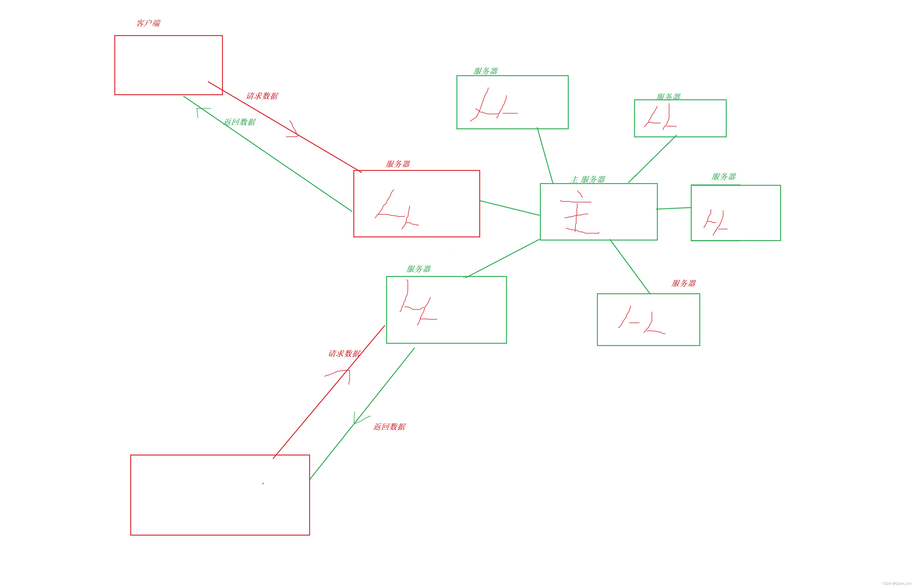

# MySQL数据库

> 数据库由一批数据构成有序的集合，这些数据被存放在结构化的数据表里。数据表之间相互关联，反映了客观事物间的本质联系。数据库系统提供对数据的安全控制和完整性控制。

# 数据库概述

**数据库的发展阶段----**

数据库的发展大致划分为如下几个阶段：
**人工管理阶段**、**文件系统阶段**、**数据库系统阶段**、**高级数据库阶段**。

**数据库的种类----**

其种类大概有3种：**层次式数据库、网络式数据库和关系式数据库**。

**数据库的特点----**

数据库的特点是：
**实现数据共享，减少数据冗余**；
**采用特定的数据类型；
具有较高的数据独立性**；
**具有统一的数据控制功能。**

# 数据库快速入门

每个数据库都是一系列二维数组的集合-----表组成,就像我们经常用的办公软件 excel,

**行被称为记录,列被称为字段,**所以每个表就长这样子----

理解了这个就非常容易理解数据库了;

> 数据库的操作比excel要稍微复杂一下,(这里是指通过cmd来操作数据库而不借助相关软件),建议初学者通过cmd来操作数据库,熟练了之后再借助软件提高效率;

# 数据库基础

**数据库系统的组成**

**数据库------用于存储数据的(物理设备)

数据库管理系统------数据库软件

> 数据库管理系统（DataBase Management
> System，DBMS）是用户创建、管理和维护数据库时所使用的软件，位于用户与操作系统之间，对数据库进行统一管理

数据库应用程序---辅助数据库的软件**

> 数据库应用程序负责与DBMS进行通信，访问和管理DBMS中存储的数据，允许用户插入、修改、删除DB中的数据。

底层结构逻辑如下图


**表的字段的数据类型---**

数据类型决定了数据在计算机中的存储格式，代表**不同的信息类型**。常用的数据类型有**整数数据类型**、**浮点数数据类型**、**精确小数类型**、**二进制数据类型**、**日期/时间数据类型**、**字符串数据类型**。
每一个字段是某种指定数据类型，比上图中的“编号”字段为整数数据，“性别”字段为字符型数据。

> **这一点跟excel表中的数据很像;**

**表的主键----**

主键又称作关键key,用于表示表中的唯一标识的记录(即主键位置不能重复,而且不能为空,)

主键存在的意义,想象一下,加入在一个班级里面,碰巧有两个男生都叫张三的男生,而且今天又穿了一样的衣服,怎么区分他俩呢?------可以通过外貌,身份证号码等信息来确认,
所以为了区分不同的数据,主键应运而生,被声明为主键的字段内容不能为NULL(空)也不能重复;

**SQL语言----操作数据库的语言**

对数据库进行数据操作的语言(增删查改)的结构化语言-----像其他语言一样都有一定的格式标准,但是由于数据库种类和软件众多,sql语言并没有完全统一,但是基本的语言标准还是有的,各家数据库软件之间有些差别;

sql语言主要分为以下部分:

> 1）数据定义语言（DDL）：DROP(删除表)、CREATE(创建表)、ALTER(选择表)等语句。

> （2）数据操作语言（DML）：INSERT（插入）、UPDATE（修改）、DELETE（删除）语句。

> （3）数据查询语言（DQL）：SELECT(选择/查询数据)语句(where(查询/选择的条件))。

> （4）数据控制语言（DCL）：GRANT(授权)、REVOKE(回收权限)、COMMIT(确认操作)、ROLLBACK(回滚)等语句。

由于数据库的主要功能是存储数据,各大语言要处理海量数据就需要从数据库里找数据,于是就有了数据库与各大语言之间的访问问题,如何与各大语言兼容?????

**数据库访问接口**

 ODBC----开放数据库连接接口

> **可以协助访问Oracle数据库\mysql数据库以及微软的acess数据库**

JDBC-----java数据库连接接口

> **由一组java语言编写的类和接口组成.可以在java中直接访问数据库(要有不同的数据库接口我在使用的有mysql,postgresql驱动)**

当然还有其他的数据库访问接口----如ADO.NET(微软.NET框架开发),PDO(针对PHP访问数据库开发的)这里不一一介绍;

# 数据库部署

且看下图-----



> **在部署数据库的时候一般是有主从服务器,以防止主服务器哪天坏了从服务器能够转正成为主服务器(介于此,主从数据库数据要及时同步)**


上面只是开胃菜,下面来到数据库----MySQL的世界

**为什么那么多企业偏爱MySQL数据库???**

尤其是中小型企业,MySQL有如下优势-----

> **1,速度快,支持多线程处理;** 

> **2,容易使用,跨平台的特性使它可以移植;**

> 
>
> **3,接口丰富----C,C++,JAVA,php,python等都有较好的支持;**

>   **4,mysql支持标准的sql语言, 支持存储过程;**

> 5,**mysql底层支持数据加密处理,能够一定程度上保证数据安全 5,最重要的是mysql是开源的,有免费的社区版供企业使用;**

# MySQL的安装与配置

[MySQL的官网下载链接----](https://dev.mysql.com/downloads/mysql/)
根据自己的操作系统下在对应版本即可-----
详细教程网上有很多,这里给出一篇仅供参考

[超级详细的mysql数据库安装指南](https://zhuanlan.zhihu.com/p/37152572)

**核心点-----端口号要记住,数据库密码要记住,其他的没啥太多要求;一路next即可**

**验证数据库是否安装成功-----**

第一步----打开-----服务-----看MySQL80是否已经运行了,


第二部---- 配置MySQL为全局运行----
跟配置java运行环境的原理一样,只不过只需要配置一个---


**MySQL的登录**

登录的命令：mysql  -hlocalhost -uroot –p
 mysql代表bin目录下的文件mysql.exe。
 -h代表host主机名。  后面跟要访问的数据库服务器的地址；如果是登录本机，可以省略,也可以写localhost

 -u代表user 用户名。后面跟登录数据的用户名，第一次安装后以root用户来登录，是MySQL的管理员用户

 -p代表 password 密码。一般不直接输入，而是回车后以保密方式输入。 

登录之后的数据库----
win10登陆以后是由5个基本数据库组成,不同的系统可能不一样,

主要的三个数据库--

 information_schema 

mysql           

  performance_schema

# 数据类型

跟学习java一样,也要学习数据类型-----类比学习就好

**数值类型**

整型数据
tinyint-----很小很小的     **占1字节**   
1字节即 8bits即能表示的最大的无符号数为2^8-1=255
**无符号数0-255,有符号数为-127到127**

smallint----很小的          **占2字节**
2字节即 8bits即能表示的最大的无符号数为2^16-1=65535
**无符号数0-65535,有符号数为-32767到32767**

mediumint---中等的       **占3字节**  同理
int---正常的                   **占4字节**  同理
bigint---较大的              **占8字节**  同理

> **现实生活中很多地方都会用到小数**

**浮点型数据**
float(单精度)        **占4字节**
double(双精度)   **占8字节**
decimal(定点小数类型)---格式decimal(m,n),dec     **占m+2字节**
m表示-----精度(总共有多少位),n表示标度,表示小数的位数; decimal在内部是以文本形式存储的

**日期和时间类型**

datetime时间(年月日时分秒)  **占8字节**
date   时间(年月日)  **占3字节**
timestamp  ----时间戳                                    **占4字节**
time-----记录时间信息   格式HH:MM:SS     **占3字节**
year----只记录年信息     格式 YYYY           **占1字节**

每种日期和时间类型表示的范围不一样,

**着重说一下year的表示**

> **1,以四位节字符串表示,范围位1901-2155**
>
> **2,以4位数字表示**
>
> **3,以两位字符串表示------范围位'00'到'69'表示2000-2069,'70'到'99'表示1970-1999**
>
> **4,以2位数字表示-----1-69 表示2001-2069,70-99表示1970-1999,其中0被转换为0000而非2000**

**文本字符串类型**

**非二进制字符串**
Char  定长字符串
varchar 可变字符串
tinytext极小的文本
text文本
mediumtext中等文本
longtext长文本
enum枚举
set一个设置类的文本
文本字符串也有长度限制,


**二进制字符串**
这种类型主要存储的是图片,视频等特别大的非文本类型数据
bit位字段类型
binary定长二进制文本
varbinary变长二进制文本
tinyblob非常小的
blob小的
mediumblob中等大小的
longblob非常大的


关于数据类型的一些细节,之后会以代码实操的形式给出详细解释;

@[ ](SQL语言)

# 数据库基本操作

针对数据库操作的知识主要有----

> **通用格式----输入完sql语言之后  要用  ;(分号 )  结尾;**

**对数据库操作----**

**登录数据库---**

> **格式----mysql -h 数据库地址 -u 用户名 -p 密码
>  (密码一般不显式的输入,而是回车隐式的输入)**
>  


**查看数据库----**

> **show databases;**
> 格式-----show databases;
> 

**使用数据库------**

> **use gavin;**
> 格式----- use  数据库名 ;
> 出现 Database changed 说明操作成功;


**查看数据库中包含多少张表-------**

> **show tables;**
> 格式----show tables;

**创建数据库**

> **create database gavin;** 
> 格式----create database  数据库名;   
> 创建数据库是在系统磁盘上划分一块区域用于数据的存储和管理;
> 数据库名不能重复

**删除数据库**

> **drop database gavin;** 
> 格式---drop database 数据库名
>
> 出现Query OK表示操作成功
> 用DROP DATABASE声明删除数据库后，数据库中存储的所有数据表和数据也将一同被删除，而且不能恢复。

**查看创建的数据库的详细信息--**

> **show create database gavin;** 
> 格式---show create database  数据库名;
> 
>
> 
>
> **查看数据库的表结构信息**
>  select distinct(engine) from information_schema.tables; 
>  格式----select distinct(engine) from information_schema.tables;
> 

这里要知道初始化的时候每个表的是用来干嘛的-------

除了自己建立的数据库之外还会有三个主要的自带数据库
名字分别为information_schema、mysql、performance_schema、

**information_schema数据库**

提供访问数据库元数据的方式-------如数据库名或表名，列的数据类型，或访问权限等
确切说information_schema是信息数据库。保存着关于MySQL服务器所维护的所有其他数据库的信息。在INFORMATION_SCHEMA中，有数个只读表。它们实际上是视图，而不是基本表;

这也验证了该数据库是属于试图性质的-----多张表的融合体

里面包含多张表-----
SCHEMATA表：提供了当前mysql实例中所有数据库的信息。
TABLES表：提供了关于数据库中的表的信息（包括视图）。
等等

**mysql数据库**

> **这个是mysql的核心数据库，负责存储数据库的用户、权限设置、关键字等mysql自己需要使用的控制和管理信息。不可以删除**，
> 常用的为user表,用于管理用户权限等相关操作;
> 如果对mysql不是很了解，也不要轻易修改这个数据库里面的表信息。

**performance_schema数据库**
一个性能优化的引擎：功能默认为关闭状态：

**数据表的操作**

在创建表的时候要考虑字段用什么数据类型以尽可能优化表的存储性能;

**创建表**

在创建表之前要选择数据库,不然不知道在那个库里创建,

> 案例---- 
> **创建一个员工信息表-----**
> **基本语法格式-----**
>
> create table  表名 ( 
>  字段名1 数据类型(长度限制),  
>  字段名2 数据类型(长度限制)  
>  );
> 当然还可以对表中数据做一些其他限制;

**查看刚刚创建的表的信息**


**创建表的其他方式-----**

源表---

```sql
mysql> select * from userinfo where fruitname regexp  'an{1}';
+------+----------+--------+-------+--------+-----------+
| id   | name     | gender | score | height | fruitname |
+------+----------+--------+-------+--------+-----------+
| 1005 | 古力娜华 | 女     | 145.6 |  166.7 | orange    |
| 1007 | Jack     | 女     | 100.4 |  198.7 | banana    |
| 1009 | 李二狗   | 男     | 123.4 |  178.9 | orange    |
| 1010 | 王建国   | 男     | 120.9 |  166.4 | banana    |
+------+----------+--------+-------+--------+-----------+
4 rows in set (0.00 sec)
```

比如要想将查询后的数据以一张表的形式保存下来-----

**> create table userinfo3 as select * from userinfo where fruitname
 regexp  'an{1}';**

```sql
mysql> create table userinfo3 as select * from userinfo where fruitname regexp  'an{1}';
Query OK, 4 rows affected, 1 warning (0.03 sec)
Records: 4  Duplicates: 0  Warnings: 1

mysql> select * from userinfo3;
+------+----------+--------+-------+--------+-----------+
| id   | name     | gender | score | height | fruitname |
+------+----------+--------+-------+--------+-----------+
| 1005 | 古力娜华 | 女     | 145.6 |  166.7 | orange    |
| 1007 | Jack     | 女     | 100.4 |  198.7 | banana    |
| 1009 | 李二狗   | 男     | 123.4 |  178.9 | orange    |
| 1010 | 王建国   | 男     | 120.9 |  166.4 | banana    |
+------+----------+--------+-------+--------+-----------+
4 rows in set (0.00 sec)

```

如果只想要字段信息,不想要数据,则可以如下操作---

**> create table userinfo4 as select id ,name ,gender, height,score from
 userinfo where 1=4 ;**   *~~where 条件处为false即可~~ *

```sql
mysql> create table userinfo4 as select id ,name ,gender, height,score from userinfo where 1=4 ;
Query OK, 0 rows affected, 1 warning (0.06 sec)
Records: 0  Duplicates: 0  Warnings: 1

mysql> select * from userinfo4;
Empty set (0.00 sec)

mysql> show create table userinfo4 \G
*************************** 1. row ***************************
       Table: userinfo4
Create Table: CREATE TABLE `userinfo4` (
  `id` int NOT NULL DEFAULT '0',
  `name` varchar(8) DEFAULT NULL,
  `gender` char(2) NOT NULL DEFAULT '男',
  `height` float(4,1) DEFAULT NULL,
  `score` decimal(4,1) DEFAULT NULL
) ENGINE=InnoDB DEFAULT CHARSET=utf8mb4 COLLATE=utf8mb4_0900_ai_ci
1 row in set (0.00 sec)

mysql>
```

**为表增加计算列**

即表中的某一列的值是通过别的列计算得来的;
格式----字段名   数据类型   generated always ( 计算列表达式    ) as virtual      

virtual 可以省略

```sql
mysql> create table testnum (
    -> a int ,
    -> b int ,
    -> c int generated always as (a*b) virtual
    -> );
Query OK, 0 rows affected (0.08 sec)

mysql>

mysql> insert into testnum (a,b) values(12,16);
Query OK, 1 row affected (0.02 sec)

mysql> select * from testnum;
+------+------+------+
| a    | b    | c    |
+------+------+------+
|   12 |   16 |  192 |
+------+------+------+
1 row in set (0.00 sec)


mysql> create table testnum1 (
    -> a int ,
    -> b int ,
    -> c int generated always as (a*b)
    -> );
Query OK, 0 rows affected (0.05 sec)

mysql> insert into testnum1 (a,b) values(12,16);
Query OK, 1 row affected (0.04 sec)

mysql> select * from testnum1;
+------+------+------+
| a    | b    | c    |
+------+------+------+
|   12 |   16 |  192 |
+------+------+------+
1 row in set (0.00 sec)
```


基本语法格式:
**show create table 表名 ;**

输出的内容包含创建的表的结构(字段名和数据类型,数据限制以及表的其他信息------存储引擎,数据编码格式等)

**向表中录入信息----**


> 格式一------
> **insert into 表名 values(各字段对应的数据类型)**;
>
> 
>
> 格式二------
> **insert into 表名 (字段名,字段名,.....)values(各字段对应的数据类型)**;
>
> **注意:插入的数据类型要和字段数据类型相匹配;**
>
> 有时为了提高效率会选择一次录入多条记录;
> 

**细节----文本类型的数据要用单引号引用;**

> 查看数据表中的信息----
> **格式-----select * from 表名** 
>
> 以上是查看数据表中的全部信息,可以根据自己需要查看部分数据;
> **格式------select 字段名1,字段名2.... from 表名** 

# 键约束

先来看创建表的时候----

**主键约束------**

主键约束（Primary Key Constraint）要求主键列的**数据唯一**，并且**不允许为空**。主键能够**唯一地标识表中的一条记录**，可以结合外键来定义不同数据表之间的关系，并且可以加快数据库查询的速度。主键和记录之间的关系如同人和身份证之间的关系，它们之间是一一对应的。

**单字段主键----**

> **添加主键的方式----**
> **格式一-------** 在指定字段信息的时候添加主键约束----
> **字段名1   数据类型   primary key** 
>
> **格式二------** 
> 在所有字段信息指定完毕后在添加主键约束-----
> **字段名1 数据类型 ,primary key(字段名1)** 

除了上述是定一个字段为主键外还可以指定多个字段为主键

**多字段联合主键**

**方式跟指定一个字段为主键的方式二一样,指定了多个主键;**
而方式一只适用于指定一个主键的情况----不然指定多主键报错;


> **注意--------
> 并不是每一个表中都需要主键，一般多个表之间进行连接操作时需要用到主键。因此并不需要为每个表建立主键，而且有些情况最好不使用主键。**

**外键约束------**

外键用来在两个表的数据之间建立连接，可以是一列或者多列。一个表可以有一个或多个外键。

外键对应的是参照完整性，一个表的**外键****可**以**为空值**，若**不为空值**，则**每一个外键值**必须**等于另一个表中主键**的某个**值**。

> 外键：首先它是表中的一个字段，虽可以不是本表的主键，但要对应另外一个表的主键。外键的主要作用是保证数据引用的完整性，定义外键后，不允许删除在另一个表中具有关联关系的行。外键的作用是保持数据的一致性、完整性

定义外键的格式----
在所有字段定义完毕之后-----
**constraint   外键名   foreign key(子表字段名) references 主表名(主表主键字段名)**

所以外键其实至少对应两张表-----
父表----含有相关字段中主键所在的那张表
子表-----含有相关字段中外键所在的那张表

> **创建主表----** **创建子表-----**
> 当然一个表中的主键也可以是另一个表中的外键,主键和外键可以指定多个
> ,但都是一一对应的关系;


设置完毕主键和外键之后,就相当于将两张表联系起来了,子表的外键必须关联父表的主键,且关联字段的数据类型必须匹配(即int 对int,而不能int 对char )

> **外键约束的两个表之间存储引擎必须一样;**

**外键策略**

建主表----
id ------学号 主键约束
name------  学生姓名   非空
gender--------学生性别  只有男,女
cid------学生班级 检查约束[1,8]

```sql
CREATE TABLE s_class (
id INT ( 11 ) auto_increment,
NAME VARCHAR ( 6 ) NOT NULL,
gender enum ( '男', '女' ) DEFAULT '男',
cid TINYINT ( 2 ),---班级
CONSTRAINT pk_sclass PRIMARY KEY ( id ),
CONSTRAINT chk_cid check(cid>=1 and cid<=8)
);
```

插入数据-----

```sql
INSERT INTO `s_class`(`id`, `NAME`, `gender`, `cid`) VALUES (1001, '张三', '男', 1);
INSERT INTO `s_class`(`id`, `NAME`, `gender`, `cid`) VALUES (1002, '李四', '男', 2);
INSERT INTO `s_class`(`id`, `NAME`, `gender`, `cid`) VALUES (1003, '李二狗', '女', 2);
INSERT INTO `s_class`(`id`, `NAME`, `gender`, `cid`) VALUES (1004, '王大川', '男', 3);
INSERT INTO `s_class`(`id`, `NAME`, `gender`, `cid`) VALUES (1006, '王中仁', '男', 5);

```

建从表----
id ------学生学号-------主键约束,自增
name---- 学生姓名   -----非空
cid2----学生班级  -------外键约束,默认3班

```sql
CREATE TABLE s_student ( 
id INT ( 11 ), 
name VARCHAR( 6 ) NOT NULL, 
cid TINYINT (2) default 3,
CONSTRAINT fk_sc_ss foreign key (id) REFERENCES s_class (id)
);
```

插入数据-----

```sql
-----正常插入数据
INSERT INTO `s_student`(`id`, `name`, `cid`) VALUES (1001, '张三', 1);
INSERT INTO `s_student`(`id`, `name`, `cid`) VALUES (1003, '李二狗', 2);
INSERT INTO `s_student`(`id`, `name`, `cid`) VALUES (1006, '王中仁', 5);

----当插入的数据---id 在s_class 中不存在时就会报错

mysql> insert into s_student values(1010,'王二麻子',2);
ERROR 1452 (23000): Cannot add or update a child row: a foreign key constraint fails (`gavin`.`s_student`, CONSTRAINT `fk_sc_ss` FOREIGN KEY (`id`) REFERENCES `s_class` (`id`))

/*所以要先先在主表中添加数据然后从表才能添加*/
mysql> insert into s_class values(1010,'王二麻子',null,2);
Query OK, 1 row affected (0.01 sec)

mysql> insert into s_student values(1010,'王二麻子',2);
Query OK, 1 row affected (0.01 sec)

mysql>

```

如果要想在子表中删除数据
当条件为非外键删除数据时---------

```sql
mysql> delete from s_class where cid=5;
ERROR 1451 (23000): Cannot delete or update a parent row: a foreign key constraint fails (`gavin`.`s_student`, CONSTRAINT `fk_sc_ss` FOREIGN KEY (`id`) REFERENCES `s_class` (`id`))
```

会报错------不能够删除或者更新父表的记录

尝试条件为外键字段删除数据-----

```sql
mysql> delete from s_student where id=1010;
Query OK, 1 row affected (0.01 sec)

mysql>
```

并没有报错;


在父表中进行上述操作--------

```sql
mysql> delete from s_class where cid=5;
ERROR 1451 (23000): Cannot delete or update a parent row: a foreign key constraint fails (`gavin`.`s_student`, CONSTRAINT `fk_sc_ss` FOREIGN KEY (`id`) REFERENCES `s_class` (`id`))
mysql> delete from s_class where id=1006;
ERROR 1451 (23000): Cannot delete or update a parent row: a foreign key constraint fails (`gavin`.`s_student`, CONSTRAINT `fk_sc_ss` FOREIGN KEY (`id`) REFERENCES `s_class` (`id`))
```

发现都报错了,说明   如果要想删除父表中的数据(在父,子表中都存在的关联数据),必须先在子表中删除而且条件是根据子表中的外键条件进行删除;

总结----

**外键策略1**

当定义外键约束时  默认是 no action---不允许操作(这里是指用户客户端那里),  如果要修改只能通过sql语句来操作;

**~~如果非要删除子表中的数据,操作思路有两种,~~ **

> **1,通过子表的外键字段作为条件进行删除 .
> 2,修改主表中的相关值(除主键/唯一约束)为其他值,删除之后在修改回原来的值;**
> 

**~~假设现在就要在子表中删除  王二麻子这条记录~~ **
方式一----

```sql
mysql> delete from s_student where id=1010;
Query OK, 1 row affected (0.01 sec)

```

方式二-----

```sql
mysql> update   s_class set  name='王er麻子' where id=1010 ;
Query OK, 1 row affected (0.01 sec)
Rows matched: 1  Changed: 1  Warnings: 0

mysql> delete from s_student where id=1010;
Query OK, 1 row affected (0.01 sec)

mysql> insert into s_student values(1010,'王二麻子',2);
Query OK, 1 row affected (0.01 sec)

mysql> delete from s_student where name='王二麻子';
Query OK, 1 row affected (0.01 sec)

mysql> update   s_class set  name='王二麻子' where id=1010 ;
Query OK, 1 row affected (0.01 sec)
Rows matched: 1  Changed: 1  Warnings: 0

```

**外键策略2**

级联操作---cacade操作,

即先删除外键约束,然后删除数据,在添加回外键约束;

```sql
mysql> alter table s_student drop foreign key fk_sc_ss;
Query OK, 0 rows affected (0.02 sec)
Records: 0  Duplicates: 0  Warnings: 0

mysql> delete from s_student where name='王二麻子';
Query OK, 1 row affected (0.01 sec)

mysql> alter table s_student add constraint fk_sc_st foreign key(id) references s_class(id);
Query OK, 3 rows affected (0.10 sec)
Records: 3  Duplicates: 0  Warnings: 0

mysql>

```

**非空约束与唯一约束--**

> 创建一个表----
>
> 

**非空约束-----**

格式-----
**字段名 数据类型   not null;**

**唯一约束----**
格式-------
**字段名 数据类型   unique;**

> 约束之间的顺序没什么特别要求,按照习惯来就好;
> 

非空约束和唯一约束根据字面意思就还可以理解,该字段录入数据的时候不允许为空---即不允许为null,可以是空字符串,不允许重复;
**验证代码-----**
但是有一种情况是----如果不录入数据,可以指定默认值;

**默认约束----**

> 创建表---
> 
>
> 插入数据----
>
> 
> 查看数据---- 由于没有录入性别,则默认按照指定的    男    
> 处理
> **插入数据的两种方式-----** 
> 第一种是不能使用默认值的; 
> 第二种指定字段插入可以使用默认值

**唯一约束和主键约束的区别--**

1,对于单主键方式创建的表时-------只能由一个主键,但是可以有多个字段声明为unique;
2,主键不允许为null,但是唯一约束可以出现null值的存在
3,删除主键是不被允许的,除非取消该字段主键资格;

**设置字段自动增长**

听名字就知道此种方式是针对整形数据的且是主键------

> 开始建表
>
> 一个表只能有一个字段使用auto_increment约束,且该字段必须是主键,字段数据类型要求为整型(tinyint,smallint,int,bigint)

格式 -----
**字段名 数据类型 primary key auto_increment**

> 插入数据看一下-----
> 

**注意-----标准的插入数据的方式为上面插入数据的方式一,mysql中支持方式二,但对于一些数据库而言可能不支持;**

**检查约束---**

检查约束一般用在录入数据时检查录入数据是否是建表人想让你输入的-----
比如新建一张表,
name-----姓名,
gender----性别(要求只能为'男','女')
age--------年龄(在18到30之间)

```sql
mysql> create table usertest001 (
    -> name varchar(6) ,
    -> gender char(1) default '男' check(gender='男'||gender='女'),
    -> age tinyint(2) check(age>=18 and age<=30)
    -> );
Query OK, 0 rows affected, 2 warnings (0.09 sec)


mysql> insert into usertest001 values('张三','n',32);
ERROR 3819 (HY000): Check constraint 'usertest001_chk_1' is violated.
mysql>
mysql> insert into usertest001 values('张三','男',22);
Query OK, 1 row affected (0.01 sec)

mysql> select * from usertest001;
+------+--------+------+
| name | gender | age  |
+------+--------+------+
| 张三 | 男     |   22 |
+------+--------+------+
1 row in set (0.00 sec)
```

> **也可以将gender 的数据类型设置为enum ('男','女')**

当数据中检查约束有多个时,可以根据检查约束错误的名称以更好地找到插入数据哪里出错了----
ERROR 3819 (HY000): Check constraint 'usertest001_**chk_1**' is violated.
表示第一个检查约束那里出现了错误,检查约束在系统内是以编号的方式进行排序的;

但是这样还是不太明显,又不能一个一个去数,


所以我们可以为表做一个约束----

```sql
mysql> create table usertest006 (
    -> name varchar(6) ,
    -> gender char(1) default '男',
    -> age tinyint(2) ,
    -> user_id int(11)  auto_increment,
    -> constraint pk_id primary key (user_id) ,
    -> constraint chk_gender check(gender='男' or gender ='女'),
    -> constraint chk_age check(age>=18 and age<=30)
    -> );
Query OK, 0 rows affected, 2 warnings (0.04 sec)

mysql> show warnings;
+---------+------+------------------------------------------------------------------------------+
| Level   | Code | Message                                                                      |
+---------+------+------------------------------------------------------------------------------+
| Warning | 1681 | Integer display width is deprecated and will be removed in a future release. |--integer类型数据在最新版本8.0中不建议加显示位宽
| Warning | 1681 | Integer display width is deprecated and will be removed in a future release. |
+---------+------+------------------------------------------------------------------------------+
2 rows in set (0.00 sec)

mysql> insert into usertest006 values
    -> ('张而三','你',48,1001);
ERROR 3819 (HY000): Check constraint 'chk_age' is violated.
mysql>
```

> **可以发现mysql只能一项一项检查错误,从最开始的到最后的错误,先对语句开头的错误做出提示;**

> **可以在创建表的时候对数据表做一些约束,当然也可以以后再添加,但是会比较麻烦,因为可能对已经添加的数据不友好;**
> 约束除了可以在创建表的时候添加,还可以在设置好字段后添加约束-----在设置完所有字段之后添加的约束也叫表约束----
> 可以是**主键约束,唯一约束,检查约束,外键约束等**

还可以建完表之后修改数据来添加约束
alter table 表名 modyfy  字段     数据类型    约束 ;
或者
alter table 表名   旧字段名     新字段名   数据类型    约束

```sql
-- 在创建表以后添加约束：
alter table t_student add constraint pk_stu primary key (sno) ; -- 主键约束
alter table t_student modify sno int(6) auto_increment; -- 修改自增条件
alter table t_student add constraint ck_stu_sex check (sex = '男' || sex = '女');
alter table t_student add constraint ck_stu_age check (age >= 18 and age <= 50);
alter table t_student add constraint uq_stu_email unique (email);
```


# 表基本操作

> **查看表的结构---**
>
> 语法格式--
> **desc 表名 ;** 包含字段名,字段类型,是否非空,主键,默认以及额外的信息 

格式----
**describe  表名;**
也可以简写为**desc 表名;**

表中各个字段的含义:
Field    字段名
Type    数据类型
Null    是否非空  即是否可以存储null值
Key    是否已编制索引,  
**Key的值可以为  
PRI---主键  
UNI----唯一  
MUL----非唯一,可以重复
Default----是否由默认值   
 Extra-----附加信息**

> 查看表的详细信息  
> **格式----show create table 表名** 
> 查看表的创建语句,存储引擎,默认编码格式等信息;

如果看起来有些乱,不如加点料-----

> **格式----show create table 表名\G**
>
> 看起来是不是比上面的好一些;
> **注意----  G后没有;(分号)**

**修改表名**

格式---

**alter  table 旧表名 rename to 新表名;**  
to可以省略;
修改表名并不能修改表的结构;-----只是改个名而已;
**这种方式并不能用来修改数据库名----修改数据库名只能通过将源库的内容导入到新库中;**

**修改表中字段的数据类型**

格式--
**alter table 表名 modify 字段名 数据类型 ;**

修改之前----

修改-----修改后----
修改注意事项---

**修改前后的表的字段如果表中由数据,则最好使得数据类型要匹配,不然会出现异常情况----后果自负哦!!!(比如有些涉及数学运算的数据改编为字符串格式......)
如果还没有数据,可以修改;**

**修改表中字段的字段名**

格式--
**alter table 表名 change 旧字段名 新字段名 新数据类型 ;**

通过这种方式可以起到给表中字段改名和修改数据类型的作用;

> CHANGE也可以只修改数据类型，实现和MODIFY同样的效果，方法是将SQL语句中的“新字段名”和“旧字段名”设置为相同的名称，只改变“数据类型”。由于不同类型的数据在机器中存储的方式及长度并不相同，修改数据类型可能会影响到数据表中已有的数据记录，**因此当数据库表中已经有数据时，不要轻易修改数据类型。**

**为表和字段取别名**

**基本格式是 -----
1,字段名  as   别名**

```sql
mysql> select name as '姓名' ,fruitname as '爱吃的水果' from userinfo ;
+----------+------------+
| 姓名     | 爱吃的水果 |
+----------+------------+
| 张三     | pear       |
| 李四     | apple      |
| 王五     | pear       |
| 李六     | apple      |
| 古力娜华 | orange     |
| 阿依古丽 | mongo      |
| Jack     | banana     |
| Gavin    | mongo      |
| 李二狗   | orange     |
| 王建国   | banana     |
| 玛丽亚   | peak       |
| 穿耳戈   | peak       |
+----------+------------+
12 rows in set (0.00 sec)
```

**2,表名 as 别名** 

```sql
mysql> select u1.name ,u1.fruitname from userinfo as u1 inner join usertest as u2 on u1.fruitname =u2.fruitname  group by u1.name;
+----------+-----------+
| name     | fruitname |
+----------+-----------+
| 王五     | pear      |
| 张三     | pear      |
| 李二狗   | orange    |
| 古力娜华 | orange    |
| 王建国   | banana    |
| Jack     | banana    |
| 穿耳戈   | peak      |
| 玛丽亚   | peak      |
| Gavin    | mongo     |
| 阿依古丽 | mongo     |
| 李六     | apple     |
| 李四     | apple     |
+----------+-----------+
12 rows in set (0.00 sec)
```

**表别名只在执行查询的时候使用，并不在返回结果中显示，而列别名定义之后，将返回给客户端显示，显示的结果字段为字段列的别名。**

> **注意-----别名不能与数据库名,数据表名重复**

**添加字段**

格式---
alter table 表名   add 新字段名 数据类型  约束条件  first  (after 已存在的字段名);
after----表示添加到某字段之后
first----表示添加到表头
如果没有first或者after 已存在的字段名,则默认是添加早表的字段末尾列;


**删除字段**

格式---
**alter table 表名  drop 字段名 ;**

尝试删除一下主键字段------


在没有外键约束的情乱下可以删除,但是如果有外键约束则不能删,
**除非将外约束给删除;**


**修改字段位置**

格式----
**alter table 表名 modify 字段名1 数据类型  first|(after  字段名);**

修改之前查看一下数据类型---


修改之后的----
**after-----**
**first----**

**修改表的存储引擎**

MySQL中主要的存储引擎有MyISAM、InnoDB、MEMORY（HEAP）、BDB、FEDERATED等。

> 查看系统支持的存储引擎--- 格式-------
> **show engines;** 还记得查看所有表已经使用的存储引擎吗?
> 查看某张表的存储引擎;
> 

修改-----

> 
> 发现错误----说明MyISAM存储引擎不支持外键 

**删除外键----**

> 有一个暴力的方式是直接将该表删除.....不建议除非真有必要这么操作
> drop table testinfo2;

接下来再操作----


**删除表**

**删除数据表就是将数据库中已经存在的表从数据库中删除**

注意，在删除表的同时，表的定义和表中所有的数据均会被删除。因此，在进行删除操作前，最好对表中的数据做一个备份，以免造成无法挽回的后果.

可以同时删除没有被关联的表
删除表的格式---
**drop table (if exists) 表1,表2,.....表n;**
删除之前-------
其中testinfo 和testinfo3有主键外键约束关系---

**删除 表testthree**
删除有主键外键约束关联的表中的一个----


会提示----
**ERROR 3730 (HY000): Cannot drop table 'testinfo' referenced by a foreign key constraint 'test_id2' on table 'testinfo3'.**

如果想要删除关联关系中的某一张只能删除外键约束后再删除;

> 删除外键再删除------
>  alter table testinfo3 drop foreign key test_id2 ; drop
> table testinfo3;

要么将所有有关联的表都删除,
**注意删除后所有数据都丢失了,建议要做好备份;**

**删除表操作中有 无if exists 的区别**

当删除的表不存在时----
1有if exists 时不好出现错误提示只有一个警告信息 **1 warning**,而没有的话会出现错误提示**1051** 
随着版本的更迭,现在mysql都到了mysql8了其实内行人把它叫做5.8版本;

<center>

[<div   style="float:left;width:180px;heigh:20px"/></div>]()

[<div   style="float:right;width:180px;heigh:20px"/></div>](/mysql/MySQLBase02.md#基本数据类型)

</center>

